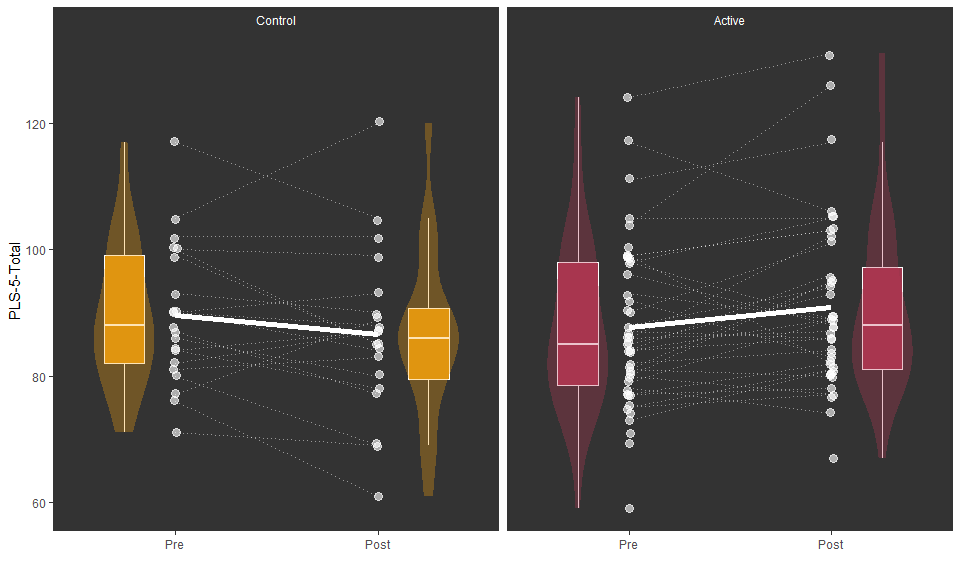
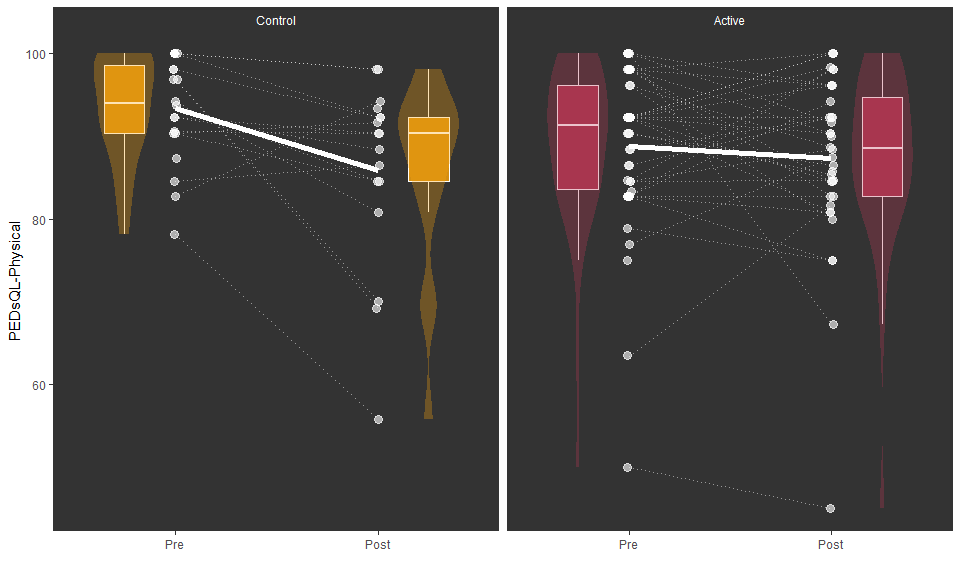

# Overview

**Original request:**

*I have attached a rough draft of the methodology for the Happy Talk study with some research questions which hopefully will help make sense of the data. *

*I have put in the following questions and highlighted the outcomes. In some places there is an option to use just one outcome or to add in another. I don’t know if our numbers allow for a second outcome in some of these places, so statistically you might not advise it.*

*Research questions – Following completion of the Happy Talk programme*

*- Based on the PLS-5 composite scores, did the receptive and or expressive language of children from disadvantaged areas improve, when compared to a control group over the same period of time? PLS-5 outcomes*

*- Using the PedsQL and CHU9D, did children’s quality of life improve compared to a control group of children from similar backgrounds, who did not complete the programme? PEDsQL total score and then composites?*

*- Using the Detailed Code of Responsiveness, did parents increase their level of responsiveness when playing with their children, compared to a control group of parents who did not complete the programme? Rate per minute outcome and total number as a possible second for PedsQL* 


*- When measured using the Communication Supporting Classroom Observation Tool (CSCOT) has the oral language environment of preschools increased when compared to control preschools in similar areas catering for a similar demographic. CSCOT score outcome*
**Note: n = 4. There really isn't an analysis possible here.** 


**Note: The following two questions can not be usefully answered with these data.** 

*- Are attendance rates associated with differential intervention outcome effects?*

*- Examining the influences of moderating or mediating influences on children’s intervention effects.*


# PLS-5

This section answers the following: *Based on the PLS-5 composite scores, did the receptive and or expressive language of children from disadvantaged areas improve, when compared to a control group over the same period of time? PLS-5 outcomes*

## PLS-5-AC

Figure. Individual level change in PLS-5-AC by study arm. 


<!-- -->


Table. Estimated effect of the intervention on PLS-5-AC scores.
<table style="border-collapse:collapse; border:none;">
<tr>
<th style="border-top: double; text-align:center; font-style:normal; font-weight:bold; padding:0.2cm;  text-align:left; ">&nbsp;</th>
<th colspan="3" style="border-top: double; text-align:center; font-style:normal; font-weight:bold; padding:0.2cm; ">Baseline adjusted</th>
<th colspan="3" style="border-top: double; text-align:center; font-style:normal; font-weight:bold; padding:0.2cm; ">Covariate adjusted</th>
</tr>
<tr>
<td style=" text-align:center; border-bottom:1px solid; font-style:italic; font-weight:normal;  text-align:left; ">Predictors</td>
<td style=" text-align:center; border-bottom:1px solid; font-style:italic; font-weight:normal;  ">Estimates</td>
<td style=" text-align:center; border-bottom:1px solid; font-style:italic; font-weight:normal;  ">CI</td>
<td style=" text-align:center; border-bottom:1px solid; font-style:italic; font-weight:normal;  ">p</td>
<td style=" text-align:center; border-bottom:1px solid; font-style:italic; font-weight:normal;  ">Estimates</td>
<td style=" text-align:center; border-bottom:1px solid; font-style:italic; font-weight:normal;  ">CI</td>
<td style=" text-align:center; border-bottom:1px solid; font-style:italic; font-weight:normal;  col7">p</td>
</tr>
<tr>
<td style=" padding:0.2cm; text-align:left; vertical-align:top; text-align:left; ">Intercept</td>
<td style=" padding:0.2cm; text-align:left; vertical-align:top; text-align:center;  ">83.46</td>
<td style=" padding:0.2cm; text-align:left; vertical-align:top; text-align:center;  ">78.95&nbsp;&ndash;&nbsp;87.97</td>
<td style=" padding:0.2cm; text-align:left; vertical-align:top; text-align:center;  "><strong>&lt;0.001</td>
<td style=" padding:0.2cm; text-align:left; vertical-align:top; text-align:center;  ">83.91</td>
<td style=" padding:0.2cm; text-align:left; vertical-align:top; text-align:center;  ">79.25&nbsp;&ndash;&nbsp;88.57</td>
<td style=" padding:0.2cm; text-align:left; vertical-align:top; text-align:center;  col7"><strong>&lt;0.001</td>
</tr>
<tr>
<td style=" padding:0.2cm; text-align:left; vertical-align:top; text-align:left; ">Active (vs Control)</td>
<td style=" padding:0.2cm; text-align:left; vertical-align:top; text-align:center;  ">8.04</td>
<td style=" padding:0.2cm; text-align:left; vertical-align:top; text-align:center;  ">2.47&nbsp;&ndash;&nbsp;13.61</td>
<td style=" padding:0.2cm; text-align:left; vertical-align:top; text-align:center;  "><strong>0.005</strong></td>
<td style=" padding:0.2cm; text-align:left; vertical-align:top; text-align:center;  ">8.15</td>
<td style=" padding:0.2cm; text-align:left; vertical-align:top; text-align:center;  ">2.44&nbsp;&ndash;&nbsp;13.86</td>
<td style=" padding:0.2cm; text-align:left; vertical-align:top; text-align:center;  col7"><strong>0.006</strong></td>
</tr>
<tr>
<td style=" padding:0.2cm; text-align:left; vertical-align:top; text-align:left; ">Baseline PLS-5-AC</td>
<td style=" padding:0.2cm; text-align:left; vertical-align:top; text-align:center;  ">0.68</td>
<td style=" padding:0.2cm; text-align:left; vertical-align:top; text-align:center;  ">0.48&nbsp;&ndash;&nbsp;0.88</td>
<td style=" padding:0.2cm; text-align:left; vertical-align:top; text-align:center;  "><strong>&lt;0.001</td>
<td style=" padding:0.2cm; text-align:left; vertical-align:top; text-align:center;  ">0.64</td>
<td style=" padding:0.2cm; text-align:left; vertical-align:top; text-align:center;  ">0.43&nbsp;&ndash;&nbsp;0.86</td>
<td style=" padding:0.2cm; text-align:left; vertical-align:top; text-align:center;  col7"><strong>&lt;0.001</td>
</tr>
<tr>
<td style=" padding:0.2cm; text-align:left; vertical-align:top; text-align:left; ">Age (m)</td>
<td style=" padding:0.2cm; text-align:left; vertical-align:top; text-align:center;  "></td>
<td style=" padding:0.2cm; text-align:left; vertical-align:top; text-align:center;  "></td>
<td style=" padding:0.2cm; text-align:left; vertical-align:top; text-align:center;  "></td>
<td style=" padding:0.2cm; text-align:left; vertical-align:top; text-align:center;  ">-0.13</td>
<td style=" padding:0.2cm; text-align:left; vertical-align:top; text-align:center;  ">-0.56&nbsp;&ndash;&nbsp;0.30</td>
<td style=" padding:0.2cm; text-align:left; vertical-align:top; text-align:center;  col7">0.557</td>
</tr>
<tr>
<td style=" padding:0.2cm; text-align:left; vertical-align:top; text-align:left; ">Previous SLT (vs None)</td>
<td style=" padding:0.2cm; text-align:left; vertical-align:top; text-align:center;  "></td>
<td style=" padding:0.2cm; text-align:left; vertical-align:top; text-align:center;  "></td>
<td style=" padding:0.2cm; text-align:left; vertical-align:top; text-align:center;  "></td>
<td style=" padding:0.2cm; text-align:left; vertical-align:top; text-align:center;  ">-2.85</td>
<td style=" padding:0.2cm; text-align:left; vertical-align:top; text-align:center;  ">-10.12&nbsp;&ndash;&nbsp;4.43</td>
<td style=" padding:0.2cm; text-align:left; vertical-align:top; text-align:center;  col7">0.436</td>
</tr>
<tr>
<td style=" padding:0.2cm; text-align:left; vertical-align:top; text-align:left; padding-top:0.1cm; padding-bottom:0.1cm; border-top:1px solid;">Observations</td>
<td style=" padding:0.2cm; text-align:left; vertical-align:top; padding-top:0.1cm; padding-bottom:0.1cm; text-align:left; border-top:1px solid;" colspan="3">58</td>
<td style=" padding:0.2cm; text-align:left; vertical-align:top; padding-top:0.1cm; padding-bottom:0.1cm; text-align:left; border-top:1px solid;" colspan="3">58</td>
</tr>
<tr>
<td style=" padding:0.2cm; text-align:left; vertical-align:top; text-align:left; padding-top:0.1cm; padding-bottom:0.1cm;">R<sup>2</sup> / R<sup>2</sup> adjusted</td>
<td style=" padding:0.2cm; text-align:left; vertical-align:top; padding-top:0.1cm; padding-bottom:0.1cm; text-align:left;" colspan="3">0.480 / 0.461</td>
<td style=" padding:0.2cm; text-align:left; vertical-align:top; padding-top:0.1cm; padding-bottom:0.1cm; text-align:left;" colspan="3">0.489 / 0.451</td>
</tr>

</table>

## PLS-5-ES

Figure. Individual level change in PLS-5-ES by study arm. 
<!-- -->

Table. Estimated effect of the intervention on PLS-5-ES scores.
<table style="border-collapse:collapse; border:none;">
<tr>
<th style="border-top: double; text-align:center; font-style:normal; font-weight:bold; padding:0.2cm;  text-align:left; ">&nbsp;</th>
<th colspan="3" style="border-top: double; text-align:center; font-style:normal; font-weight:bold; padding:0.2cm; ">Baseline adjusted</th>
<th colspan="3" style="border-top: double; text-align:center; font-style:normal; font-weight:bold; padding:0.2cm; ">Covariate adjusted</th>
</tr>
<tr>
<td style=" text-align:center; border-bottom:1px solid; font-style:italic; font-weight:normal;  text-align:left; ">Predictors</td>
<td style=" text-align:center; border-bottom:1px solid; font-style:italic; font-weight:normal;  ">Estimates</td>
<td style=" text-align:center; border-bottom:1px solid; font-style:italic; font-weight:normal;  ">CI</td>
<td style=" text-align:center; border-bottom:1px solid; font-style:italic; font-weight:normal;  ">p</td>
<td style=" text-align:center; border-bottom:1px solid; font-style:italic; font-weight:normal;  ">Estimates</td>
<td style=" text-align:center; border-bottom:1px solid; font-style:italic; font-weight:normal;  ">CI</td>
<td style=" text-align:center; border-bottom:1px solid; font-style:italic; font-weight:normal;  col7">p</td>
</tr>
<tr>
<td style=" padding:0.2cm; text-align:left; vertical-align:top; text-align:left; ">Intercept</td>
<td style=" padding:0.2cm; text-align:left; vertical-align:top; text-align:center;  ">89.86</td>
<td style=" padding:0.2cm; text-align:left; vertical-align:top; text-align:center;  ">85.88&nbsp;&ndash;&nbsp;93.85</td>
<td style=" padding:0.2cm; text-align:left; vertical-align:top; text-align:center;  "><strong>&lt;0.001</td>
<td style=" padding:0.2cm; text-align:left; vertical-align:top; text-align:center;  ">89.78</td>
<td style=" padding:0.2cm; text-align:left; vertical-align:top; text-align:center;  ">85.65&nbsp;&ndash;&nbsp;93.90</td>
<td style=" padding:0.2cm; text-align:left; vertical-align:top; text-align:center;  col7"><strong>&lt;0.001</td>
</tr>
<tr>
<td style=" padding:0.2cm; text-align:left; vertical-align:top; text-align:left; ">Active (vs Control)</td>
<td style=" padding:0.2cm; text-align:left; vertical-align:top; text-align:center;  ">2.89</td>
<td style=" padding:0.2cm; text-align:left; vertical-align:top; text-align:center;  ">-2.16&nbsp;&ndash;&nbsp;7.94</td>
<td style=" padding:0.2cm; text-align:left; vertical-align:top; text-align:center;  ">0.256</td>
<td style=" padding:0.2cm; text-align:left; vertical-align:top; text-align:center;  ">2.76</td>
<td style=" padding:0.2cm; text-align:left; vertical-align:top; text-align:center;  ">-2.47&nbsp;&ndash;&nbsp;7.99</td>
<td style=" padding:0.2cm; text-align:left; vertical-align:top; text-align:center;  col7">0.294</td>
</tr>
<tr>
<td style=" padding:0.2cm; text-align:left; vertical-align:top; text-align:left; ">Baseline PLS-5-ES</td>
<td style=" padding:0.2cm; text-align:left; vertical-align:top; text-align:center;  ">0.95</td>
<td style=" padding:0.2cm; text-align:left; vertical-align:top; text-align:center;  ">0.73&nbsp;&ndash;&nbsp;1.17</td>
<td style=" padding:0.2cm; text-align:left; vertical-align:top; text-align:center;  "><strong>&lt;0.001</td>
<td style=" padding:0.2cm; text-align:left; vertical-align:top; text-align:center;  ">0.96</td>
<td style=" padding:0.2cm; text-align:left; vertical-align:top; text-align:center;  ">0.72&nbsp;&ndash;&nbsp;1.19</td>
<td style=" padding:0.2cm; text-align:left; vertical-align:top; text-align:center;  col7"><strong>&lt;0.001</td>
</tr>
<tr>
<td style=" padding:0.2cm; text-align:left; vertical-align:top; text-align:left; ">Age (m)</td>
<td style=" padding:0.2cm; text-align:left; vertical-align:top; text-align:center;  "></td>
<td style=" padding:0.2cm; text-align:left; vertical-align:top; text-align:center;  "></td>
<td style=" padding:0.2cm; text-align:left; vertical-align:top; text-align:center;  "></td>
<td style=" padding:0.2cm; text-align:left; vertical-align:top; text-align:center;  ">-0.02</td>
<td style=" padding:0.2cm; text-align:left; vertical-align:top; text-align:center;  ">-0.42&nbsp;&ndash;&nbsp;0.39</td>
<td style=" padding:0.2cm; text-align:left; vertical-align:top; text-align:center;  col7">0.940</td>
</tr>
<tr>
<td style=" padding:0.2cm; text-align:left; vertical-align:top; text-align:left; ">Previous SLT (vs None)</td>
<td style=" padding:0.2cm; text-align:left; vertical-align:top; text-align:center;  "></td>
<td style=" padding:0.2cm; text-align:left; vertical-align:top; text-align:center;  "></td>
<td style=" padding:0.2cm; text-align:left; vertical-align:top; text-align:center;  "></td>
<td style=" padding:0.2cm; text-align:left; vertical-align:top; text-align:center;  ">0.96</td>
<td style=" padding:0.2cm; text-align:left; vertical-align:top; text-align:center;  ">-5.83&nbsp;&ndash;&nbsp;7.75</td>
<td style=" padding:0.2cm; text-align:left; vertical-align:top; text-align:center;  col7">0.777</td>
</tr>
<tr>
<td style=" padding:0.2cm; text-align:left; vertical-align:top; text-align:left; padding-top:0.1cm; padding-bottom:0.1cm; border-top:1px solid;">Observations</td>
<td style=" padding:0.2cm; text-align:left; vertical-align:top; padding-top:0.1cm; padding-bottom:0.1cm; text-align:left; border-top:1px solid;" colspan="3">54</td>
<td style=" padding:0.2cm; text-align:left; vertical-align:top; padding-top:0.1cm; padding-bottom:0.1cm; text-align:left; border-top:1px solid;" colspan="3">54</td>
</tr>
<tr>
<td style=" padding:0.2cm; text-align:left; vertical-align:top; text-align:left; padding-top:0.1cm; padding-bottom:0.1cm;">R<sup>2</sup> / R<sup>2</sup> adjusted</td>
<td style=" padding:0.2cm; text-align:left; vertical-align:top; padding-top:0.1cm; padding-bottom:0.1cm; text-align:left;" colspan="3">0.615 / 0.600</td>
<td style=" padding:0.2cm; text-align:left; vertical-align:top; padding-top:0.1cm; padding-bottom:0.1cm; text-align:left;" colspan="3">0.616 / 0.584</td>
</tr>

</table>


## PLS-5-Total

Figure. Individual level change in PLS-5-Total by study arm. 
<!-- -->


Table. Estimated effect of the intervention on PLS-5-Total scores.
<table style="border-collapse:collapse; border:none;">
<tr>
<th style="border-top: double; text-align:center; font-style:normal; font-weight:bold; padding:0.2cm;  text-align:left; ">&nbsp;</th>
<th colspan="3" style="border-top: double; text-align:center; font-style:normal; font-weight:bold; padding:0.2cm; ">Baseline adjusted</th>
<th colspan="3" style="border-top: double; text-align:center; font-style:normal; font-weight:bold; padding:0.2cm; ">Covariate adjusted</th>
</tr>
<tr>
<td style=" text-align:center; border-bottom:1px solid; font-style:italic; font-weight:normal;  text-align:left; ">Predictors</td>
<td style=" text-align:center; border-bottom:1px solid; font-style:italic; font-weight:normal;  ">Estimates</td>
<td style=" text-align:center; border-bottom:1px solid; font-style:italic; font-weight:normal;  ">CI</td>
<td style=" text-align:center; border-bottom:1px solid; font-style:italic; font-weight:normal;  ">p</td>
<td style=" text-align:center; border-bottom:1px solid; font-style:italic; font-weight:normal;  ">Estimates</td>
<td style=" text-align:center; border-bottom:1px solid; font-style:italic; font-weight:normal;  ">CI</td>
<td style=" text-align:center; border-bottom:1px solid; font-style:italic; font-weight:normal;  col7">p</td>
</tr>
<tr>
<td style=" padding:0.2cm; text-align:left; vertical-align:top; text-align:left; ">Intercept</td>
<td style=" padding:0.2cm; text-align:left; vertical-align:top; text-align:center;  ">85.33</td>
<td style=" padding:0.2cm; text-align:left; vertical-align:top; text-align:center;  ">81.57&nbsp;&ndash;&nbsp;89.09</td>
<td style=" padding:0.2cm; text-align:left; vertical-align:top; text-align:center;  "><strong>&lt;0.001</td>
<td style=" padding:0.2cm; text-align:left; vertical-align:top; text-align:center;  ">85.39</td>
<td style=" padding:0.2cm; text-align:left; vertical-align:top; text-align:center;  ">81.48&nbsp;&ndash;&nbsp;89.30</td>
<td style=" padding:0.2cm; text-align:left; vertical-align:top; text-align:center;  col7"><strong>&lt;0.001</td>
</tr>
<tr>
<td style=" padding:0.2cm; text-align:left; vertical-align:top; text-align:left; ">Active (vs Control)</td>
<td style=" padding:0.2cm; text-align:left; vertical-align:top; text-align:center;  ">6.29</td>
<td style=" padding:0.2cm; text-align:left; vertical-align:top; text-align:center;  ">1.56&nbsp;&ndash;&nbsp;11.01</td>
<td style=" padding:0.2cm; text-align:left; vertical-align:top; text-align:center;  "><strong>0.010</strong></td>
<td style=" padding:0.2cm; text-align:left; vertical-align:top; text-align:center;  ">6.21</td>
<td style=" padding:0.2cm; text-align:left; vertical-align:top; text-align:center;  ">1.32&nbsp;&ndash;&nbsp;11.10</td>
<td style=" padding:0.2cm; text-align:left; vertical-align:top; text-align:center;  col7"><strong>0.014</strong></td>
</tr>
<tr>
<td style=" padding:0.2cm; text-align:left; vertical-align:top; text-align:left; ">Baseline PLS-5-Total</td>
<td style=" padding:0.2cm; text-align:left; vertical-align:top; text-align:center;  ">0.89</td>
<td style=" padding:0.2cm; text-align:left; vertical-align:top; text-align:center;  ">0.70&nbsp;&ndash;&nbsp;1.08</td>
<td style=" padding:0.2cm; text-align:left; vertical-align:top; text-align:center;  "><strong>&lt;0.001</td>
<td style=" padding:0.2cm; text-align:left; vertical-align:top; text-align:center;  ">0.88</td>
<td style=" padding:0.2cm; text-align:left; vertical-align:top; text-align:center;  ">0.68&nbsp;&ndash;&nbsp;1.09</td>
<td style=" padding:0.2cm; text-align:left; vertical-align:top; text-align:center;  col7"><strong>&lt;0.001</td>
</tr>
<tr>
<td style=" padding:0.2cm; text-align:left; vertical-align:top; text-align:left; ">Age (m)</td>
<td style=" padding:0.2cm; text-align:left; vertical-align:top; text-align:center;  "></td>
<td style=" padding:0.2cm; text-align:left; vertical-align:top; text-align:center;  "></td>
<td style=" padding:0.2cm; text-align:left; vertical-align:top; text-align:center;  "></td>
<td style=" padding:0.2cm; text-align:left; vertical-align:top; text-align:center;  ">-0.07</td>
<td style=" padding:0.2cm; text-align:left; vertical-align:top; text-align:center;  ">-0.45&nbsp;&ndash;&nbsp;0.30</td>
<td style=" padding:0.2cm; text-align:left; vertical-align:top; text-align:center;  col7">0.695</td>
</tr>
<tr>
<td style=" padding:0.2cm; text-align:left; vertical-align:top; text-align:left; ">Previous SLT (vs None)</td>
<td style=" padding:0.2cm; text-align:left; vertical-align:top; text-align:center;  "></td>
<td style=" padding:0.2cm; text-align:left; vertical-align:top; text-align:center;  "></td>
<td style=" padding:0.2cm; text-align:left; vertical-align:top; text-align:center;  "></td>
<td style=" padding:0.2cm; text-align:left; vertical-align:top; text-align:center;  ">-0.11</td>
<td style=" padding:0.2cm; text-align:left; vertical-align:top; text-align:center;  ">-6.58&nbsp;&ndash;&nbsp;6.36</td>
<td style=" padding:0.2cm; text-align:left; vertical-align:top; text-align:center;  col7">0.974</td>
</tr>
<tr>
<td style=" padding:0.2cm; text-align:left; vertical-align:top; text-align:left; padding-top:0.1cm; padding-bottom:0.1cm; border-top:1px solid;">Observations</td>
<td style=" padding:0.2cm; text-align:left; vertical-align:top; padding-top:0.1cm; padding-bottom:0.1cm; text-align:left; border-top:1px solid;" colspan="3">54</td>
<td style=" padding:0.2cm; text-align:left; vertical-align:top; padding-top:0.1cm; padding-bottom:0.1cm; text-align:left; border-top:1px solid;" colspan="3">54</td>
</tr>
<tr>
<td style=" padding:0.2cm; text-align:left; vertical-align:top; text-align:left; padding-top:0.1cm; padding-bottom:0.1cm;">R<sup>2</sup> / R<sup>2</sup> adjusted</td>
<td style=" padding:0.2cm; text-align:left; vertical-align:top; padding-top:0.1cm; padding-bottom:0.1cm; text-align:left;" colspan="3">0.645 / 0.631</td>
<td style=" padding:0.2cm; text-align:left; vertical-align:top; padding-top:0.1cm; padding-bottom:0.1cm; text-align:left;" colspan="3">0.646 / 0.617</td>
</tr>

</table>

# QOL

This section answers the following: 

*- Using the PedsQL and CHU9D, did children’s quality of life improve compared to a control group of children from similar backgrounds, who did not complete the programme? PEDsQL total score and then composites?*

## PEDsQL-Psychosocial

Figure. Individual level change in PEDsQL-Psychosocial scores by study arm. 
<!-- -->

Table. Estimated effect of the intervention on PEDsQL-Psychosocial scores.
<!--html_preserve-->
 <div align=center><strong>Logistic (Proportional Odds) Ordinal Regression Model</strong></div>
 
 <pre>
 orm(formula = post_peds_psychosocial ~ arm + center(peds_psychosocial_pre), 
     data = data)
 </pre>
 
 
 <div align=center>Frequencies of Responses</div>
 
 <pre>
  62.5 68.75 71.88 81.25 84.37  87.5 90.63 93.75 96.43 96.87 96.88   100 
     1     1     1     2     1     7     2    13     3     1     3    15 
 </pre>
 
 Frequencies of Missing Values Due to Each Variable
 <pre>
 post_peds_psychosocial                    arm  peds_psychosocial_pre 
                     28                      0                     19 
 </pre>
 
 <table class='gmisc_table' style='border-collapse: collapse; margin-top: 1em; margin-bottom: 1em;' >
<thead>
<tr>
<th style='border-bottom: 1px solid grey; border-top: 2px solid grey; border-left: 1px solid black; border-right: 1px solid black; text-align: center;'></th>
<th style='border-bottom: 1px solid grey; border-top: 2px solid grey; border-right: 1px solid black; text-align: center;'>Model Likelihood<br>Ratio Test</th>
<th style='border-bottom: 1px solid grey; border-top: 2px solid grey; border-right: 1px solid black; text-align: center;'>Discrimination<br> Indexes</th>
<th style='border-bottom: 1px solid grey; border-top: 2px solid grey; border-right: 1px solid black; text-align: center;'>Rank Discrim.<br>Indexes</th>
</tr>
</thead>
<tbody>
<tr>
<td style='min-width: 9em; border-left: 1px solid black; border-right: 1px solid black; text-align: center;'>Obs 50</td>
<td style='min-width: 9em; border-right: 1px solid black; text-align: center;'>LR χ<sup>2</sup> 3.50</td>
<td style='min-width: 9em; border-right: 1px solid black; text-align: center;'><i>R</i><sup>2</sup> 0.069</td>
<td style='min-width: 9em; border-right: 1px solid black; text-align: center;'>ρ 0.243</td>
</tr>
<tr>
<td style='min-width: 9em; border-left: 1px solid black; border-right: 1px solid black; text-align: center;'>Distinct <i>Y</i> 12</td>
<td style='min-width: 9em; border-right: 1px solid black; text-align: center;'>d.f. 2</td>
<td style='min-width: 9em; border-right: 1px solid black; text-align: center;'><i>g</i> 0.524</td>
<td style='min-width: 9em; border-right: 1px solid black; text-align: center;'></td>
</tr>
<tr>
<td style='min-width: 9em; border-left: 1px solid black; border-right: 1px solid black; text-align: center;'><i>Y</i><sub>0.5</sub> 93.75</td>
<td style='min-width: 9em; border-right: 1px solid black; text-align: center;'>Pr(>χ<sup>2</sup>) 0.1737</td>
<td style='min-width: 9em; border-right: 1px solid black; text-align: center;'><i>g</i><sub>r</sub> 1.689</td>
<td style='min-width: 9em; border-right: 1px solid black; text-align: center;'></td>
</tr>
<tr>
<td style='min-width: 9em; border-left: 1px solid black; border-right: 1px solid black; text-align: center;'>max |∂log <i>L</i>/∂β| 2×10<sup>-6</sup></td>
<td style='min-width: 9em; border-right: 1px solid black; text-align: center;'>Score χ<sup>2</sup> 3.62</td>
<td style='min-width: 9em; border-right: 1px solid black; text-align: center;'><span style="text-decoration: overline">|Pr(<i>Y</i> ≥ median)-½|</span> 0.205</td>
<td style='min-width: 9em; border-right: 1px solid black; text-align: center;'></td>
</tr>
<tr>
<td style='min-width: 9em; border-bottom: 2px solid grey; border-left: 1px solid black; border-right: 1px solid black; text-align: center;'></td>
<td style='min-width: 9em; border-bottom: 2px solid grey; border-right: 1px solid black; text-align: center;'>Pr(>χ<sup>2</sup>) 0.1639</td>
<td style='min-width: 9em; border-bottom: 2px solid grey; border-right: 1px solid black; text-align: center;'></td>
<td style='min-width: 9em; border-bottom: 2px solid grey; border-right: 1px solid black; text-align: center;'></td>
</tr>
</tbody>
</table>

 
 <table class='gmisc_table' style='border-collapse: collapse; margin-top: 1em; margin-bottom: 1em;' >
<thead>
<tr>
<th style='font-weight: 900; border-bottom: 1px solid grey; border-top: 2px solid grey; text-align: center;'></th>
<th style='border-bottom: 1px solid grey; border-top: 2px solid grey; text-align: right;'>β</th>
<th style='border-bottom: 1px solid grey; border-top: 2px solid grey; text-align: right;'>S.E.</th>
<th style='border-bottom: 1px solid grey; border-top: 2px solid grey; text-align: right;'>Wald <i>Z</i></th>
<th style='border-bottom: 1px solid grey; border-top: 2px solid grey; text-align: right;'>Pr(>|<i>Z</i>|)</th>
</tr>
</thead>
<tbody>
<tr>
<td style='text-align: left;'>arm=Active</td>
<td style='min-width: 7em; text-align: right;'> -0.4345</td>
<td style='min-width: 7em; text-align: right;'> 0.5726</td>
<td style='min-width: 7em; text-align: right;'>-0.76</td>
<td style='min-width: 7em; text-align: right;'>0.4480</td>
</tr>
<tr>
<td style='border-bottom: 2px solid grey; text-align: left;'>peds_psychosocial_pre</td>
<td style='min-width: 7em; border-bottom: 2px solid grey; text-align: right;'>  0.0684</td>
<td style='min-width: 7em; border-bottom: 2px solid grey; text-align: right;'> 0.0371</td>
<td style='min-width: 7em; border-bottom: 2px solid grey; text-align: right;'> 1.85</td>
<td style='min-width: 7em; border-bottom: 2px solid grey; text-align: right;'>0.0650</td>
</tr>
</tbody>
</table>
<!--/html_preserve--><!--html_preserve-->
 <div align=center><strong>Logistic (Proportional Odds) Ordinal Regression Model</strong></div>
 
 <pre>
 orm(formula = post_peds_psychosocial ~ arm + center(peds_psychosocial_pre) + 
     center(age_in_months) + previous_slt_involvement, data = data)
 </pre>
 
 
 <div align=center>Frequencies of Responses</div>
 
 <pre>
  62.5 68.75 71.88 81.25 84.37  87.5 90.63 93.75 96.43 96.87 96.88   100 
     1     1     1     2     1     7     2    13     3     1     3    15 
 </pre>
 
 Frequencies of Missing Values Due to Each Variable
 <pre>
   post_peds_psychosocial                      arm    peds_psychosocial_pre 
                       28                        0                       19 
            age_in_months previous_slt_involvement 
                        0                        0 
 </pre>
 
 <table class='gmisc_table' style='border-collapse: collapse; margin-top: 1em; margin-bottom: 1em;' >
<thead>
<tr>
<th style='border-bottom: 1px solid grey; border-top: 2px solid grey; border-left: 1px solid black; border-right: 1px solid black; text-align: center;'></th>
<th style='border-bottom: 1px solid grey; border-top: 2px solid grey; border-right: 1px solid black; text-align: center;'>Model Likelihood<br>Ratio Test</th>
<th style='border-bottom: 1px solid grey; border-top: 2px solid grey; border-right: 1px solid black; text-align: center;'>Discrimination<br> Indexes</th>
<th style='border-bottom: 1px solid grey; border-top: 2px solid grey; border-right: 1px solid black; text-align: center;'>Rank Discrim.<br>Indexes</th>
</tr>
</thead>
<tbody>
<tr>
<td style='min-width: 9em; border-left: 1px solid black; border-right: 1px solid black; text-align: center;'>Obs 50</td>
<td style='min-width: 9em; border-right: 1px solid black; text-align: center;'>LR χ<sup>2</sup> 8.82</td>
<td style='min-width: 9em; border-right: 1px solid black; text-align: center;'><i>R</i><sup>2</sup> 0.165</td>
<td style='min-width: 9em; border-right: 1px solid black; text-align: center;'>ρ 0.339</td>
</tr>
<tr>
<td style='min-width: 9em; border-left: 1px solid black; border-right: 1px solid black; text-align: center;'>Distinct <i>Y</i> 12</td>
<td style='min-width: 9em; border-right: 1px solid black; text-align: center;'>d.f. 4</td>
<td style='min-width: 9em; border-right: 1px solid black; text-align: center;'><i>g</i> 0.873</td>
<td style='min-width: 9em; border-right: 1px solid black; text-align: center;'></td>
</tr>
<tr>
<td style='min-width: 9em; border-left: 1px solid black; border-right: 1px solid black; text-align: center;'><i>Y</i><sub>0.5</sub> 93.75</td>
<td style='min-width: 9em; border-right: 1px solid black; text-align: center;'>Pr(>χ<sup>2</sup>) 0.0658</td>
<td style='min-width: 9em; border-right: 1px solid black; text-align: center;'><i>g</i><sub>r</sub> 2.395</td>
<td style='min-width: 9em; border-right: 1px solid black; text-align: center;'></td>
</tr>
<tr>
<td style='min-width: 9em; border-left: 1px solid black; border-right: 1px solid black; text-align: center;'>max |∂log <i>L</i>/∂β| 3×10<sup>-5</sup></td>
<td style='min-width: 9em; border-right: 1px solid black; text-align: center;'>Score χ<sup>2</sup> 9.18</td>
<td style='min-width: 9em; border-right: 1px solid black; text-align: center;'><span style="text-decoration: overline">|Pr(<i>Y</i> ≥ median)-½|</span> 0.224</td>
<td style='min-width: 9em; border-right: 1px solid black; text-align: center;'></td>
</tr>
<tr>
<td style='min-width: 9em; border-bottom: 2px solid grey; border-left: 1px solid black; border-right: 1px solid black; text-align: center;'></td>
<td style='min-width: 9em; border-bottom: 2px solid grey; border-right: 1px solid black; text-align: center;'>Pr(>χ<sup>2</sup>) 0.0569</td>
<td style='min-width: 9em; border-bottom: 2px solid grey; border-right: 1px solid black; text-align: center;'></td>
<td style='min-width: 9em; border-bottom: 2px solid grey; border-right: 1px solid black; text-align: center;'></td>
</tr>
</tbody>
</table>

 
 <table class='gmisc_table' style='border-collapse: collapse; margin-top: 1em; margin-bottom: 1em;' >
<thead>
<tr>
<th style='font-weight: 900; border-bottom: 1px solid grey; border-top: 2px solid grey; text-align: center;'></th>
<th style='border-bottom: 1px solid grey; border-top: 2px solid grey; text-align: right;'>β</th>
<th style='border-bottom: 1px solid grey; border-top: 2px solid grey; text-align: right;'>S.E.</th>
<th style='border-bottom: 1px solid grey; border-top: 2px solid grey; text-align: right;'>Wald <i>Z</i></th>
<th style='border-bottom: 1px solid grey; border-top: 2px solid grey; text-align: right;'>Pr(>|<i>Z</i>|)</th>
</tr>
</thead>
<tbody>
<tr>
<td style='text-align: left;'>arm=Active</td>
<td style='min-width: 7em; text-align: right;'> -0.3796</td>
<td style='min-width: 7em; text-align: right;'> 0.5787</td>
<td style='min-width: 7em; text-align: right;'>-0.66</td>
<td style='min-width: 7em; text-align: right;'>0.5119</td>
</tr>
<tr>
<td style='text-align: left;'>peds_psychosocial_pre</td>
<td style='min-width: 7em; text-align: right;'>  0.0626</td>
<td style='min-width: 7em; text-align: right;'> 0.0376</td>
<td style='min-width: 7em; text-align: right;'> 1.66</td>
<td style='min-width: 7em; text-align: right;'>0.0959</td>
</tr>
<tr>
<td style='text-align: left;'>age_in_months</td>
<td style='min-width: 7em; text-align: right;'> -0.1036</td>
<td style='min-width: 7em; text-align: right;'> 0.0501</td>
<td style='min-width: 7em; text-align: right;'>-2.07</td>
<td style='min-width: 7em; text-align: right;'>0.0386</td>
</tr>
<tr>
<td style='border-bottom: 2px solid grey; text-align: left;'>previous_slt_involvement=yes</td>
<td style='min-width: 7em; border-bottom: 2px solid grey; text-align: right;'> -0.3269</td>
<td style='min-width: 7em; border-bottom: 2px solid grey; text-align: right;'> 0.6450</td>
<td style='min-width: 7em; border-bottom: 2px solid grey; text-align: right;'>-0.51</td>
<td style='min-width: 7em; border-bottom: 2px solid grey; text-align: right;'>0.6123</td>
</tr>
</tbody>
</table>
<!--/html_preserve-->

## PEDsQL-Physical

Figure. Individual level change in PEDsQL-Physical scores by study arm. 
<!-- -->


Table. Estimated effect of the intervention on PEDsQL-Physical scores.
<!--html_preserve-->
 <div align=center><strong>Logistic (Proportional Odds) Ordinal Regression Model</strong></div>
 
 <pre>
 orm(formula = post_peds_physical ~ arm + center(peds_physical_pre), 
     data = data)
 </pre>
 
 Frequencies of Missing Values Due to Each Variable
 <pre>
 post_peds_physical                arm  peds_physical_pre 
                 28                  0                 19 
 </pre>
 
 <table class='gmisc_table' style='border-collapse: collapse; margin-top: 1em; margin-bottom: 1em;' >
<thead>
<tr>
<th style='border-bottom: 1px solid grey; border-top: 2px solid grey; border-left: 1px solid black; border-right: 1px solid black; text-align: center;'></th>
<th style='border-bottom: 1px solid grey; border-top: 2px solid grey; border-right: 1px solid black; text-align: center;'>Model Likelihood<br>Ratio Test</th>
<th style='border-bottom: 1px solid grey; border-top: 2px solid grey; border-right: 1px solid black; text-align: center;'>Discrimination<br> Indexes</th>
<th style='border-bottom: 1px solid grey; border-top: 2px solid grey; border-right: 1px solid black; text-align: center;'>Rank Discrim.<br>Indexes</th>
</tr>
</thead>
<tbody>
<tr>
<td style='min-width: 9em; border-left: 1px solid black; border-right: 1px solid black; text-align: center;'>Obs 50</td>
<td style='min-width: 9em; border-right: 1px solid black; text-align: center;'>LR χ<sup>2</sup> 8.53</td>
<td style='min-width: 9em; border-right: 1px solid black; text-align: center;'><i>R</i><sup>2</sup> 0.157</td>
<td style='min-width: 9em; border-right: 1px solid black; text-align: center;'>ρ 0.297</td>
</tr>
<tr>
<td style='min-width: 9em; border-left: 1px solid black; border-right: 1px solid black; text-align: center;'>Distinct <i>Y</i> 28</td>
<td style='min-width: 9em; border-right: 1px solid black; text-align: center;'>d.f. 2</td>
<td style='min-width: 9em; border-right: 1px solid black; text-align: center;'><i>g</i> 0.878</td>
<td style='min-width: 9em; border-right: 1px solid black; text-align: center;'></td>
</tr>
<tr>
<td style='min-width: 9em; border-left: 1px solid black; border-right: 1px solid black; text-align: center;'><i>Y</i><sub>0.5</sub> 88.46</td>
<td style='min-width: 9em; border-right: 1px solid black; text-align: center;'>Pr(>χ<sup>2</sup>) 0.0140</td>
<td style='min-width: 9em; border-right: 1px solid black; text-align: center;'><i>g</i><sub>r</sub> 2.407</td>
<td style='min-width: 9em; border-right: 1px solid black; text-align: center;'></td>
</tr>
<tr>
<td style='min-width: 9em; border-left: 1px solid black; border-right: 1px solid black; text-align: center;'>max |∂log <i>L</i>/∂β| 0.004</td>
<td style='min-width: 9em; border-right: 1px solid black; text-align: center;'>Score χ<sup>2</sup> 9.41</td>
<td style='min-width: 9em; border-right: 1px solid black; text-align: center;'><span style="text-decoration: overline">|Pr(<i>Y</i> ≥ median)-½|</span> 0.144</td>
<td style='min-width: 9em; border-right: 1px solid black; text-align: center;'></td>
</tr>
<tr>
<td style='min-width: 9em; border-bottom: 2px solid grey; border-left: 1px solid black; border-right: 1px solid black; text-align: center;'></td>
<td style='min-width: 9em; border-bottom: 2px solid grey; border-right: 1px solid black; text-align: center;'>Pr(>χ<sup>2</sup>) 0.0090</td>
<td style='min-width: 9em; border-bottom: 2px solid grey; border-right: 1px solid black; text-align: center;'></td>
<td style='min-width: 9em; border-bottom: 2px solid grey; border-right: 1px solid black; text-align: center;'></td>
</tr>
</tbody>
</table>

 
 <table class='gmisc_table' style='border-collapse: collapse; margin-top: 1em; margin-bottom: 1em;' >
<thead>
<tr>
<th style='font-weight: 900; border-bottom: 1px solid grey; border-top: 2px solid grey; text-align: center;'></th>
<th style='border-bottom: 1px solid grey; border-top: 2px solid grey; text-align: right;'>β</th>
<th style='border-bottom: 1px solid grey; border-top: 2px solid grey; text-align: right;'>S.E.</th>
<th style='border-bottom: 1px solid grey; border-top: 2px solid grey; text-align: right;'>Wald <i>Z</i></th>
<th style='border-bottom: 1px solid grey; border-top: 2px solid grey; text-align: right;'>Pr(>|<i>Z</i>|)</th>
</tr>
</thead>
<tbody>
<tr>
<td style='text-align: left;'>arm=Active</td>
<td style='min-width: 7em; text-align: right;'> 0.5322</td>
<td style='min-width: 7em; text-align: right;'> 0.5416</td>
<td style='min-width: 7em; text-align: right;'>0.98</td>
<td style='min-width: 7em; text-align: right;'>0.3258</td>
</tr>
<tr>
<td style='border-bottom: 2px solid grey; text-align: left;'>peds_physical_pre</td>
<td style='min-width: 7em; border-bottom: 2px solid grey; text-align: right;'> 0.0902</td>
<td style='min-width: 7em; border-bottom: 2px solid grey; text-align: right;'> 0.0311</td>
<td style='min-width: 7em; border-bottom: 2px solid grey; text-align: right;'>2.90</td>
<td style='min-width: 7em; border-bottom: 2px solid grey; text-align: right;'>0.0038</td>
</tr>
</tbody>
</table>
<!--/html_preserve--><!--html_preserve-->
 <div align=center><strong>Logistic (Proportional Odds) Ordinal Regression Model</strong></div>
 
 <pre>
 orm(formula = post_peds_physical ~ arm + center(peds_physical_pre) + 
     center(age_in_months) + previous_slt_involvement, data = data)
 </pre>
 
 Frequencies of Missing Values Due to Each Variable
 <pre>
       post_peds_physical                      arm        peds_physical_pre 
                       28                        0                       19 
            age_in_months previous_slt_involvement 
                        0                        0 
 </pre>
 
 <table class='gmisc_table' style='border-collapse: collapse; margin-top: 1em; margin-bottom: 1em;' >
<thead>
<tr>
<th style='border-bottom: 1px solid grey; border-top: 2px solid grey; border-left: 1px solid black; border-right: 1px solid black; text-align: center;'></th>
<th style='border-bottom: 1px solid grey; border-top: 2px solid grey; border-right: 1px solid black; text-align: center;'>Model Likelihood<br>Ratio Test</th>
<th style='border-bottom: 1px solid grey; border-top: 2px solid grey; border-right: 1px solid black; text-align: center;'>Discrimination<br> Indexes</th>
<th style='border-bottom: 1px solid grey; border-top: 2px solid grey; border-right: 1px solid black; text-align: center;'>Rank Discrim.<br>Indexes</th>
</tr>
</thead>
<tbody>
<tr>
<td style='min-width: 9em; border-left: 1px solid black; border-right: 1px solid black; text-align: center;'>Obs 50</td>
<td style='min-width: 9em; border-right: 1px solid black; text-align: center;'>LR χ<sup>2</sup> 8.54</td>
<td style='min-width: 9em; border-right: 1px solid black; text-align: center;'><i>R</i><sup>2</sup> 0.157</td>
<td style='min-width: 9em; border-right: 1px solid black; text-align: center;'>ρ 0.289</td>
</tr>
<tr>
<td style='min-width: 9em; border-left: 1px solid black; border-right: 1px solid black; text-align: center;'>Distinct <i>Y</i> 28</td>
<td style='min-width: 9em; border-right: 1px solid black; text-align: center;'>d.f. 4</td>
<td style='min-width: 9em; border-right: 1px solid black; text-align: center;'><i>g</i> 0.878</td>
<td style='min-width: 9em; border-right: 1px solid black; text-align: center;'></td>
</tr>
<tr>
<td style='min-width: 9em; border-left: 1px solid black; border-right: 1px solid black; text-align: center;'><i>Y</i><sub>0.5</sub> 88.46</td>
<td style='min-width: 9em; border-right: 1px solid black; text-align: center;'>Pr(>χ<sup>2</sup>) 0.0736</td>
<td style='min-width: 9em; border-right: 1px solid black; text-align: center;'><i>g</i><sub>r</sub> 2.406</td>
<td style='min-width: 9em; border-right: 1px solid black; text-align: center;'></td>
</tr>
<tr>
<td style='min-width: 9em; border-left: 1px solid black; border-right: 1px solid black; text-align: center;'>max |∂log <i>L</i>/∂β| 0.004</td>
<td style='min-width: 9em; border-right: 1px solid black; text-align: center;'>Score χ<sup>2</sup> 9.43</td>
<td style='min-width: 9em; border-right: 1px solid black; text-align: center;'><span style="text-decoration: overline">|Pr(<i>Y</i> ≥ median)-½|</span> 0.144</td>
<td style='min-width: 9em; border-right: 1px solid black; text-align: center;'></td>
</tr>
<tr>
<td style='min-width: 9em; border-bottom: 2px solid grey; border-left: 1px solid black; border-right: 1px solid black; text-align: center;'></td>
<td style='min-width: 9em; border-bottom: 2px solid grey; border-right: 1px solid black; text-align: center;'>Pr(>χ<sup>2</sup>) 0.0511</td>
<td style='min-width: 9em; border-bottom: 2px solid grey; border-right: 1px solid black; text-align: center;'></td>
<td style='min-width: 9em; border-bottom: 2px solid grey; border-right: 1px solid black; text-align: center;'></td>
</tr>
</tbody>
</table>

 
 <table class='gmisc_table' style='border-collapse: collapse; margin-top: 1em; margin-bottom: 1em;' >
<thead>
<tr>
<th style='font-weight: 900; border-bottom: 1px solid grey; border-top: 2px solid grey; text-align: center;'></th>
<th style='border-bottom: 1px solid grey; border-top: 2px solid grey; text-align: right;'>β</th>
<th style='border-bottom: 1px solid grey; border-top: 2px solid grey; text-align: right;'>S.E.</th>
<th style='border-bottom: 1px solid grey; border-top: 2px solid grey; text-align: right;'>Wald <i>Z</i></th>
<th style='border-bottom: 1px solid grey; border-top: 2px solid grey; text-align: right;'>Pr(>|<i>Z</i>|)</th>
</tr>
</thead>
<tbody>
<tr>
<td style='text-align: left;'>arm=Active</td>
<td style='min-width: 7em; text-align: right;'>  0.5345</td>
<td style='min-width: 7em; text-align: right;'> 0.5546</td>
<td style='min-width: 7em; text-align: right;'> 0.96</td>
<td style='min-width: 7em; text-align: right;'>0.3351</td>
</tr>
<tr>
<td style='text-align: left;'>peds_physical_pre</td>
<td style='min-width: 7em; text-align: right;'>  0.0899</td>
<td style='min-width: 7em; text-align: right;'> 0.0314</td>
<td style='min-width: 7em; text-align: right;'> 2.87</td>
<td style='min-width: 7em; text-align: right;'>0.0041</td>
</tr>
<tr>
<td style='text-align: left;'>age_in_months</td>
<td style='min-width: 7em; text-align: right;'> -0.0014</td>
<td style='min-width: 7em; text-align: right;'> 0.0515</td>
<td style='min-width: 7em; text-align: right;'>-0.03</td>
<td style='min-width: 7em; text-align: right;'>0.9777</td>
</tr>
<tr>
<td style='border-bottom: 2px solid grey; text-align: left;'>previous_slt_involvement=yes</td>
<td style='min-width: 7em; border-bottom: 2px solid grey; text-align: right;'> -0.0589</td>
<td style='min-width: 7em; border-bottom: 2px solid grey; text-align: right;'> 0.6783</td>
<td style='min-width: 7em; border-bottom: 2px solid grey; text-align: right;'>-0.09</td>
<td style='min-width: 7em; border-bottom: 2px solid grey; text-align: right;'>0.9308</td>
</tr>
</tbody>
</table>
<!--/html_preserve-->

## PEDsQL-Total

Figure. Individual level change in PEDsQL-Total scores by study arm. 
<!-- -->


Table. Estimated effect of the intervention on PEDsQL-Total scores.
<!--html_preserve-->
 <div align=center><strong>Logistic (Proportional Odds) Ordinal Regression Model</strong></div>
 
 <pre>
 orm(formula = post_peds_tot ~ arm + center(peds_tot_pre), data = data)
 </pre>
 
 Frequencies of Missing Values Due to Each Variable
 <pre>
 post_peds_tot           arm  peds_tot_pre 
            28             0            19 
 </pre>
 
 <table class='gmisc_table' style='border-collapse: collapse; margin-top: 1em; margin-bottom: 1em;' >
<thead>
<tr>
<th style='border-bottom: 1px solid grey; border-top: 2px solid grey; border-left: 1px solid black; border-right: 1px solid black; text-align: center;'></th>
<th style='border-bottom: 1px solid grey; border-top: 2px solid grey; border-right: 1px solid black; text-align: center;'>Model Likelihood<br>Ratio Test</th>
<th style='border-bottom: 1px solid grey; border-top: 2px solid grey; border-right: 1px solid black; text-align: center;'>Discrimination<br> Indexes</th>
<th style='border-bottom: 1px solid grey; border-top: 2px solid grey; border-right: 1px solid black; text-align: center;'>Rank Discrim.<br>Indexes</th>
</tr>
</thead>
<tbody>
<tr>
<td style='min-width: 9em; border-left: 1px solid black; border-right: 1px solid black; text-align: center;'>Obs 50</td>
<td style='min-width: 9em; border-right: 1px solid black; text-align: center;'>LR χ<sup>2</sup> 13.59</td>
<td style='min-width: 9em; border-right: 1px solid black; text-align: center;'><i>R</i><sup>2</sup> 0.238</td>
<td style='min-width: 9em; border-right: 1px solid black; text-align: center;'>ρ 0.328</td>
</tr>
<tr>
<td style='min-width: 9em; border-left: 1px solid black; border-right: 1px solid black; text-align: center;'>Distinct <i>Y</i> 33</td>
<td style='min-width: 9em; border-right: 1px solid black; text-align: center;'>d.f. 2</td>
<td style='min-width: 9em; border-right: 1px solid black; text-align: center;'><i>g</i> 1.161</td>
<td style='min-width: 9em; border-right: 1px solid black; text-align: center;'></td>
</tr>
<tr>
<td style='min-width: 9em; border-left: 1px solid black; border-right: 1px solid black; text-align: center;'><i>Y</i><sub>0.5</sub> 90.79</td>
<td style='min-width: 9em; border-right: 1px solid black; text-align: center;'>Pr(>χ<sup>2</sup>) 0.0011</td>
<td style='min-width: 9em; border-right: 1px solid black; text-align: center;'><i>g</i><sub>r</sub> 3.192</td>
<td style='min-width: 9em; border-right: 1px solid black; text-align: center;'></td>
</tr>
<tr>
<td style='min-width: 9em; border-left: 1px solid black; border-right: 1px solid black; text-align: center;'>max |∂log <i>L</i>/∂β| 3×10<sup>-5</sup></td>
<td style='min-width: 9em; border-right: 1px solid black; text-align: center;'>Score χ<sup>2</sup> 15.48</td>
<td style='min-width: 9em; border-right: 1px solid black; text-align: center;'><span style="text-decoration: overline">|Pr(<i>Y</i> ≥ median)-½|</span> 0.164</td>
<td style='min-width: 9em; border-right: 1px solid black; text-align: center;'></td>
</tr>
<tr>
<td style='min-width: 9em; border-bottom: 2px solid grey; border-left: 1px solid black; border-right: 1px solid black; text-align: center;'></td>
<td style='min-width: 9em; border-bottom: 2px solid grey; border-right: 1px solid black; text-align: center;'>Pr(>χ<sup>2</sup>) 0.0004</td>
<td style='min-width: 9em; border-bottom: 2px solid grey; border-right: 1px solid black; text-align: center;'></td>
<td style='min-width: 9em; border-bottom: 2px solid grey; border-right: 1px solid black; text-align: center;'></td>
</tr>
</tbody>
</table>

 
 <table class='gmisc_table' style='border-collapse: collapse; margin-top: 1em; margin-bottom: 1em;' >
<thead>
<tr>
<th style='font-weight: 900; border-bottom: 1px solid grey; border-top: 2px solid grey; text-align: center;'></th>
<th style='border-bottom: 1px solid grey; border-top: 2px solid grey; text-align: right;'>β</th>
<th style='border-bottom: 1px solid grey; border-top: 2px solid grey; text-align: right;'>S.E.</th>
<th style='border-bottom: 1px solid grey; border-top: 2px solid grey; text-align: right;'>Wald <i>Z</i></th>
<th style='border-bottom: 1px solid grey; border-top: 2px solid grey; text-align: right;'>Pr(>|<i>Z</i>|)</th>
</tr>
</thead>
<tbody>
<tr>
<td style='text-align: left;'>arm=Active</td>
<td style='min-width: 7em; text-align: right;'> 0.1958</td>
<td style='min-width: 7em; text-align: right;'> 0.5197</td>
<td style='min-width: 7em; text-align: right;'>0.38</td>
<td style='min-width: 7em; text-align: right;'>0.7063</td>
</tr>
<tr>
<td style='border-bottom: 2px solid grey; text-align: left;'>peds_tot_pre</td>
<td style='min-width: 7em; border-bottom: 2px solid grey; text-align: right;'> 0.1487</td>
<td style='min-width: 7em; border-bottom: 2px solid grey; text-align: right;'> 0.0411</td>
<td style='min-width: 7em; border-bottom: 2px solid grey; text-align: right;'>3.62</td>
<td style='min-width: 7em; border-bottom: 2px solid grey; text-align: right;'>0.0003</td>
</tr>
</tbody>
</table>
<!--/html_preserve--><!--html_preserve-->
 <div align=center><strong>Logistic (Proportional Odds) Ordinal Regression Model</strong></div>
 
 <pre>
 orm(formula = post_peds_tot ~ arm + center(peds_tot_pre) + center(age_in_months) + 
     previous_slt_involvement, data = data)
 </pre>
 
 Frequencies of Missing Values Due to Each Variable
 <pre>
            post_peds_tot                      arm             peds_tot_pre 
                       28                        0                       19 
            age_in_months previous_slt_involvement 
                        0                        0 
 </pre>
 
 <table class='gmisc_table' style='border-collapse: collapse; margin-top: 1em; margin-bottom: 1em;' >
<thead>
<tr>
<th style='border-bottom: 1px solid grey; border-top: 2px solid grey; border-left: 1px solid black; border-right: 1px solid black; text-align: center;'></th>
<th style='border-bottom: 1px solid grey; border-top: 2px solid grey; border-right: 1px solid black; text-align: center;'>Model Likelihood<br>Ratio Test</th>
<th style='border-bottom: 1px solid grey; border-top: 2px solid grey; border-right: 1px solid black; text-align: center;'>Discrimination<br> Indexes</th>
<th style='border-bottom: 1px solid grey; border-top: 2px solid grey; border-right: 1px solid black; text-align: center;'>Rank Discrim.<br>Indexes</th>
</tr>
</thead>
<tbody>
<tr>
<td style='min-width: 9em; border-left: 1px solid black; border-right: 1px solid black; text-align: center;'>Obs 50</td>
<td style='min-width: 9em; border-right: 1px solid black; text-align: center;'>LR χ<sup>2</sup> 13.86</td>
<td style='min-width: 9em; border-right: 1px solid black; text-align: center;'><i>R</i><sup>2</sup> 0.242</td>
<td style='min-width: 9em; border-right: 1px solid black; text-align: center;'>ρ 0.322</td>
</tr>
<tr>
<td style='min-width: 9em; border-left: 1px solid black; border-right: 1px solid black; text-align: center;'>Distinct <i>Y</i> 33</td>
<td style='min-width: 9em; border-right: 1px solid black; text-align: center;'>d.f. 4</td>
<td style='min-width: 9em; border-right: 1px solid black; text-align: center;'><i>g</i> 1.168</td>
<td style='min-width: 9em; border-right: 1px solid black; text-align: center;'></td>
</tr>
<tr>
<td style='min-width: 9em; border-left: 1px solid black; border-right: 1px solid black; text-align: center;'><i>Y</i><sub>0.5</sub> 90.79</td>
<td style='min-width: 9em; border-right: 1px solid black; text-align: center;'>Pr(>χ<sup>2</sup>) 0.0078</td>
<td style='min-width: 9em; border-right: 1px solid black; text-align: center;'><i>g</i><sub>r</sub> 3.217</td>
<td style='min-width: 9em; border-right: 1px solid black; text-align: center;'></td>
</tr>
<tr>
<td style='min-width: 9em; border-left: 1px solid black; border-right: 1px solid black; text-align: center;'>max |∂log <i>L</i>/∂β| 2×10<sup>-5</sup></td>
<td style='min-width: 9em; border-right: 1px solid black; text-align: center;'>Score χ<sup>2</sup> 16.14</td>
<td style='min-width: 9em; border-right: 1px solid black; text-align: center;'><span style="text-decoration: overline">|Pr(<i>Y</i> ≥ median)-½|</span> 0.163</td>
<td style='min-width: 9em; border-right: 1px solid black; text-align: center;'></td>
</tr>
<tr>
<td style='min-width: 9em; border-bottom: 2px solid grey; border-left: 1px solid black; border-right: 1px solid black; text-align: center;'></td>
<td style='min-width: 9em; border-bottom: 2px solid grey; border-right: 1px solid black; text-align: center;'>Pr(>χ<sup>2</sup>) 0.0028</td>
<td style='min-width: 9em; border-bottom: 2px solid grey; border-right: 1px solid black; text-align: center;'></td>
<td style='min-width: 9em; border-bottom: 2px solid grey; border-right: 1px solid black; text-align: center;'></td>
</tr>
</tbody>
</table>

 
 <table class='gmisc_table' style='border-collapse: collapse; margin-top: 1em; margin-bottom: 1em;' >
<thead>
<tr>
<th style='font-weight: 900; border-bottom: 1px solid grey; border-top: 2px solid grey; text-align: center;'></th>
<th style='border-bottom: 1px solid grey; border-top: 2px solid grey; text-align: right;'>β</th>
<th style='border-bottom: 1px solid grey; border-top: 2px solid grey; text-align: right;'>S.E.</th>
<th style='border-bottom: 1px solid grey; border-top: 2px solid grey; text-align: right;'>Wald <i>Z</i></th>
<th style='border-bottom: 1px solid grey; border-top: 2px solid grey; text-align: right;'>Pr(>|<i>Z</i>|)</th>
</tr>
</thead>
<tbody>
<tr>
<td style='text-align: left;'>arm=Active</td>
<td style='min-width: 7em; text-align: right;'>  0.2486</td>
<td style='min-width: 7em; text-align: right;'> 0.5313</td>
<td style='min-width: 7em; text-align: right;'> 0.47</td>
<td style='min-width: 7em; text-align: right;'>0.6399</td>
</tr>
<tr>
<td style='text-align: left;'>peds_tot_pre</td>
<td style='min-width: 7em; text-align: right;'>  0.1463</td>
<td style='min-width: 7em; text-align: right;'> 0.0416</td>
<td style='min-width: 7em; text-align: right;'> 3.52</td>
<td style='min-width: 7em; text-align: right;'>0.0004</td>
</tr>
<tr>
<td style='text-align: left;'>age_in_months</td>
<td style='min-width: 7em; text-align: right;'> -0.0277</td>
<td style='min-width: 7em; text-align: right;'> 0.0532</td>
<td style='min-width: 7em; text-align: right;'>-0.52</td>
<td style='min-width: 7em; text-align: right;'>0.6025</td>
</tr>
<tr>
<td style='border-bottom: 2px solid grey; text-align: left;'>previous_slt_involvement=yes</td>
<td style='min-width: 7em; border-bottom: 2px solid grey; text-align: right;'>  0.0909</td>
<td style='min-width: 7em; border-bottom: 2px solid grey; text-align: right;'> 0.6534</td>
<td style='min-width: 7em; border-bottom: 2px solid grey; text-align: right;'> 0.14</td>
<td style='min-width: 7em; border-bottom: 2px solid grey; text-align: right;'>0.8894</td>
</tr>
</tbody>
</table>
<!--/html_preserve-->

## CHU9D-Total

Figure. Individual level change in CHU9D-Total scores by study arm. 
<!-- -->


Table. Estimated effect of the intervention on PEDsQL-Total scores.
<!--html_preserve-->
 <div align=center><strong>Logistic (Proportional Odds) Ordinal Regression Model</strong></div>
 
 <pre>
 orm(formula = post_chu9d_tot ~ arm + center(chu9d_tot_pre), data = data)
 </pre>
 
 Frequencies of Missing Values Due to Each Variable
 <pre>
 post_chu9d_tot            arm  chu9d_tot_pre 
             27              0             18 
 </pre>
 
 <table class='gmisc_table' style='border-collapse: collapse; margin-top: 1em; margin-bottom: 1em;' >
<thead>
<tr>
<th style='border-bottom: 1px solid grey; border-top: 2px solid grey; border-left: 1px solid black; border-right: 1px solid black; text-align: center;'></th>
<th style='border-bottom: 1px solid grey; border-top: 2px solid grey; border-right: 1px solid black; text-align: center;'>Model Likelihood<br>Ratio Test</th>
<th style='border-bottom: 1px solid grey; border-top: 2px solid grey; border-right: 1px solid black; text-align: center;'>Discrimination<br> Indexes</th>
<th style='border-bottom: 1px solid grey; border-top: 2px solid grey; border-right: 1px solid black; text-align: center;'>Rank Discrim.<br>Indexes</th>
</tr>
</thead>
<tbody>
<tr>
<td style='min-width: 9em; border-left: 1px solid black; border-right: 1px solid black; text-align: center;'>Obs 52</td>
<td style='min-width: 9em; border-right: 1px solid black; text-align: center;'>LR χ<sup>2</sup> 7.13</td>
<td style='min-width: 9em; border-right: 1px solid black; text-align: center;'><i>R</i><sup>2</sup> 0.128</td>
<td style='min-width: 9em; border-right: 1px solid black; text-align: center;'>ρ 0.249</td>
</tr>
<tr>
<td style='min-width: 9em; border-left: 1px solid black; border-right: 1px solid black; text-align: center;'>Distinct <i>Y</i> 29</td>
<td style='min-width: 9em; border-right: 1px solid black; text-align: center;'>d.f. 2</td>
<td style='min-width: 9em; border-right: 1px solid black; text-align: center;'><i>g</i> 0.749</td>
<td style='min-width: 9em; border-right: 1px solid black; text-align: center;'></td>
</tr>
<tr>
<td style='min-width: 9em; border-left: 1px solid black; border-right: 1px solid black; text-align: center;'><i>Y</i><sub>0.5</sub> 0.9475</td>
<td style='min-width: 9em; border-right: 1px solid black; text-align: center;'>Pr(>χ<sup>2</sup>) 0.0283</td>
<td style='min-width: 9em; border-right: 1px solid black; text-align: center;'><i>g</i><sub>r</sub> 2.116</td>
<td style='min-width: 9em; border-right: 1px solid black; text-align: center;'></td>
</tr>
<tr>
<td style='min-width: 9em; border-left: 1px solid black; border-right: 1px solid black; text-align: center;'>max |∂log <i>L</i>/∂β| 6×10<sup>-5</sup></td>
<td style='min-width: 9em; border-right: 1px solid black; text-align: center;'>Score χ<sup>2</sup> 7.42</td>
<td style='min-width: 9em; border-right: 1px solid black; text-align: center;'><span style="text-decoration: overline">|Pr(<i>Y</i> ≥ median)-½|</span> 0.139</td>
<td style='min-width: 9em; border-right: 1px solid black; text-align: center;'></td>
</tr>
<tr>
<td style='min-width: 9em; border-bottom: 2px solid grey; border-left: 1px solid black; border-right: 1px solid black; text-align: center;'></td>
<td style='min-width: 9em; border-bottom: 2px solid grey; border-right: 1px solid black; text-align: center;'>Pr(>χ<sup>2</sup>) 0.0244</td>
<td style='min-width: 9em; border-bottom: 2px solid grey; border-right: 1px solid black; text-align: center;'></td>
<td style='min-width: 9em; border-bottom: 2px solid grey; border-right: 1px solid black; text-align: center;'></td>
</tr>
</tbody>
</table>

 
 <table class='gmisc_table' style='border-collapse: collapse; margin-top: 1em; margin-bottom: 1em;' >
<thead>
<tr>
<th style='font-weight: 900; border-bottom: 1px solid grey; border-top: 2px solid grey; text-align: center;'></th>
<th style='border-bottom: 1px solid grey; border-top: 2px solid grey; text-align: right;'>β</th>
<th style='border-bottom: 1px solid grey; border-top: 2px solid grey; text-align: right;'>S.E.</th>
<th style='border-bottom: 1px solid grey; border-top: 2px solid grey; text-align: right;'>Wald <i>Z</i></th>
<th style='border-bottom: 1px solid grey; border-top: 2px solid grey; text-align: right;'>Pr(>|<i>Z</i>|)</th>
</tr>
</thead>
<tbody>
<tr>
<td style='text-align: left;'>arm=Active</td>
<td style='min-width: 7em; text-align: right;'> -0.1124</td>
<td style='min-width: 7em; text-align: right;'> 0.5392</td>
<td style='min-width: 7em; text-align: right;'>-0.21</td>
<td style='min-width: 7em; text-align: right;'>0.8349</td>
</tr>
<tr>
<td style='border-bottom: 2px solid grey; text-align: left;'>chu9d_tot_pre</td>
<td style='min-width: 7em; border-bottom: 2px solid grey; text-align: right;'> 12.3818</td>
<td style='min-width: 7em; border-bottom: 2px solid grey; text-align: right;'> 4.8916</td>
<td style='min-width: 7em; border-bottom: 2px solid grey; text-align: right;'> 2.53</td>
<td style='min-width: 7em; border-bottom: 2px solid grey; text-align: right;'>0.0114</td>
</tr>
</tbody>
</table>
<!--/html_preserve--><!--html_preserve-->
 <div align=center><strong>Logistic (Proportional Odds) Ordinal Regression Model</strong></div>
 
 <pre>
 orm(formula = post_chu9d_tot ~ arm + center(chu9d_tot_pre) + 
     center(age_in_months) + previous_slt_involvement, data = data)
 </pre>
 
 Frequencies of Missing Values Due to Each Variable
 <pre>
           post_chu9d_tot                      arm            chu9d_tot_pre 
                       27                        0                       18 
            age_in_months previous_slt_involvement 
                        0                        0 
 </pre>
 
 <table class='gmisc_table' style='border-collapse: collapse; margin-top: 1em; margin-bottom: 1em;' >
<thead>
<tr>
<th style='border-bottom: 1px solid grey; border-top: 2px solid grey; border-left: 1px solid black; border-right: 1px solid black; text-align: center;'></th>
<th style='border-bottom: 1px solid grey; border-top: 2px solid grey; border-right: 1px solid black; text-align: center;'>Model Likelihood<br>Ratio Test</th>
<th style='border-bottom: 1px solid grey; border-top: 2px solid grey; border-right: 1px solid black; text-align: center;'>Discrimination<br> Indexes</th>
<th style='border-bottom: 1px solid grey; border-top: 2px solid grey; border-right: 1px solid black; text-align: center;'>Rank Discrim.<br>Indexes</th>
</tr>
</thead>
<tbody>
<tr>
<td style='min-width: 9em; border-left: 1px solid black; border-right: 1px solid black; text-align: center;'>Obs 52</td>
<td style='min-width: 9em; border-right: 1px solid black; text-align: center;'>LR χ<sup>2</sup> 8.07</td>
<td style='min-width: 9em; border-right: 1px solid black; text-align: center;'><i>R</i><sup>2</sup> 0.144</td>
<td style='min-width: 9em; border-right: 1px solid black; text-align: center;'>ρ 0.347</td>
</tr>
<tr>
<td style='min-width: 9em; border-left: 1px solid black; border-right: 1px solid black; text-align: center;'>Distinct <i>Y</i> 29</td>
<td style='min-width: 9em; border-right: 1px solid black; text-align: center;'>d.f. 4</td>
<td style='min-width: 9em; border-right: 1px solid black; text-align: center;'><i>g</i> 0.824</td>
<td style='min-width: 9em; border-right: 1px solid black; text-align: center;'></td>
</tr>
<tr>
<td style='min-width: 9em; border-left: 1px solid black; border-right: 1px solid black; text-align: center;'><i>Y</i><sub>0.5</sub> 0.9475</td>
<td style='min-width: 9em; border-right: 1px solid black; text-align: center;'>Pr(>χ<sup>2</sup>) 0.0891</td>
<td style='min-width: 9em; border-right: 1px solid black; text-align: center;'><i>g</i><sub>r</sub> 2.279</td>
<td style='min-width: 9em; border-right: 1px solid black; text-align: center;'></td>
</tr>
<tr>
<td style='min-width: 9em; border-left: 1px solid black; border-right: 1px solid black; text-align: center;'>max |∂log <i>L</i>/∂β| 3×10<sup>-5</sup></td>
<td style='min-width: 9em; border-right: 1px solid black; text-align: center;'>Score χ<sup>2</sup> 8.28</td>
<td style='min-width: 9em; border-right: 1px solid black; text-align: center;'><span style="text-decoration: overline">|Pr(<i>Y</i> ≥ median)-½|</span> 0.145</td>
<td style='min-width: 9em; border-right: 1px solid black; text-align: center;'></td>
</tr>
<tr>
<td style='min-width: 9em; border-bottom: 2px solid grey; border-left: 1px solid black; border-right: 1px solid black; text-align: center;'></td>
<td style='min-width: 9em; border-bottom: 2px solid grey; border-right: 1px solid black; text-align: center;'>Pr(>χ<sup>2</sup>) 0.0817</td>
<td style='min-width: 9em; border-bottom: 2px solid grey; border-right: 1px solid black; text-align: center;'></td>
<td style='min-width: 9em; border-bottom: 2px solid grey; border-right: 1px solid black; text-align: center;'></td>
</tr>
</tbody>
</table>

 
 <table class='gmisc_table' style='border-collapse: collapse; margin-top: 1em; margin-bottom: 1em;' >
<thead>
<tr>
<th style='font-weight: 900; border-bottom: 1px solid grey; border-top: 2px solid grey; text-align: center;'></th>
<th style='border-bottom: 1px solid grey; border-top: 2px solid grey; text-align: right;'>β</th>
<th style='border-bottom: 1px solid grey; border-top: 2px solid grey; text-align: right;'>S.E.</th>
<th style='border-bottom: 1px solid grey; border-top: 2px solid grey; text-align: right;'>Wald <i>Z</i></th>
<th style='border-bottom: 1px solid grey; border-top: 2px solid grey; text-align: right;'>Pr(>|<i>Z</i>|)</th>
</tr>
</thead>
<tbody>
<tr>
<td style='text-align: left;'>arm=Active</td>
<td style='min-width: 7em; text-align: right;'> -0.1248</td>
<td style='min-width: 7em; text-align: right;'> 0.5392</td>
<td style='min-width: 7em; text-align: right;'>-0.23</td>
<td style='min-width: 7em; text-align: right;'>0.8170</td>
</tr>
<tr>
<td style='text-align: left;'>chu9d_tot_pre</td>
<td style='min-width: 7em; text-align: right;'> 11.3253</td>
<td style='min-width: 7em; text-align: right;'> 5.0088</td>
<td style='min-width: 7em; text-align: right;'> 2.26</td>
<td style='min-width: 7em; text-align: right;'>0.0238</td>
</tr>
<tr>
<td style='text-align: left;'>age_in_months</td>
<td style='min-width: 7em; text-align: right;'> -0.0320</td>
<td style='min-width: 7em; text-align: right;'> 0.0470</td>
<td style='min-width: 7em; text-align: right;'>-0.68</td>
<td style='min-width: 7em; text-align: right;'>0.4964</td>
</tr>
<tr>
<td style='border-bottom: 2px solid grey; text-align: left;'>previous_slt_involvement=yes</td>
<td style='min-width: 7em; border-bottom: 2px solid grey; text-align: right;'> -0.3587</td>
<td style='min-width: 7em; border-bottom: 2px solid grey; text-align: right;'> 0.6690</td>
<td style='min-width: 7em; border-bottom: 2px solid grey; text-align: right;'>-0.54</td>
<td style='min-width: 7em; border-bottom: 2px solid grey; text-align: right;'>0.5918</td>
</tr>
</tbody>
</table>
<!--/html_preserve-->


# Responsiveness

This section answers the following: 

*- Using the Detailed Code of Responsiveness, did parents increase their level of responsiveness when playing with their children, compared to a control group of parents who did not complete the programme? Rate per minute outcome and total number as a possible second for PedsQL*

## Expansions

Figure. Individual level change in Expansions by study arm. 
<!-- -->


Table. Estimated effect of the intervention on Expansions.
<table style="border-collapse:collapse; border:none;">
<tr>
<th style="border-top: double; text-align:center; font-style:normal; font-weight:bold; padding:0.2cm;  text-align:left; ">&nbsp;</th>
<th colspan="3" style="border-top: double; text-align:center; font-style:normal; font-weight:bold; padding:0.2cm; ">Baseline adjusted</th>
<th colspan="3" style="border-top: double; text-align:center; font-style:normal; font-weight:bold; padding:0.2cm; ">Covariate adjusted</th>
</tr>
<tr>
<td style=" text-align:center; border-bottom:1px solid; font-style:italic; font-weight:normal;  text-align:left; ">Predictors</td>
<td style=" text-align:center; border-bottom:1px solid; font-style:italic; font-weight:normal;  ">Estimates</td>
<td style=" text-align:center; border-bottom:1px solid; font-style:italic; font-weight:normal;  ">CI</td>
<td style=" text-align:center; border-bottom:1px solid; font-style:italic; font-weight:normal;  ">p</td>
<td style=" text-align:center; border-bottom:1px solid; font-style:italic; font-weight:normal;  ">Estimates</td>
<td style=" text-align:center; border-bottom:1px solid; font-style:italic; font-weight:normal;  ">CI</td>
<td style=" text-align:center; border-bottom:1px solid; font-style:italic; font-weight:normal;  col7">p</td>
</tr>
<tr>
<td style=" padding:0.2cm; text-align:left; vertical-align:top; text-align:left; ">Intercept</td>
<td style=" padding:0.2cm; text-align:left; vertical-align:top; text-align:center;  ">4.47</td>
<td style=" padding:0.2cm; text-align:left; vertical-align:top; text-align:center;  ">2.48&nbsp;&ndash;&nbsp;6.46</td>
<td style=" padding:0.2cm; text-align:left; vertical-align:top; text-align:center;  "><strong>&lt;0.001</td>
<td style=" padding:0.2cm; text-align:left; vertical-align:top; text-align:center;  ">4.26</td>
<td style=" padding:0.2cm; text-align:left; vertical-align:top; text-align:center;  ">2.19&nbsp;&ndash;&nbsp;6.33</td>
<td style=" padding:0.2cm; text-align:left; vertical-align:top; text-align:center;  col7"><strong>&lt;0.001</td>
</tr>
<tr>
<td style=" padding:0.2cm; text-align:left; vertical-align:top; text-align:left; ">Active (vs Control)</td>
<td style=" padding:0.2cm; text-align:left; vertical-align:top; text-align:center;  ">1.83</td>
<td style=" padding:0.2cm; text-align:left; vertical-align:top; text-align:center;  ">-0.56&nbsp;&ndash;&nbsp;4.22</td>
<td style=" padding:0.2cm; text-align:left; vertical-align:top; text-align:center;  ">0.130</td>
<td style=" padding:0.2cm; text-align:left; vertical-align:top; text-align:center;  ">1.85</td>
<td style=" padding:0.2cm; text-align:left; vertical-align:top; text-align:center;  ">-0.63&nbsp;&ndash;&nbsp;4.33</td>
<td style=" padding:0.2cm; text-align:left; vertical-align:top; text-align:center;  col7">0.140</td>
</tr>
<tr>
<td style=" padding:0.2cm; text-align:left; vertical-align:top; text-align:left; ">Baseline Expansions</td>
<td style=" padding:0.2cm; text-align:left; vertical-align:top; text-align:center;  ">0.35</td>
<td style=" padding:0.2cm; text-align:left; vertical-align:top; text-align:center;  ">0.04&nbsp;&ndash;&nbsp;0.65</td>
<td style=" padding:0.2cm; text-align:left; vertical-align:top; text-align:center;  "><strong>0.028</strong></td>
<td style=" padding:0.2cm; text-align:left; vertical-align:top; text-align:center;  ">0.38</td>
<td style=" padding:0.2cm; text-align:left; vertical-align:top; text-align:center;  ">0.05&nbsp;&ndash;&nbsp;0.70</td>
<td style=" padding:0.2cm; text-align:left; vertical-align:top; text-align:center;  col7"><strong>0.026</strong></td>
</tr>
<tr>
<td style=" padding:0.2cm; text-align:left; vertical-align:top; text-align:left; ">Age (m)</td>
<td style=" padding:0.2cm; text-align:left; vertical-align:top; text-align:center;  "></td>
<td style=" padding:0.2cm; text-align:left; vertical-align:top; text-align:center;  "></td>
<td style=" padding:0.2cm; text-align:left; vertical-align:top; text-align:center;  "></td>
<td style=" padding:0.2cm; text-align:left; vertical-align:top; text-align:center;  ">0.06</td>
<td style=" padding:0.2cm; text-align:left; vertical-align:top; text-align:center;  ">-0.16&nbsp;&ndash;&nbsp;0.27</td>
<td style=" padding:0.2cm; text-align:left; vertical-align:top; text-align:center;  col7">0.603</td>
</tr>
<tr>
<td style=" padding:0.2cm; text-align:left; vertical-align:top; text-align:left; ">Previous SLT (vs None)</td>
<td style=" padding:0.2cm; text-align:left; vertical-align:top; text-align:center;  "></td>
<td style=" padding:0.2cm; text-align:left; vertical-align:top; text-align:center;  "></td>
<td style=" padding:0.2cm; text-align:left; vertical-align:top; text-align:center;  "></td>
<td style=" padding:0.2cm; text-align:left; vertical-align:top; text-align:center;  ">0.92</td>
<td style=" padding:0.2cm; text-align:left; vertical-align:top; text-align:center;  ">-1.96&nbsp;&ndash;&nbsp;3.79</td>
<td style=" padding:0.2cm; text-align:left; vertical-align:top; text-align:center;  col7">0.524</td>
</tr>
<tr>
<td style=" padding:0.2cm; text-align:left; vertical-align:top; text-align:left; padding-top:0.1cm; padding-bottom:0.1cm; border-top:1px solid;">Observations</td>
<td style=" padding:0.2cm; text-align:left; vertical-align:top; padding-top:0.1cm; padding-bottom:0.1cm; text-align:left; border-top:1px solid;" colspan="3">52</td>
<td style=" padding:0.2cm; text-align:left; vertical-align:top; padding-top:0.1cm; padding-bottom:0.1cm; text-align:left; border-top:1px solid;" colspan="3">52</td>
</tr>
<tr>
<td style=" padding:0.2cm; text-align:left; vertical-align:top; text-align:left; padding-top:0.1cm; padding-bottom:0.1cm;">R<sup>2</sup> / R<sup>2</sup> adjusted</td>
<td style=" padding:0.2cm; text-align:left; vertical-align:top; padding-top:0.1cm; padding-bottom:0.1cm; text-align:left;" colspan="3">0.129 / 0.093</td>
<td style=" padding:0.2cm; text-align:left; vertical-align:top; padding-top:0.1cm; padding-bottom:0.1cm; text-align:left;" colspan="3">0.143 / 0.070</td>
</tr>

</table>


## Imitations

Figure. Individual level change in Imitations by study arm. 
<!-- -->


Table. Estimated effect of the intervention on Imitations.
<table style="border-collapse:collapse; border:none;">
<tr>
<th style="border-top: double; text-align:center; font-style:normal; font-weight:bold; padding:0.2cm;  text-align:left; ">&nbsp;</th>
<th colspan="3" style="border-top: double; text-align:center; font-style:normal; font-weight:bold; padding:0.2cm; ">Baseline adjusted</th>
<th colspan="3" style="border-top: double; text-align:center; font-style:normal; font-weight:bold; padding:0.2cm; ">Covariate adjusted</th>
</tr>
<tr>
<td style=" text-align:center; border-bottom:1px solid; font-style:italic; font-weight:normal;  text-align:left; ">Predictors</td>
<td style=" text-align:center; border-bottom:1px solid; font-style:italic; font-weight:normal;  ">Estimates</td>
<td style=" text-align:center; border-bottom:1px solid; font-style:italic; font-weight:normal;  ">CI</td>
<td style=" text-align:center; border-bottom:1px solid; font-style:italic; font-weight:normal;  ">p</td>
<td style=" text-align:center; border-bottom:1px solid; font-style:italic; font-weight:normal;  ">Estimates</td>
<td style=" text-align:center; border-bottom:1px solid; font-style:italic; font-weight:normal;  ">CI</td>
<td style=" text-align:center; border-bottom:1px solid; font-style:italic; font-weight:normal;  col7">p</td>
</tr>
<tr>
<td style=" padding:0.2cm; text-align:left; vertical-align:top; text-align:left; ">Intercept</td>
<td style=" padding:0.2cm; text-align:left; vertical-align:top; text-align:center;  ">2.58</td>
<td style=" padding:0.2cm; text-align:left; vertical-align:top; text-align:center;  ">1.14&nbsp;&ndash;&nbsp;4.02</td>
<td style=" padding:0.2cm; text-align:left; vertical-align:top; text-align:center;  "><strong>0.001</strong></td>
<td style=" padding:0.2cm; text-align:left; vertical-align:top; text-align:center;  ">2.61</td>
<td style=" padding:0.2cm; text-align:left; vertical-align:top; text-align:center;  ">1.11&nbsp;&ndash;&nbsp;4.10</td>
<td style=" padding:0.2cm; text-align:left; vertical-align:top; text-align:center;  col7"><strong>0.001</strong></td>
</tr>
<tr>
<td style=" padding:0.2cm; text-align:left; vertical-align:top; text-align:left; ">Active (vs Control)</td>
<td style=" padding:0.2cm; text-align:left; vertical-align:top; text-align:center;  ">0.69</td>
<td style=" padding:0.2cm; text-align:left; vertical-align:top; text-align:center;  ">-1.05&nbsp;&ndash;&nbsp;2.43</td>
<td style=" padding:0.2cm; text-align:left; vertical-align:top; text-align:center;  ">0.429</td>
<td style=" padding:0.2cm; text-align:left; vertical-align:top; text-align:center;  ">0.82</td>
<td style=" padding:0.2cm; text-align:left; vertical-align:top; text-align:center;  ">-0.97&nbsp;&ndash;&nbsp;2.61</td>
<td style=" padding:0.2cm; text-align:left; vertical-align:top; text-align:center;  col7">0.363</td>
</tr>
<tr>
<td style=" padding:0.2cm; text-align:left; vertical-align:top; text-align:left; ">Baseline Imitations</td>
<td style=" padding:0.2cm; text-align:left; vertical-align:top; text-align:center;  ">0.31</td>
<td style=" padding:0.2cm; text-align:left; vertical-align:top; text-align:center;  ">-0.03&nbsp;&ndash;&nbsp;0.66</td>
<td style=" padding:0.2cm; text-align:left; vertical-align:top; text-align:center;  ">0.070</td>
<td style=" padding:0.2cm; text-align:left; vertical-align:top; text-align:center;  ">0.34</td>
<td style=" padding:0.2cm; text-align:left; vertical-align:top; text-align:center;  ">-0.01&nbsp;&ndash;&nbsp;0.69</td>
<td style=" padding:0.2cm; text-align:left; vertical-align:top; text-align:center;  col7">0.059</td>
</tr>
<tr>
<td style=" padding:0.2cm; text-align:left; vertical-align:top; text-align:left; ">Age (m)</td>
<td style=" padding:0.2cm; text-align:left; vertical-align:top; text-align:center;  "></td>
<td style=" padding:0.2cm; text-align:left; vertical-align:top; text-align:center;  "></td>
<td style=" padding:0.2cm; text-align:left; vertical-align:top; text-align:center;  "></td>
<td style=" padding:0.2cm; text-align:left; vertical-align:top; text-align:center;  ">0.04</td>
<td style=" padding:0.2cm; text-align:left; vertical-align:top; text-align:center;  ">-0.11&nbsp;&ndash;&nbsp;0.19</td>
<td style=" padding:0.2cm; text-align:left; vertical-align:top; text-align:center;  col7">0.580</td>
</tr>
<tr>
<td style=" padding:0.2cm; text-align:left; vertical-align:top; text-align:left; ">Previous SLT (vs None)</td>
<td style=" padding:0.2cm; text-align:left; vertical-align:top; text-align:center;  "></td>
<td style=" padding:0.2cm; text-align:left; vertical-align:top; text-align:center;  "></td>
<td style=" padding:0.2cm; text-align:left; vertical-align:top; text-align:center;  "></td>
<td style=" padding:0.2cm; text-align:left; vertical-align:top; text-align:center;  ">-0.71</td>
<td style=" padding:0.2cm; text-align:left; vertical-align:top; text-align:center;  ">-2.82&nbsp;&ndash;&nbsp;1.39</td>
<td style=" padding:0.2cm; text-align:left; vertical-align:top; text-align:center;  col7">0.500</td>
</tr>
<tr>
<td style=" padding:0.2cm; text-align:left; vertical-align:top; text-align:left; padding-top:0.1cm; padding-bottom:0.1cm; border-top:1px solid;">Observations</td>
<td style=" padding:0.2cm; text-align:left; vertical-align:top; padding-top:0.1cm; padding-bottom:0.1cm; text-align:left; border-top:1px solid;" colspan="3">52</td>
<td style=" padding:0.2cm; text-align:left; vertical-align:top; padding-top:0.1cm; padding-bottom:0.1cm; text-align:left; border-top:1px solid;" colspan="3">52</td>
</tr>
<tr>
<td style=" padding:0.2cm; text-align:left; vertical-align:top; text-align:left; padding-top:0.1cm; padding-bottom:0.1cm;">R<sup>2</sup> / R<sup>2</sup> adjusted</td>
<td style=" padding:0.2cm; text-align:left; vertical-align:top; padding-top:0.1cm; padding-bottom:0.1cm; text-align:left;" colspan="3">0.081 / 0.044</td>
<td style=" padding:0.2cm; text-align:left; vertical-align:top; padding-top:0.1cm; padding-bottom:0.1cm; text-align:left;" colspan="3">0.094 / 0.017</td>
</tr>

</table>


## Responsive Questions

Figure. Individual level change in Responsive Questions by study arm. 
<!-- -->


Table. Estimated effect of the intervention on Responsive Questions.
<table style="border-collapse:collapse; border:none;">
<tr>
<th style="border-top: double; text-align:center; font-style:normal; font-weight:bold; padding:0.2cm;  text-align:left; ">&nbsp;</th>
<th colspan="3" style="border-top: double; text-align:center; font-style:normal; font-weight:bold; padding:0.2cm; ">Baseline adjusted</th>
<th colspan="3" style="border-top: double; text-align:center; font-style:normal; font-weight:bold; padding:0.2cm; ">Covariate adjusted</th>
</tr>
<tr>
<td style=" text-align:center; border-bottom:1px solid; font-style:italic; font-weight:normal;  text-align:left; ">Predictors</td>
<td style=" text-align:center; border-bottom:1px solid; font-style:italic; font-weight:normal;  ">Estimates</td>
<td style=" text-align:center; border-bottom:1px solid; font-style:italic; font-weight:normal;  ">CI</td>
<td style=" text-align:center; border-bottom:1px solid; font-style:italic; font-weight:normal;  ">p</td>
<td style=" text-align:center; border-bottom:1px solid; font-style:italic; font-weight:normal;  ">Estimates</td>
<td style=" text-align:center; border-bottom:1px solid; font-style:italic; font-weight:normal;  ">CI</td>
<td style=" text-align:center; border-bottom:1px solid; font-style:italic; font-weight:normal;  col7">p</td>
</tr>
<tr>
<td style=" padding:0.2cm; text-align:left; vertical-align:top; text-align:left; ">Intercept</td>
<td style=" padding:0.2cm; text-align:left; vertical-align:top; text-align:center;  ">5.30</td>
<td style=" padding:0.2cm; text-align:left; vertical-align:top; text-align:center;  ">3.17&nbsp;&ndash;&nbsp;7.43</td>
<td style=" padding:0.2cm; text-align:left; vertical-align:top; text-align:center;  "><strong>&lt;0.001</td>
<td style=" padding:0.2cm; text-align:left; vertical-align:top; text-align:center;  ">5.33</td>
<td style=" padding:0.2cm; text-align:left; vertical-align:top; text-align:center;  ">3.08&nbsp;&ndash;&nbsp;7.58</td>
<td style=" padding:0.2cm; text-align:left; vertical-align:top; text-align:center;  col7"><strong>&lt;0.001</td>
</tr>
<tr>
<td style=" padding:0.2cm; text-align:left; vertical-align:top; text-align:left; ">Active (vs Control)</td>
<td style=" padding:0.2cm; text-align:left; vertical-align:top; text-align:center;  ">0.48</td>
<td style=" padding:0.2cm; text-align:left; vertical-align:top; text-align:center;  ">-2.10&nbsp;&ndash;&nbsp;3.06</td>
<td style=" padding:0.2cm; text-align:left; vertical-align:top; text-align:center;  ">0.711</td>
<td style=" padding:0.2cm; text-align:left; vertical-align:top; text-align:center;  ">0.36</td>
<td style=" padding:0.2cm; text-align:left; vertical-align:top; text-align:center;  ">-2.34&nbsp;&ndash;&nbsp;3.07</td>
<td style=" padding:0.2cm; text-align:left; vertical-align:top; text-align:center;  col7">0.788</td>
</tr>
<tr>
<td style=" padding:0.2cm; text-align:left; vertical-align:top; text-align:left; ">Baseline Responsive Questions</td>
<td style=" padding:0.2cm; text-align:left; vertical-align:top; text-align:center;  ">0.24</td>
<td style=" padding:0.2cm; text-align:left; vertical-align:top; text-align:center;  ">-0.18&nbsp;&ndash;&nbsp;0.65</td>
<td style=" padding:0.2cm; text-align:left; vertical-align:top; text-align:center;  ">0.262</td>
<td style=" padding:0.2cm; text-align:left; vertical-align:top; text-align:center;  ">0.22</td>
<td style=" padding:0.2cm; text-align:left; vertical-align:top; text-align:center;  ">-0.23&nbsp;&ndash;&nbsp;0.67</td>
<td style=" padding:0.2cm; text-align:left; vertical-align:top; text-align:center;  col7">0.331</td>
</tr>
<tr>
<td style=" padding:0.2cm; text-align:left; vertical-align:top; text-align:left; ">Age (m)</td>
<td style=" padding:0.2cm; text-align:left; vertical-align:top; text-align:center;  "></td>
<td style=" padding:0.2cm; text-align:left; vertical-align:top; text-align:center;  "></td>
<td style=" padding:0.2cm; text-align:left; vertical-align:top; text-align:center;  "></td>
<td style=" padding:0.2cm; text-align:left; vertical-align:top; text-align:center;  ">-0.04</td>
<td style=" padding:0.2cm; text-align:left; vertical-align:top; text-align:center;  ">-0.27&nbsp;&ndash;&nbsp;0.19</td>
<td style=" padding:0.2cm; text-align:left; vertical-align:top; text-align:center;  col7">0.729</td>
</tr>
<tr>
<td style=" padding:0.2cm; text-align:left; vertical-align:top; text-align:left; ">Previous SLT (vs None)</td>
<td style=" padding:0.2cm; text-align:left; vertical-align:top; text-align:center;  "></td>
<td style=" padding:0.2cm; text-align:left; vertical-align:top; text-align:center;  "></td>
<td style=" padding:0.2cm; text-align:left; vertical-align:top; text-align:center;  "></td>
<td style=" padding:0.2cm; text-align:left; vertical-align:top; text-align:center;  ">0.31</td>
<td style=" padding:0.2cm; text-align:left; vertical-align:top; text-align:center;  ">-2.81&nbsp;&ndash;&nbsp;3.43</td>
<td style=" padding:0.2cm; text-align:left; vertical-align:top; text-align:center;  col7">0.841</td>
</tr>
<tr>
<td style=" padding:0.2cm; text-align:left; vertical-align:top; text-align:left; padding-top:0.1cm; padding-bottom:0.1cm; border-top:1px solid;">Observations</td>
<td style=" padding:0.2cm; text-align:left; vertical-align:top; padding-top:0.1cm; padding-bottom:0.1cm; text-align:left; border-top:1px solid;" colspan="3">52</td>
<td style=" padding:0.2cm; text-align:left; vertical-align:top; padding-top:0.1cm; padding-bottom:0.1cm; text-align:left; border-top:1px solid;" colspan="3">52</td>
</tr>
<tr>
<td style=" padding:0.2cm; text-align:left; vertical-align:top; text-align:left; padding-top:0.1cm; padding-bottom:0.1cm;">R<sup>2</sup> / R<sup>2</sup> adjusted</td>
<td style=" padding:0.2cm; text-align:left; vertical-align:top; padding-top:0.1cm; padding-bottom:0.1cm; text-align:left;" colspan="3">0.026 / -0.013</td>
<td style=" padding:0.2cm; text-align:left; vertical-align:top; padding-top:0.1cm; padding-bottom:0.1cm; text-align:left;" colspan="3">0.029 / -0.053</td>
</tr>

</table>

## Labels

Figure. Individual level change in Labels by study arm. 
<!-- -->


Table. Estimated effect of the intervention on Labels.
<table style="border-collapse:collapse; border:none;">
<tr>
<th style="border-top: double; text-align:center; font-style:normal; font-weight:bold; padding:0.2cm;  text-align:left; ">&nbsp;</th>
<th colspan="3" style="border-top: double; text-align:center; font-style:normal; font-weight:bold; padding:0.2cm; ">Baseline adjusted</th>
<th colspan="3" style="border-top: double; text-align:center; font-style:normal; font-weight:bold; padding:0.2cm; ">Covariate adjusted</th>
</tr>
<tr>
<td style=" text-align:center; border-bottom:1px solid; font-style:italic; font-weight:normal;  text-align:left; ">Predictors</td>
<td style=" text-align:center; border-bottom:1px solid; font-style:italic; font-weight:normal;  ">Estimates</td>
<td style=" text-align:center; border-bottom:1px solid; font-style:italic; font-weight:normal;  ">CI</td>
<td style=" text-align:center; border-bottom:1px solid; font-style:italic; font-weight:normal;  ">p</td>
<td style=" text-align:center; border-bottom:1px solid; font-style:italic; font-weight:normal;  ">Estimates</td>
<td style=" text-align:center; border-bottom:1px solid; font-style:italic; font-weight:normal;  ">CI</td>
<td style=" text-align:center; border-bottom:1px solid; font-style:italic; font-weight:normal;  col7">p</td>
</tr>
<tr>
<td style=" padding:0.2cm; text-align:left; vertical-align:top; text-align:left; ">Intercept</td>
<td style=" padding:0.2cm; text-align:left; vertical-align:top; text-align:center;  ">3.88</td>
<td style=" padding:0.2cm; text-align:left; vertical-align:top; text-align:center;  ">2.24&nbsp;&ndash;&nbsp;5.52</td>
<td style=" padding:0.2cm; text-align:left; vertical-align:top; text-align:center;  "><strong>&lt;0.001</td>
<td style=" padding:0.2cm; text-align:left; vertical-align:top; text-align:center;  ">3.93</td>
<td style=" padding:0.2cm; text-align:left; vertical-align:top; text-align:center;  ">2.29&nbsp;&ndash;&nbsp;5.57</td>
<td style=" padding:0.2cm; text-align:left; vertical-align:top; text-align:center;  col7"><strong>&lt;0.001</td>
</tr>
<tr>
<td style=" padding:0.2cm; text-align:left; vertical-align:top; text-align:left; ">Active (vs Control)</td>
<td style=" padding:0.2cm; text-align:left; vertical-align:top; text-align:center;  ">0.55</td>
<td style=" padding:0.2cm; text-align:left; vertical-align:top; text-align:center;  ">-1.42&nbsp;&ndash;&nbsp;2.52</td>
<td style=" padding:0.2cm; text-align:left; vertical-align:top; text-align:center;  ">0.577</td>
<td style=" padding:0.2cm; text-align:left; vertical-align:top; text-align:center;  ">0.16</td>
<td style=" padding:0.2cm; text-align:left; vertical-align:top; text-align:center;  ">-1.80&nbsp;&ndash;&nbsp;2.12</td>
<td style=" padding:0.2cm; text-align:left; vertical-align:top; text-align:center;  col7">0.872</td>
</tr>
<tr>
<td style=" padding:0.2cm; text-align:left; vertical-align:top; text-align:left; ">Baseline Labels</td>
<td style=" padding:0.2cm; text-align:left; vertical-align:top; text-align:center;  ">0.07</td>
<td style=" padding:0.2cm; text-align:left; vertical-align:top; text-align:center;  ">-0.25&nbsp;&ndash;&nbsp;0.40</td>
<td style=" padding:0.2cm; text-align:left; vertical-align:top; text-align:center;  ">0.642</td>
<td style=" padding:0.2cm; text-align:left; vertical-align:top; text-align:center;  ">0.07</td>
<td style=" padding:0.2cm; text-align:left; vertical-align:top; text-align:center;  ">-0.25&nbsp;&ndash;&nbsp;0.38</td>
<td style=" padding:0.2cm; text-align:left; vertical-align:top; text-align:center;  col7">0.671</td>
</tr>
<tr>
<td style=" padding:0.2cm; text-align:left; vertical-align:top; text-align:left; ">Age (m)</td>
<td style=" padding:0.2cm; text-align:left; vertical-align:top; text-align:center;  "></td>
<td style=" padding:0.2cm; text-align:left; vertical-align:top; text-align:center;  "></td>
<td style=" padding:0.2cm; text-align:left; vertical-align:top; text-align:center;  "></td>
<td style=" padding:0.2cm; text-align:left; vertical-align:top; text-align:center;  ">-0.15</td>
<td style=" padding:0.2cm; text-align:left; vertical-align:top; text-align:center;  ">-0.31&nbsp;&ndash;&nbsp;0.02</td>
<td style=" padding:0.2cm; text-align:left; vertical-align:top; text-align:center;  col7">0.074</td>
</tr>
<tr>
<td style=" padding:0.2cm; text-align:left; vertical-align:top; text-align:left; ">Previous SLT (vs None)</td>
<td style=" padding:0.2cm; text-align:left; vertical-align:top; text-align:center;  "></td>
<td style=" padding:0.2cm; text-align:left; vertical-align:top; text-align:center;  "></td>
<td style=" padding:0.2cm; text-align:left; vertical-align:top; text-align:center;  "></td>
<td style=" padding:0.2cm; text-align:left; vertical-align:top; text-align:center;  ">1.38</td>
<td style=" padding:0.2cm; text-align:left; vertical-align:top; text-align:center;  ">-0.91&nbsp;&ndash;&nbsp;3.67</td>
<td style=" padding:0.2cm; text-align:left; vertical-align:top; text-align:center;  col7">0.230</td>
</tr>
<tr>
<td style=" padding:0.2cm; text-align:left; vertical-align:top; text-align:left; padding-top:0.1cm; padding-bottom:0.1cm; border-top:1px solid;">Observations</td>
<td style=" padding:0.2cm; text-align:left; vertical-align:top; padding-top:0.1cm; padding-bottom:0.1cm; text-align:left; border-top:1px solid;" colspan="3">52</td>
<td style=" padding:0.2cm; text-align:left; vertical-align:top; padding-top:0.1cm; padding-bottom:0.1cm; text-align:left; border-top:1px solid;" colspan="3">52</td>
</tr>
<tr>
<td style=" padding:0.2cm; text-align:left; vertical-align:top; text-align:left; padding-top:0.1cm; padding-bottom:0.1cm;">R<sup>2</sup> / R<sup>2</sup> adjusted</td>
<td style=" padding:0.2cm; text-align:left; vertical-align:top; padding-top:0.1cm; padding-bottom:0.1cm; text-align:left;" colspan="3">0.011 / -0.030</td>
<td style=" padding:0.2cm; text-align:left; vertical-align:top; padding-top:0.1cm; padding-bottom:0.1cm; text-align:left;" colspan="3">0.093 / 0.016</td>
</tr>

</table>

## Responsiveness Total

Figure. Individual level change in Responsiveness Total by study arm. 
<!-- -->


Table. Estimated effect of the intervention on Responsiveness Total.
<table style="border-collapse:collapse; border:none;">
<tr>
<th style="border-top: double; text-align:center; font-style:normal; font-weight:bold; padding:0.2cm;  text-align:left; ">&nbsp;</th>
<th colspan="3" style="border-top: double; text-align:center; font-style:normal; font-weight:bold; padding:0.2cm; ">Baseline adjusted</th>
<th colspan="3" style="border-top: double; text-align:center; font-style:normal; font-weight:bold; padding:0.2cm; ">Covariate adjusted</th>
</tr>
<tr>
<td style=" text-align:center; border-bottom:1px solid; font-style:italic; font-weight:normal;  text-align:left; ">Predictors</td>
<td style=" text-align:center; border-bottom:1px solid; font-style:italic; font-weight:normal;  ">Estimates</td>
<td style=" text-align:center; border-bottom:1px solid; font-style:italic; font-weight:normal;  ">CI</td>
<td style=" text-align:center; border-bottom:1px solid; font-style:italic; font-weight:normal;  ">p</td>
<td style=" text-align:center; border-bottom:1px solid; font-style:italic; font-weight:normal;  ">Estimates</td>
<td style=" text-align:center; border-bottom:1px solid; font-style:italic; font-weight:normal;  ">CI</td>
<td style=" text-align:center; border-bottom:1px solid; font-style:italic; font-weight:normal;  col7">p</td>
</tr>
<tr>
<td style=" padding:0.2cm; text-align:left; vertical-align:top; text-align:left; ">Intercept</td>
<td style=" padding:0.2cm; text-align:left; vertical-align:top; text-align:center;  ">16.16</td>
<td style=" padding:0.2cm; text-align:left; vertical-align:top; text-align:center;  ">11.57&nbsp;&ndash;&nbsp;20.76</td>
<td style=" padding:0.2cm; text-align:left; vertical-align:top; text-align:center;  "><strong>&lt;0.001</td>
<td style=" padding:0.2cm; text-align:left; vertical-align:top; text-align:center;  ">16.11</td>
<td style=" padding:0.2cm; text-align:left; vertical-align:top; text-align:center;  ">11.28&nbsp;&ndash;&nbsp;20.94</td>
<td style=" padding:0.2cm; text-align:left; vertical-align:top; text-align:center;  col7"><strong>&lt;0.001</td>
</tr>
<tr>
<td style=" padding:0.2cm; text-align:left; vertical-align:top; text-align:left; ">Active (vs Control)</td>
<td style=" padding:0.2cm; text-align:left; vertical-align:top; text-align:center;  ">3.17</td>
<td style=" padding:0.2cm; text-align:left; vertical-align:top; text-align:center;  ">-2.34&nbsp;&ndash;&nbsp;8.68</td>
<td style=" padding:0.2cm; text-align:left; vertical-align:top; text-align:center;  ">0.253</td>
<td style=" padding:0.2cm; text-align:left; vertical-align:top; text-align:center;  ">3.27</td>
<td style=" padding:0.2cm; text-align:left; vertical-align:top; text-align:center;  ">-2.52&nbsp;&ndash;&nbsp;9.06</td>
<td style=" padding:0.2cm; text-align:left; vertical-align:top; text-align:center;  col7">0.262</td>
</tr>
<tr>
<td style=" padding:0.2cm; text-align:left; vertical-align:top; text-align:left; ">Baseline Responsiveness Total</td>
<td style=" padding:0.2cm; text-align:left; vertical-align:top; text-align:center;  ">0.37</td>
<td style=" padding:0.2cm; text-align:left; vertical-align:top; text-align:center;  ">0.02&nbsp;&ndash;&nbsp;0.72</td>
<td style=" padding:0.2cm; text-align:left; vertical-align:top; text-align:center;  "><strong>0.040</strong></td>
<td style=" padding:0.2cm; text-align:left; vertical-align:top; text-align:center;  ">0.38</td>
<td style=" padding:0.2cm; text-align:left; vertical-align:top; text-align:center;  ">-0.00&nbsp;&ndash;&nbsp;0.76</td>
<td style=" padding:0.2cm; text-align:left; vertical-align:top; text-align:center;  col7">0.050</td>
</tr>
<tr>
<td style=" padding:0.2cm; text-align:left; vertical-align:top; text-align:left; ">Age (m)</td>
<td style=" padding:0.2cm; text-align:left; vertical-align:top; text-align:center;  "></td>
<td style=" padding:0.2cm; text-align:left; vertical-align:top; text-align:center;  "></td>
<td style=" padding:0.2cm; text-align:left; vertical-align:top; text-align:center;  "></td>
<td style=" padding:0.2cm; text-align:left; vertical-align:top; text-align:center;  ">0.04</td>
<td style=" padding:0.2cm; text-align:left; vertical-align:top; text-align:center;  ">-0.45&nbsp;&ndash;&nbsp;0.53</td>
<td style=" padding:0.2cm; text-align:left; vertical-align:top; text-align:center;  col7">0.869</td>
</tr>
<tr>
<td style=" padding:0.2cm; text-align:left; vertical-align:top; text-align:left; ">Previous SLT (vs None)</td>
<td style=" padding:0.2cm; text-align:left; vertical-align:top; text-align:center;  "></td>
<td style=" padding:0.2cm; text-align:left; vertical-align:top; text-align:center;  "></td>
<td style=" padding:0.2cm; text-align:left; vertical-align:top; text-align:center;  "></td>
<td style=" padding:0.2cm; text-align:left; vertical-align:top; text-align:center;  ">-0.10</td>
<td style=" padding:0.2cm; text-align:left; vertical-align:top; text-align:center;  ">-6.53&nbsp;&ndash;&nbsp;6.33</td>
<td style=" padding:0.2cm; text-align:left; vertical-align:top; text-align:center;  col7">0.975</td>
</tr>
<tr>
<td style=" padding:0.2cm; text-align:left; vertical-align:top; text-align:left; padding-top:0.1cm; padding-bottom:0.1cm; border-top:1px solid;">Observations</td>
<td style=" padding:0.2cm; text-align:left; vertical-align:top; padding-top:0.1cm; padding-bottom:0.1cm; text-align:left; border-top:1px solid;" colspan="3">53</td>
<td style=" padding:0.2cm; text-align:left; vertical-align:top; padding-top:0.1cm; padding-bottom:0.1cm; text-align:left; border-top:1px solid;" colspan="3">53</td>
</tr>
<tr>
<td style=" padding:0.2cm; text-align:left; vertical-align:top; text-align:left; padding-top:0.1cm; padding-bottom:0.1cm;">R<sup>2</sup> / R<sup>2</sup> adjusted</td>
<td style=" padding:0.2cm; text-align:left; vertical-align:top; padding-top:0.1cm; padding-bottom:0.1cm; text-align:left;" colspan="3">0.099 / 0.063</td>
<td style=" padding:0.2cm; text-align:left; vertical-align:top; padding-top:0.1cm; padding-bottom:0.1cm; text-align:left;" colspan="3">0.099 / 0.024</td>
</tr>

</table>

## Responsiveness Rate

Figure. Individual level change in Responsiveness Rate by study arm. 
<!-- -->


Table. Estimated effect of the intervention on Responsiveness Total.
<table style="border-collapse:collapse; border:none;">
<tr>
<th style="border-top: double; text-align:center; font-style:normal; font-weight:bold; padding:0.2cm;  text-align:left; ">&nbsp;</th>
<th colspan="3" style="border-top: double; text-align:center; font-style:normal; font-weight:bold; padding:0.2cm; ">Baseline adjusted</th>
<th colspan="3" style="border-top: double; text-align:center; font-style:normal; font-weight:bold; padding:0.2cm; ">Covariate adjusted</th>
</tr>
<tr>
<td style=" text-align:center; border-bottom:1px solid; font-style:italic; font-weight:normal;  text-align:left; ">Predictors</td>
<td style=" text-align:center; border-bottom:1px solid; font-style:italic; font-weight:normal;  ">Estimates</td>
<td style=" text-align:center; border-bottom:1px solid; font-style:italic; font-weight:normal;  ">CI</td>
<td style=" text-align:center; border-bottom:1px solid; font-style:italic; font-weight:normal;  ">p</td>
<td style=" text-align:center; border-bottom:1px solid; font-style:italic; font-weight:normal;  ">Estimates</td>
<td style=" text-align:center; border-bottom:1px solid; font-style:italic; font-weight:normal;  ">CI</td>
<td style=" text-align:center; border-bottom:1px solid; font-style:italic; font-weight:normal;  col7">p</td>
</tr>
<tr>
<td style=" padding:0.2cm; text-align:left; vertical-align:top; text-align:left; ">Intercept</td>
<td style=" padding:0.2cm; text-align:left; vertical-align:top; text-align:center;  ">3.23</td>
<td style=" padding:0.2cm; text-align:left; vertical-align:top; text-align:center;  ">2.31&nbsp;&ndash;&nbsp;4.15</td>
<td style=" padding:0.2cm; text-align:left; vertical-align:top; text-align:center;  "><strong>&lt;0.001</td>
<td style=" padding:0.2cm; text-align:left; vertical-align:top; text-align:center;  ">3.22</td>
<td style=" padding:0.2cm; text-align:left; vertical-align:top; text-align:center;  ">2.26&nbsp;&ndash;&nbsp;4.19</td>
<td style=" padding:0.2cm; text-align:left; vertical-align:top; text-align:center;  col7"><strong>&lt;0.001</td>
</tr>
<tr>
<td style=" padding:0.2cm; text-align:left; vertical-align:top; text-align:left; ">Active (vs Control)</td>
<td style=" padding:0.2cm; text-align:left; vertical-align:top; text-align:center;  ">0.63</td>
<td style=" padding:0.2cm; text-align:left; vertical-align:top; text-align:center;  ">-0.47&nbsp;&ndash;&nbsp;1.74</td>
<td style=" padding:0.2cm; text-align:left; vertical-align:top; text-align:center;  ">0.253</td>
<td style=" padding:0.2cm; text-align:left; vertical-align:top; text-align:center;  ">0.65</td>
<td style=" padding:0.2cm; text-align:left; vertical-align:top; text-align:center;  ">-0.50&nbsp;&ndash;&nbsp;1.81</td>
<td style=" padding:0.2cm; text-align:left; vertical-align:top; text-align:center;  col7">0.262</td>
</tr>
<tr>
<td style=" padding:0.2cm; text-align:left; vertical-align:top; text-align:left; ">Baseline Responsiveness Total</td>
<td style=" padding:0.2cm; text-align:left; vertical-align:top; text-align:center;  ">0.37</td>
<td style=" padding:0.2cm; text-align:left; vertical-align:top; text-align:center;  ">0.02&nbsp;&ndash;&nbsp;0.72</td>
<td style=" padding:0.2cm; text-align:left; vertical-align:top; text-align:center;  "><strong>0.040</strong></td>
<td style=" padding:0.2cm; text-align:left; vertical-align:top; text-align:center;  ">0.38</td>
<td style=" padding:0.2cm; text-align:left; vertical-align:top; text-align:center;  ">-0.00&nbsp;&ndash;&nbsp;0.76</td>
<td style=" padding:0.2cm; text-align:left; vertical-align:top; text-align:center;  col7">0.050</td>
</tr>
<tr>
<td style=" padding:0.2cm; text-align:left; vertical-align:top; text-align:left; ">Age (m)</td>
<td style=" padding:0.2cm; text-align:left; vertical-align:top; text-align:center;  "></td>
<td style=" padding:0.2cm; text-align:left; vertical-align:top; text-align:center;  "></td>
<td style=" padding:0.2cm; text-align:left; vertical-align:top; text-align:center;  "></td>
<td style=" padding:0.2cm; text-align:left; vertical-align:top; text-align:center;  ">0.01</td>
<td style=" padding:0.2cm; text-align:left; vertical-align:top; text-align:center;  ">-0.09&nbsp;&ndash;&nbsp;0.11</td>
<td style=" padding:0.2cm; text-align:left; vertical-align:top; text-align:center;  col7">0.869</td>
</tr>
<tr>
<td style=" padding:0.2cm; text-align:left; vertical-align:top; text-align:left; ">Previous SLT (vs None)</td>
<td style=" padding:0.2cm; text-align:left; vertical-align:top; text-align:center;  "></td>
<td style=" padding:0.2cm; text-align:left; vertical-align:top; text-align:center;  "></td>
<td style=" padding:0.2cm; text-align:left; vertical-align:top; text-align:center;  "></td>
<td style=" padding:0.2cm; text-align:left; vertical-align:top; text-align:center;  ">-0.02</td>
<td style=" padding:0.2cm; text-align:left; vertical-align:top; text-align:center;  ">-1.31&nbsp;&ndash;&nbsp;1.27</td>
<td style=" padding:0.2cm; text-align:left; vertical-align:top; text-align:center;  col7">0.975</td>
</tr>
<tr>
<td style=" padding:0.2cm; text-align:left; vertical-align:top; text-align:left; padding-top:0.1cm; padding-bottom:0.1cm; border-top:1px solid;">Observations</td>
<td style=" padding:0.2cm; text-align:left; vertical-align:top; padding-top:0.1cm; padding-bottom:0.1cm; text-align:left; border-top:1px solid;" colspan="3">53</td>
<td style=" padding:0.2cm; text-align:left; vertical-align:top; padding-top:0.1cm; padding-bottom:0.1cm; text-align:left; border-top:1px solid;" colspan="3">53</td>
</tr>
<tr>
<td style=" padding:0.2cm; text-align:left; vertical-align:top; text-align:left; padding-top:0.1cm; padding-bottom:0.1cm;">R<sup>2</sup> / R<sup>2</sup> adjusted</td>
<td style=" padding:0.2cm; text-align:left; vertical-align:top; padding-top:0.1cm; padding-bottom:0.1cm; text-align:left;" colspan="3">0.099 / 0.063</td>
<td style=" padding:0.2cm; text-align:left; vertical-align:top; padding-top:0.1cm; padding-bottom:0.1cm; text-align:left;" colspan="3">0.099 / 0.024</td>
</tr>

</table>


## PaRRiS

Figure. Individual level change in PaRRiS by study arm. 
<!-- -->


Table. Estimated effect of the intervention on PaRRiS.
<table style="border-collapse:collapse; border:none;">
<tr>
<th style="border-top: double; text-align:center; font-style:normal; font-weight:bold; padding:0.2cm;  text-align:left; ">&nbsp;</th>
<th colspan="3" style="border-top: double; text-align:center; font-style:normal; font-weight:bold; padding:0.2cm; ">Baseline adjusted</th>
<th colspan="3" style="border-top: double; text-align:center; font-style:normal; font-weight:bold; padding:0.2cm; ">Covariate adjusted</th>
</tr>
<tr>
<td style=" text-align:center; border-bottom:1px solid; font-style:italic; font-weight:normal;  text-align:left; ">Predictors</td>
<td style=" text-align:center; border-bottom:1px solid; font-style:italic; font-weight:normal;  ">Estimates</td>
<td style=" text-align:center; border-bottom:1px solid; font-style:italic; font-weight:normal;  ">CI</td>
<td style=" text-align:center; border-bottom:1px solid; font-style:italic; font-weight:normal;  ">p</td>
<td style=" text-align:center; border-bottom:1px solid; font-style:italic; font-weight:normal;  ">Estimates</td>
<td style=" text-align:center; border-bottom:1px solid; font-style:italic; font-weight:normal;  ">CI</td>
<td style=" text-align:center; border-bottom:1px solid; font-style:italic; font-weight:normal;  col7">p</td>
</tr>
<tr>
<td style=" padding:0.2cm; text-align:left; vertical-align:top; text-align:left; ">Intercept</td>
<td style=" padding:0.2cm; text-align:left; vertical-align:top; text-align:center;  ">3.27</td>
<td style=" padding:0.2cm; text-align:left; vertical-align:top; text-align:center;  ">2.81&nbsp;&ndash;&nbsp;3.73</td>
<td style=" padding:0.2cm; text-align:left; vertical-align:top; text-align:center;  "><strong>&lt;0.001</td>
<td style=" padding:0.2cm; text-align:left; vertical-align:top; text-align:center;  ">3.27</td>
<td style=" padding:0.2cm; text-align:left; vertical-align:top; text-align:center;  ">2.79&nbsp;&ndash;&nbsp;3.75</td>
<td style=" padding:0.2cm; text-align:left; vertical-align:top; text-align:center;  col7"><strong>&lt;0.001</td>
</tr>
<tr>
<td style=" padding:0.2cm; text-align:left; vertical-align:top; text-align:left; ">Active (vs Control)</td>
<td style=" padding:0.2cm; text-align:left; vertical-align:top; text-align:center;  ">0.38</td>
<td style=" padding:0.2cm; text-align:left; vertical-align:top; text-align:center;  ">-0.18&nbsp;&ndash;&nbsp;0.94</td>
<td style=" padding:0.2cm; text-align:left; vertical-align:top; text-align:center;  ">0.178</td>
<td style=" padding:0.2cm; text-align:left; vertical-align:top; text-align:center;  ">0.42</td>
<td style=" padding:0.2cm; text-align:left; vertical-align:top; text-align:center;  ">-0.16&nbsp;&ndash;&nbsp;0.99</td>
<td style=" padding:0.2cm; text-align:left; vertical-align:top; text-align:center;  col7">0.156</td>
</tr>
<tr>
<td style=" padding:0.2cm; text-align:left; vertical-align:top; text-align:left; ">Baseline PaRRiS</td>
<td style=" padding:0.2cm; text-align:left; vertical-align:top; text-align:center;  ">0.47</td>
<td style=" padding:0.2cm; text-align:left; vertical-align:top; text-align:center;  ">0.21&nbsp;&ndash;&nbsp;0.73</td>
<td style=" padding:0.2cm; text-align:left; vertical-align:top; text-align:center;  "><strong>0.001</strong></td>
<td style=" padding:0.2cm; text-align:left; vertical-align:top; text-align:center;  ">0.46</td>
<td style=" padding:0.2cm; text-align:left; vertical-align:top; text-align:center;  ">0.19&nbsp;&ndash;&nbsp;0.73</td>
<td style=" padding:0.2cm; text-align:left; vertical-align:top; text-align:center;  col7"><strong>0.001</strong></td>
</tr>
<tr>
<td style=" padding:0.2cm; text-align:left; vertical-align:top; text-align:left; ">Age (m)</td>
<td style=" padding:0.2cm; text-align:left; vertical-align:top; text-align:center;  "></td>
<td style=" padding:0.2cm; text-align:left; vertical-align:top; text-align:center;  "></td>
<td style=" padding:0.2cm; text-align:left; vertical-align:top; text-align:center;  "></td>
<td style=" padding:0.2cm; text-align:left; vertical-align:top; text-align:center;  ">0.01</td>
<td style=" padding:0.2cm; text-align:left; vertical-align:top; text-align:center;  ">-0.03&nbsp;&ndash;&nbsp;0.06</td>
<td style=" padding:0.2cm; text-align:left; vertical-align:top; text-align:center;  col7">0.566</td>
</tr>
<tr>
<td style=" padding:0.2cm; text-align:left; vertical-align:top; text-align:left; ">Previous SLT (vs None)</td>
<td style=" padding:0.2cm; text-align:left; vertical-align:top; text-align:center;  "></td>
<td style=" padding:0.2cm; text-align:left; vertical-align:top; text-align:center;  "></td>
<td style=" padding:0.2cm; text-align:left; vertical-align:top; text-align:center;  "></td>
<td style=" padding:0.2cm; text-align:left; vertical-align:top; text-align:center;  ">-0.13</td>
<td style=" padding:0.2cm; text-align:left; vertical-align:top; text-align:center;  ">-0.82&nbsp;&ndash;&nbsp;0.55</td>
<td style=" padding:0.2cm; text-align:left; vertical-align:top; text-align:center;  col7">0.694</td>
</tr>
<tr>
<td style=" padding:0.2cm; text-align:left; vertical-align:top; text-align:left; padding-top:0.1cm; padding-bottom:0.1cm; border-top:1px solid;">Observations</td>
<td style=" padding:0.2cm; text-align:left; vertical-align:top; padding-top:0.1cm; padding-bottom:0.1cm; text-align:left; border-top:1px solid;" colspan="3">52</td>
<td style=" padding:0.2cm; text-align:left; vertical-align:top; padding-top:0.1cm; padding-bottom:0.1cm; text-align:left; border-top:1px solid;" colspan="3">52</td>
</tr>
<tr>
<td style=" padding:0.2cm; text-align:left; vertical-align:top; text-align:left; padding-top:0.1cm; padding-bottom:0.1cm;">R<sup>2</sup> / R<sup>2</sup> adjusted</td>
<td style=" padding:0.2cm; text-align:left; vertical-align:top; padding-top:0.1cm; padding-bottom:0.1cm; text-align:left;" colspan="3">0.239 / 0.208</td>
<td style=" padding:0.2cm; text-align:left; vertical-align:top; padding-top:0.1cm; padding-bottom:0.1cm; text-align:left;" colspan="3">0.246 / 0.182</td>
</tr>

</table>


<!--html_preserve--><div class="container st-container">
<h3>Data Frame Summary</h3>
<h4>data</h4>
<strong>Dimensions</strong>: 81 x 62
  <br/><strong>Duplicates</strong>: 0
<br/>
<table class="table table-striped table-bordered st-table st-table-striped st-table-bordered st-multiline ">
  <thead>
    <tr>
      <th align="center" class="st-protect-top-border"><strong>No</strong></th>
      <th align="center" class="st-protect-top-border"><strong>Variable</strong></th>
      <th align="center" class="st-protect-top-border"><strong>Stats / Values</strong></th>
      <th align="center" class="st-protect-top-border"><strong>Freqs (% of Valid)</strong></th>
      <th align="center" class="st-protect-top-border"><strong>Graph</strong></th>
      <th align="center" class="st-protect-top-border"><strong>Valid</strong></th>
      <th align="center" class="st-protect-top-border"><strong>Missing</strong></th>
    </tr>
  </thead>
  <tbody>
    <tr>
      <td align="center">1</td>
      <td align="left">code
[character]</td>
      <td align="left">1. ABD308
2. ABH301
3. ABI305
4. ADD404
5. ADE402
6. ADG302
7. ADM208
8. ADM306
9. ADT401
10. AFL310
[ 71 others ]</td>
      <td align="left" style="padding:0;vertical-align:middle"><table style="border-collapse:collapse;border:none;margin:0"><tr style="background-color:transparent"><td style="padding:0 5px 0 7px;margin:0;border:0" align="right">1</td><td style="padding:0 2px 0 0;border:0;" align="left">(</td><td style="padding:0;border:0" align="right">1.2%</td><td style="padding:0 4px 0 2px;border:0" align="left">)</td></tr><tr style="background-color:transparent"><td style="padding:0 5px 0 7px;margin:0;border:0" align="right">1</td><td style="padding:0 2px 0 0;border:0;" align="left">(</td><td style="padding:0;border:0" align="right">1.2%</td><td style="padding:0 4px 0 2px;border:0" align="left">)</td></tr><tr style="background-color:transparent"><td style="padding:0 5px 0 7px;margin:0;border:0" align="right">1</td><td style="padding:0 2px 0 0;border:0;" align="left">(</td><td style="padding:0;border:0" align="right">1.2%</td><td style="padding:0 4px 0 2px;border:0" align="left">)</td></tr><tr style="background-color:transparent"><td style="padding:0 5px 0 7px;margin:0;border:0" align="right">1</td><td style="padding:0 2px 0 0;border:0;" align="left">(</td><td style="padding:0;border:0" align="right">1.2%</td><td style="padding:0 4px 0 2px;border:0" align="left">)</td></tr><tr style="background-color:transparent"><td style="padding:0 5px 0 7px;margin:0;border:0" align="right">1</td><td style="padding:0 2px 0 0;border:0;" align="left">(</td><td style="padding:0;border:0" align="right">1.2%</td><td style="padding:0 4px 0 2px;border:0" align="left">)</td></tr><tr style="background-color:transparent"><td style="padding:0 5px 0 7px;margin:0;border:0" align="right">1</td><td style="padding:0 2px 0 0;border:0;" align="left">(</td><td style="padding:0;border:0" align="right">1.2%</td><td style="padding:0 4px 0 2px;border:0" align="left">)</td></tr><tr style="background-color:transparent"><td style="padding:0 5px 0 7px;margin:0;border:0" align="right">1</td><td style="padding:0 2px 0 0;border:0;" align="left">(</td><td style="padding:0;border:0" align="right">1.2%</td><td style="padding:0 4px 0 2px;border:0" align="left">)</td></tr><tr style="background-color:transparent"><td style="padding:0 5px 0 7px;margin:0;border:0" align="right">1</td><td style="padding:0 2px 0 0;border:0;" align="left">(</td><td style="padding:0;border:0" align="right">1.2%</td><td style="padding:0 4px 0 2px;border:0" align="left">)</td></tr><tr style="background-color:transparent"><td style="padding:0 5px 0 7px;margin:0;border:0" align="right">1</td><td style="padding:0 2px 0 0;border:0;" align="left">(</td><td style="padding:0;border:0" align="right">1.2%</td><td style="padding:0 4px 0 2px;border:0" align="left">)</td></tr><tr style="background-color:transparent"><td style="padding:0 5px 0 7px;margin:0;border:0" align="right">1</td><td style="padding:0 2px 0 0;border:0;" align="left">(</td><td style="padding:0;border:0" align="right">1.2%</td><td style="padding:0 4px 0 2px;border:0" align="left">)</td></tr><tr style="background-color:transparent"><td style="padding:0 5px 0 7px;margin:0;border:0" align="right">71</td><td style="padding:0 2px 0 0;border:0;" align="left">(</td><td style="padding:0;border:0" align="right">87.6%</td><td style="padding:0 4px 0 2px;border:0" align="left">)</td></tr></table></td>
      <td align="left" style="vertical-align:middle;padding:0;background-color:transparent"></td>
      <td align="center">81
(100%)</td>
      <td align="center">0
(0%)</td>
    </tr>
    <tr>
      <td align="center">2</td>
      <td align="left">gender
[character]</td>
      <td align="left">1. female
2. male</td>
      <td align="left" style="padding:0;vertical-align:middle"><table style="border-collapse:collapse;border:none;margin:0"><tr style="background-color:transparent"><td style="padding:0 5px 0 7px;margin:0;border:0" align="right">35</td><td style="padding:0 2px 0 0;border:0;" align="left">(</td><td style="padding:0;border:0" align="right">43.2%</td><td style="padding:0 4px 0 2px;border:0" align="left">)</td></tr><tr style="background-color:transparent"><td style="padding:0 5px 0 7px;margin:0;border:0" align="right">46</td><td style="padding:0 2px 0 0;border:0;" align="left">(</td><td style="padding:0;border:0" align="right">56.8%</td><td style="padding:0 4px 0 2px;border:0" align="left">)</td></tr></table></td>
      <td align="left" style="vertical-align:middle;padding:0;background-color:transparent"></td>
      <td align="center">81
(100%)</td>
      <td align="center">0
(0%)</td>
    </tr>
    <tr>
      <td align="center">3</td>
      <td align="left">age
[character]</td>
      <td align="left">1. 3;03
2. 3;05
3. 3;06
4. 3;01
5. 3;11
6. 4;04
7. 3;09
8. 4;00
9. 4;01
10. 2;08
[ 15 others ]</td>
      <td align="left" style="padding:0;vertical-align:middle"><table style="border-collapse:collapse;border:none;margin:0"><tr style="background-color:transparent"><td style="padding:0 5px 0 7px;margin:0;border:0" align="right">6</td><td style="padding:0 2px 0 0;border:0;" align="left">(</td><td style="padding:0;border:0" align="right">7.4%</td><td style="padding:0 4px 0 2px;border:0" align="left">)</td></tr><tr style="background-color:transparent"><td style="padding:0 5px 0 7px;margin:0;border:0" align="right">6</td><td style="padding:0 2px 0 0;border:0;" align="left">(</td><td style="padding:0;border:0" align="right">7.4%</td><td style="padding:0 4px 0 2px;border:0" align="left">)</td></tr><tr style="background-color:transparent"><td style="padding:0 5px 0 7px;margin:0;border:0" align="right">6</td><td style="padding:0 2px 0 0;border:0;" align="left">(</td><td style="padding:0;border:0" align="right">7.4%</td><td style="padding:0 4px 0 2px;border:0" align="left">)</td></tr><tr style="background-color:transparent"><td style="padding:0 5px 0 7px;margin:0;border:0" align="right">5</td><td style="padding:0 2px 0 0;border:0;" align="left">(</td><td style="padding:0;border:0" align="right">6.2%</td><td style="padding:0 4px 0 2px;border:0" align="left">)</td></tr><tr style="background-color:transparent"><td style="padding:0 5px 0 7px;margin:0;border:0" align="right">5</td><td style="padding:0 2px 0 0;border:0;" align="left">(</td><td style="padding:0;border:0" align="right">6.2%</td><td style="padding:0 4px 0 2px;border:0" align="left">)</td></tr><tr style="background-color:transparent"><td style="padding:0 5px 0 7px;margin:0;border:0" align="right">5</td><td style="padding:0 2px 0 0;border:0;" align="left">(</td><td style="padding:0;border:0" align="right">6.2%</td><td style="padding:0 4px 0 2px;border:0" align="left">)</td></tr><tr style="background-color:transparent"><td style="padding:0 5px 0 7px;margin:0;border:0" align="right">4</td><td style="padding:0 2px 0 0;border:0;" align="left">(</td><td style="padding:0;border:0" align="right">4.9%</td><td style="padding:0 4px 0 2px;border:0" align="left">)</td></tr><tr style="background-color:transparent"><td style="padding:0 5px 0 7px;margin:0;border:0" align="right">4</td><td style="padding:0 2px 0 0;border:0;" align="left">(</td><td style="padding:0;border:0" align="right">4.9%</td><td style="padding:0 4px 0 2px;border:0" align="left">)</td></tr><tr style="background-color:transparent"><td style="padding:0 5px 0 7px;margin:0;border:0" align="right">4</td><td style="padding:0 2px 0 0;border:0;" align="left">(</td><td style="padding:0;border:0" align="right">4.9%</td><td style="padding:0 4px 0 2px;border:0" align="left">)</td></tr><tr style="background-color:transparent"><td style="padding:0 5px 0 7px;margin:0;border:0" align="right">3</td><td style="padding:0 2px 0 0;border:0;" align="left">(</td><td style="padding:0;border:0" align="right">3.7%</td><td style="padding:0 4px 0 2px;border:0" align="left">)</td></tr><tr style="background-color:transparent"><td style="padding:0 5px 0 7px;margin:0;border:0" align="right">33</td><td style="padding:0 2px 0 0;border:0;" align="left">(</td><td style="padding:0;border:0" align="right">40.7%</td><td style="padding:0 4px 0 2px;border:0" align="left">)</td></tr></table></td>
      <td align="left" style="vertical-align:middle;padding:0;background-color:transparent"></td>
      <td align="center">81
(100%)</td>
      <td align="center">0
(0%)</td>
    </tr>
    <tr>
      <td align="center">4</td>
      <td align="left">age_in_months
[numeric]</td>
      <td align="left">Mean (sd) : 44 (7)
min < med < max:
32 < 43 < 64
IQR (CV) : 10 (0.2)</td>
      <td align="left" style="vertical-align:middle">26 distinct values</td>
      <td align="left" style="vertical-align:middle;padding:0;background-color:transparent"></td>
      <td align="center">81
(100%)</td>
      <td align="center">0
(0%)</td>
    </tr>
    <tr>
      <td align="center">5</td>
      <td align="left">preschool
[character]</td>
      <td align="left">1. A
2. B
3. C
4. D</td>
      <td align="left" style="padding:0;vertical-align:middle"><table style="border-collapse:collapse;border:none;margin:0"><tr style="background-color:transparent"><td style="padding:0 5px 0 7px;margin:0;border:0" align="right">29</td><td style="padding:0 2px 0 0;border:0;" align="left">(</td><td style="padding:0;border:0" align="right">35.8%</td><td style="padding:0 4px 0 2px;border:0" align="left">)</td></tr><tr style="background-color:transparent"><td style="padding:0 5px 0 7px;margin:0;border:0" align="right">13</td><td style="padding:0 2px 0 0;border:0;" align="left">(</td><td style="padding:0;border:0" align="right">16.1%</td><td style="padding:0 4px 0 2px;border:0" align="left">)</td></tr><tr style="background-color:transparent"><td style="padding:0 5px 0 7px;margin:0;border:0" align="right">27</td><td style="padding:0 2px 0 0;border:0;" align="left">(</td><td style="padding:0;border:0" align="right">33.3%</td><td style="padding:0 4px 0 2px;border:0" align="left">)</td></tr><tr style="background-color:transparent"><td style="padding:0 5px 0 7px;margin:0;border:0" align="right">12</td><td style="padding:0 2px 0 0;border:0;" align="left">(</td><td style="padding:0;border:0" align="right">14.8%</td><td style="padding:0 4px 0 2px;border:0" align="left">)</td></tr></table></td>
      <td align="left" style="vertical-align:middle;padding:0;background-color:transparent"></td>
      <td align="center">81
(100%)</td>
      <td align="center">0
(0%)</td>
    </tr>
    <tr>
      <td align="center">6</td>
      <td align="left">arm
[factor]</td>
      <td align="left">1. Control
2. Active</td>
      <td align="left" style="padding:0;vertical-align:middle"><table style="border-collapse:collapse;border:none;margin:0"><tr style="background-color:transparent"><td style="padding:0 5px 0 7px;margin:0;border:0" align="right">25</td><td style="padding:0 2px 0 0;border:0;" align="left">(</td><td style="padding:0;border:0" align="right">30.9%</td><td style="padding:0 4px 0 2px;border:0" align="left">)</td></tr><tr style="background-color:transparent"><td style="padding:0 5px 0 7px;margin:0;border:0" align="right">56</td><td style="padding:0 2px 0 0;border:0;" align="left">(</td><td style="padding:0;border:0" align="right">69.1%</td><td style="padding:0 4px 0 2px;border:0" align="left">)</td></tr></table></td>
      <td align="left" style="vertical-align:middle;padding:0;background-color:transparent"></td>
      <td align="center">81
(100%)</td>
      <td align="center">0
(0%)</td>
    </tr>
    <tr>
      <td align="center">7</td>
      <td align="left">previous_slt_involvement
[character]</td>
      <td align="left">1. no
2. yes</td>
      <td align="left" style="padding:0;vertical-align:middle"><table style="border-collapse:collapse;border:none;margin:0"><tr style="background-color:transparent"><td style="padding:0 5px 0 7px;margin:0;border:0" align="right">64</td><td style="padding:0 2px 0 0;border:0;" align="left">(</td><td style="padding:0;border:0" align="right">79.0%</td><td style="padding:0 4px 0 2px;border:0" align="left">)</td></tr><tr style="background-color:transparent"><td style="padding:0 5px 0 7px;margin:0;border:0" align="right">17</td><td style="padding:0 2px 0 0;border:0;" align="left">(</td><td style="padding:0;border:0" align="right">21.0%</td><td style="padding:0 4px 0 2px;border:0" align="left">)</td></tr></table></td>
      <td align="left" style="vertical-align:middle;padding:0;background-color:transparent"></td>
      <td align="center">81
(100%)</td>
      <td align="center">0
(0%)</td>
    </tr>
    <tr>
      <td align="center">8</td>
      <td align="left">languages_spoken
[character]</td>
      <td align="left">1. Arabic
2. Chinese
3. Polish
4. Polishprimary
5. Spanish</td>
      <td align="left" style="padding:0;vertical-align:middle"><table style="border-collapse:collapse;border:none;margin:0"><tr style="background-color:transparent"><td style="padding:0 5px 0 7px;margin:0;border:0" align="right">1</td><td style="padding:0 2px 0 0;border:0;" align="left">(</td><td style="padding:0;border:0" align="right">12.5%</td><td style="padding:0 4px 0 2px;border:0" align="left">)</td></tr><tr style="background-color:transparent"><td style="padding:0 5px 0 7px;margin:0;border:0" align="right">1</td><td style="padding:0 2px 0 0;border:0;" align="left">(</td><td style="padding:0;border:0" align="right">12.5%</td><td style="padding:0 4px 0 2px;border:0" align="left">)</td></tr><tr style="background-color:transparent"><td style="padding:0 5px 0 7px;margin:0;border:0" align="right">4</td><td style="padding:0 2px 0 0;border:0;" align="left">(</td><td style="padding:0;border:0" align="right">50.0%</td><td style="padding:0 4px 0 2px;border:0" align="left">)</td></tr><tr style="background-color:transparent"><td style="padding:0 5px 0 7px;margin:0;border:0" align="right">1</td><td style="padding:0 2px 0 0;border:0;" align="left">(</td><td style="padding:0;border:0" align="right">12.5%</td><td style="padding:0 4px 0 2px;border:0" align="left">)</td></tr><tr style="background-color:transparent"><td style="padding:0 5px 0 7px;margin:0;border:0" align="right">1</td><td style="padding:0 2px 0 0;border:0;" align="left">(</td><td style="padding:0;border:0" align="right">12.5%</td><td style="padding:0 4px 0 2px;border:0" align="left">)</td></tr></table></td>
      <td align="left" style="vertical-align:middle;padding:0;background-color:transparent"></td>
      <td align="center">8
(9.88%)</td>
      <td align="center">73
(90.12%)</td>
    </tr>
    <tr>
      <td align="center">9</td>
      <td align="left">number_of_siblings
[character]</td>
      <td align="left">1. 0
2. 1
3. 2
4. 3
5. 4
6. NA
7. NR</td>
      <td align="left" style="padding:0;vertical-align:middle"><table style="border-collapse:collapse;border:none;margin:0"><tr style="background-color:transparent"><td style="padding:0 5px 0 7px;margin:0;border:0" align="right">14</td><td style="padding:0 2px 0 0;border:0;" align="left">(</td><td style="padding:0;border:0" align="right">17.3%</td><td style="padding:0 4px 0 2px;border:0" align="left">)</td></tr><tr style="background-color:transparent"><td style="padding:0 5px 0 7px;margin:0;border:0" align="right">34</td><td style="padding:0 2px 0 0;border:0;" align="left">(</td><td style="padding:0;border:0" align="right">42.0%</td><td style="padding:0 4px 0 2px;border:0" align="left">)</td></tr><tr style="background-color:transparent"><td style="padding:0 5px 0 7px;margin:0;border:0" align="right">18</td><td style="padding:0 2px 0 0;border:0;" align="left">(</td><td style="padding:0;border:0" align="right">22.2%</td><td style="padding:0 4px 0 2px;border:0" align="left">)</td></tr><tr style="background-color:transparent"><td style="padding:0 5px 0 7px;margin:0;border:0" align="right">10</td><td style="padding:0 2px 0 0;border:0;" align="left">(</td><td style="padding:0;border:0" align="right">12.3%</td><td style="padding:0 4px 0 2px;border:0" align="left">)</td></tr><tr style="background-color:transparent"><td style="padding:0 5px 0 7px;margin:0;border:0" align="right">1</td><td style="padding:0 2px 0 0;border:0;" align="left">(</td><td style="padding:0;border:0" align="right">1.2%</td><td style="padding:0 4px 0 2px;border:0" align="left">)</td></tr><tr style="background-color:transparent"><td style="padding:0 5px 0 7px;margin:0;border:0" align="right">1</td><td style="padding:0 2px 0 0;border:0;" align="left">(</td><td style="padding:0;border:0" align="right">1.2%</td><td style="padding:0 4px 0 2px;border:0" align="left">)</td></tr><tr style="background-color:transparent"><td style="padding:0 5px 0 7px;margin:0;border:0" align="right">3</td><td style="padding:0 2px 0 0;border:0;" align="left">(</td><td style="padding:0;border:0" align="right">3.7%</td><td style="padding:0 4px 0 2px;border:0" align="left">)</td></tr></table></td>
      <td align="left" style="vertical-align:middle;padding:0;background-color:transparent"></td>
      <td align="center">81
(100%)</td>
      <td align="center">0
(0%)</td>
    </tr>
    <tr>
      <td align="center">10</td>
      <td align="left">parent_education
[character]</td>
      <td align="left">1. NR
2. Primary Schol
3. Primary School
4. Profesisonal Training
5. Professional Training
6. Secondar school
7. Secondary school
8. Secondary School
9. Secondary scool
10. Student
11. University</td>
      <td align="left" style="padding:0;vertical-align:middle"><table style="border-collapse:collapse;border:none;margin:0"><tr style="background-color:transparent"><td style="padding:0 5px 0 7px;margin:0;border:0" align="right">32</td><td style="padding:0 2px 0 0;border:0;" align="left">(</td><td style="padding:0;border:0" align="right">39.5%</td><td style="padding:0 4px 0 2px;border:0" align="left">)</td></tr><tr style="background-color:transparent"><td style="padding:0 5px 0 7px;margin:0;border:0" align="right">1</td><td style="padding:0 2px 0 0;border:0;" align="left">(</td><td style="padding:0;border:0" align="right">1.2%</td><td style="padding:0 4px 0 2px;border:0" align="left">)</td></tr><tr style="background-color:transparent"><td style="padding:0 5px 0 7px;margin:0;border:0" align="right">4</td><td style="padding:0 2px 0 0;border:0;" align="left">(</td><td style="padding:0;border:0" align="right">4.9%</td><td style="padding:0 4px 0 2px;border:0" align="left">)</td></tr><tr style="background-color:transparent"><td style="padding:0 5px 0 7px;margin:0;border:0" align="right">1</td><td style="padding:0 2px 0 0;border:0;" align="left">(</td><td style="padding:0;border:0" align="right">1.2%</td><td style="padding:0 4px 0 2px;border:0" align="left">)</td></tr><tr style="background-color:transparent"><td style="padding:0 5px 0 7px;margin:0;border:0" align="right">21</td><td style="padding:0 2px 0 0;border:0;" align="left">(</td><td style="padding:0;border:0" align="right">25.9%</td><td style="padding:0 4px 0 2px;border:0" align="left">)</td></tr><tr style="background-color:transparent"><td style="padding:0 5px 0 7px;margin:0;border:0" align="right">1</td><td style="padding:0 2px 0 0;border:0;" align="left">(</td><td style="padding:0;border:0" align="right">1.2%</td><td style="padding:0 4px 0 2px;border:0" align="left">)</td></tr><tr style="background-color:transparent"><td style="padding:0 5px 0 7px;margin:0;border:0" align="right">1</td><td style="padding:0 2px 0 0;border:0;" align="left">(</td><td style="padding:0;border:0" align="right">1.2%</td><td style="padding:0 4px 0 2px;border:0" align="left">)</td></tr><tr style="background-color:transparent"><td style="padding:0 5px 0 7px;margin:0;border:0" align="right">12</td><td style="padding:0 2px 0 0;border:0;" align="left">(</td><td style="padding:0;border:0" align="right">14.8%</td><td style="padding:0 4px 0 2px;border:0" align="left">)</td></tr><tr style="background-color:transparent"><td style="padding:0 5px 0 7px;margin:0;border:0" align="right">1</td><td style="padding:0 2px 0 0;border:0;" align="left">(</td><td style="padding:0;border:0" align="right">1.2%</td><td style="padding:0 4px 0 2px;border:0" align="left">)</td></tr><tr style="background-color:transparent"><td style="padding:0 5px 0 7px;margin:0;border:0" align="right">1</td><td style="padding:0 2px 0 0;border:0;" align="left">(</td><td style="padding:0;border:0" align="right">1.2%</td><td style="padding:0 4px 0 2px;border:0" align="left">)</td></tr><tr style="background-color:transparent"><td style="padding:0 5px 0 7px;margin:0;border:0" align="right">6</td><td style="padding:0 2px 0 0;border:0;" align="left">(</td><td style="padding:0;border:0" align="right">7.4%</td><td style="padding:0 4px 0 2px;border:0" align="left">)</td></tr></table></td>
      <td align="left" style="vertical-align:middle;padding:0;background-color:transparent"></td>
      <td align="center">81
(100%)</td>
      <td align="center">0
(0%)</td>
    </tr>
    <tr>
      <td align="center">11</td>
      <td align="left">mother_s_occupation
[character]</td>
      <td align="left">1. Housewife
2. NR
3. Hairdresser
4. Waitress
5. Careworker
6. Chef
7. Foster Carer
8. Houswife
9. Nurse
10. Sales Assistant
[ 25 others ]</td>
      <td align="left" style="padding:0;vertical-align:middle"><table style="border-collapse:collapse;border:none;margin:0"><tr style="background-color:transparent"><td style="padding:0 5px 0 7px;margin:0;border:0" align="right">19</td><td style="padding:0 2px 0 0;border:0;" align="left">(</td><td style="padding:0;border:0" align="right">23.5%</td><td style="padding:0 4px 0 2px;border:0" align="left">)</td></tr><tr style="background-color:transparent"><td style="padding:0 5px 0 7px;margin:0;border:0" align="right">13</td><td style="padding:0 2px 0 0;border:0;" align="left">(</td><td style="padding:0;border:0" align="right">16.0%</td><td style="padding:0 4px 0 2px;border:0" align="left">)</td></tr><tr style="background-color:transparent"><td style="padding:0 5px 0 7px;margin:0;border:0" align="right">6</td><td style="padding:0 2px 0 0;border:0;" align="left">(</td><td style="padding:0;border:0" align="right">7.4%</td><td style="padding:0 4px 0 2px;border:0" align="left">)</td></tr><tr style="background-color:transparent"><td style="padding:0 5px 0 7px;margin:0;border:0" align="right">4</td><td style="padding:0 2px 0 0;border:0;" align="left">(</td><td style="padding:0;border:0" align="right">4.9%</td><td style="padding:0 4px 0 2px;border:0" align="left">)</td></tr><tr style="background-color:transparent"><td style="padding:0 5px 0 7px;margin:0;border:0" align="right">2</td><td style="padding:0 2px 0 0;border:0;" align="left">(</td><td style="padding:0;border:0" align="right">2.5%</td><td style="padding:0 4px 0 2px;border:0" align="left">)</td></tr><tr style="background-color:transparent"><td style="padding:0 5px 0 7px;margin:0;border:0" align="right">2</td><td style="padding:0 2px 0 0;border:0;" align="left">(</td><td style="padding:0;border:0" align="right">2.5%</td><td style="padding:0 4px 0 2px;border:0" align="left">)</td></tr><tr style="background-color:transparent"><td style="padding:0 5px 0 7px;margin:0;border:0" align="right">2</td><td style="padding:0 2px 0 0;border:0;" align="left">(</td><td style="padding:0;border:0" align="right">2.5%</td><td style="padding:0 4px 0 2px;border:0" align="left">)</td></tr><tr style="background-color:transparent"><td style="padding:0 5px 0 7px;margin:0;border:0" align="right">2</td><td style="padding:0 2px 0 0;border:0;" align="left">(</td><td style="padding:0;border:0" align="right">2.5%</td><td style="padding:0 4px 0 2px;border:0" align="left">)</td></tr><tr style="background-color:transparent"><td style="padding:0 5px 0 7px;margin:0;border:0" align="right">2</td><td style="padding:0 2px 0 0;border:0;" align="left">(</td><td style="padding:0;border:0" align="right">2.5%</td><td style="padding:0 4px 0 2px;border:0" align="left">)</td></tr><tr style="background-color:transparent"><td style="padding:0 5px 0 7px;margin:0;border:0" align="right">2</td><td style="padding:0 2px 0 0;border:0;" align="left">(</td><td style="padding:0;border:0" align="right">2.5%</td><td style="padding:0 4px 0 2px;border:0" align="left">)</td></tr><tr style="background-color:transparent"><td style="padding:0 5px 0 7px;margin:0;border:0" align="right">27</td><td style="padding:0 2px 0 0;border:0;" align="left">(</td><td style="padding:0;border:0" align="right">33.3%</td><td style="padding:0 4px 0 2px;border:0" align="left">)</td></tr></table></td>
      <td align="left" style="vertical-align:middle;padding:0;background-color:transparent"></td>
      <td align="center">81
(100%)</td>
      <td align="center">0
(0%)</td>
    </tr>
    <tr>
      <td align="center">12</td>
      <td align="left">hours_work_week_12
[character]</td>
      <td align="left">1. NR
2. 20
3. 19.5
4. 30
5. NA
6. 15
7. 25
8. 34
9. 35
10. 39
[ 11 others ]</td>
      <td align="left" style="padding:0;vertical-align:middle"><table style="border-collapse:collapse;border:none;margin:0"><tr style="background-color:transparent"><td style="padding:0 5px 0 7px;margin:0;border:0" align="right">43</td><td style="padding:0 2px 0 0;border:0;" align="left">(</td><td style="padding:0;border:0" align="right">53.1%</td><td style="padding:0 4px 0 2px;border:0" align="left">)</td></tr><tr style="background-color:transparent"><td style="padding:0 5px 0 7px;margin:0;border:0" align="right">5</td><td style="padding:0 2px 0 0;border:0;" align="left">(</td><td style="padding:0;border:0" align="right">6.2%</td><td style="padding:0 4px 0 2px;border:0" align="left">)</td></tr><tr style="background-color:transparent"><td style="padding:0 5px 0 7px;margin:0;border:0" align="right">4</td><td style="padding:0 2px 0 0;border:0;" align="left">(</td><td style="padding:0;border:0" align="right">4.9%</td><td style="padding:0 4px 0 2px;border:0" align="left">)</td></tr><tr style="background-color:transparent"><td style="padding:0 5px 0 7px;margin:0;border:0" align="right">4</td><td style="padding:0 2px 0 0;border:0;" align="left">(</td><td style="padding:0;border:0" align="right">4.9%</td><td style="padding:0 4px 0 2px;border:0" align="left">)</td></tr><tr style="background-color:transparent"><td style="padding:0 5px 0 7px;margin:0;border:0" align="right">3</td><td style="padding:0 2px 0 0;border:0;" align="left">(</td><td style="padding:0;border:0" align="right">3.7%</td><td style="padding:0 4px 0 2px;border:0" align="left">)</td></tr><tr style="background-color:transparent"><td style="padding:0 5px 0 7px;margin:0;border:0" align="right">2</td><td style="padding:0 2px 0 0;border:0;" align="left">(</td><td style="padding:0;border:0" align="right">2.5%</td><td style="padding:0 4px 0 2px;border:0" align="left">)</td></tr><tr style="background-color:transparent"><td style="padding:0 5px 0 7px;margin:0;border:0" align="right">2</td><td style="padding:0 2px 0 0;border:0;" align="left">(</td><td style="padding:0;border:0" align="right">2.5%</td><td style="padding:0 4px 0 2px;border:0" align="left">)</td></tr><tr style="background-color:transparent"><td style="padding:0 5px 0 7px;margin:0;border:0" align="right">2</td><td style="padding:0 2px 0 0;border:0;" align="left">(</td><td style="padding:0;border:0" align="right">2.5%</td><td style="padding:0 4px 0 2px;border:0" align="left">)</td></tr><tr style="background-color:transparent"><td style="padding:0 5px 0 7px;margin:0;border:0" align="right">2</td><td style="padding:0 2px 0 0;border:0;" align="left">(</td><td style="padding:0;border:0" align="right">2.5%</td><td style="padding:0 4px 0 2px;border:0" align="left">)</td></tr><tr style="background-color:transparent"><td style="padding:0 5px 0 7px;margin:0;border:0" align="right">2</td><td style="padding:0 2px 0 0;border:0;" align="left">(</td><td style="padding:0;border:0" align="right">2.5%</td><td style="padding:0 4px 0 2px;border:0" align="left">)</td></tr><tr style="background-color:transparent"><td style="padding:0 5px 0 7px;margin:0;border:0" align="right">12</td><td style="padding:0 2px 0 0;border:0;" align="left">(</td><td style="padding:0;border:0" align="right">14.8%</td><td style="padding:0 4px 0 2px;border:0" align="left">)</td></tr></table></td>
      <td align="left" style="vertical-align:middle;padding:0;background-color:transparent"></td>
      <td align="center">81
(100%)</td>
      <td align="center">0
(0%)</td>
    </tr>
    <tr>
      <td align="center">13</td>
      <td align="left">father_s_occupation
[character]</td>
      <td align="left">1. NR
2. Chef
3. Civil Engineer
4. Clerical Officer
5. Crane Driver
6. Customer Assistance
7. Customer Assistant
8. Electronic Engineer
9. I.T programmer
10. Mechanic
[ 7 others ]</td>
      <td align="left" style="padding:0;vertical-align:middle"><table style="border-collapse:collapse;border:none;margin:0"><tr style="background-color:transparent"><td style="padding:0 5px 0 7px;margin:0;border:0" align="right">65</td><td style="padding:0 2px 0 0;border:0;" align="left">(</td><td style="padding:0;border:0" align="right">80.2%</td><td style="padding:0 4px 0 2px;border:0" align="left">)</td></tr><tr style="background-color:transparent"><td style="padding:0 5px 0 7px;margin:0;border:0" align="right">1</td><td style="padding:0 2px 0 0;border:0;" align="left">(</td><td style="padding:0;border:0" align="right">1.2%</td><td style="padding:0 4px 0 2px;border:0" align="left">)</td></tr><tr style="background-color:transparent"><td style="padding:0 5px 0 7px;margin:0;border:0" align="right">1</td><td style="padding:0 2px 0 0;border:0;" align="left">(</td><td style="padding:0;border:0" align="right">1.2%</td><td style="padding:0 4px 0 2px;border:0" align="left">)</td></tr><tr style="background-color:transparent"><td style="padding:0 5px 0 7px;margin:0;border:0" align="right">1</td><td style="padding:0 2px 0 0;border:0;" align="left">(</td><td style="padding:0;border:0" align="right">1.2%</td><td style="padding:0 4px 0 2px;border:0" align="left">)</td></tr><tr style="background-color:transparent"><td style="padding:0 5px 0 7px;margin:0;border:0" align="right">1</td><td style="padding:0 2px 0 0;border:0;" align="left">(</td><td style="padding:0;border:0" align="right">1.2%</td><td style="padding:0 4px 0 2px;border:0" align="left">)</td></tr><tr style="background-color:transparent"><td style="padding:0 5px 0 7px;margin:0;border:0" align="right">1</td><td style="padding:0 2px 0 0;border:0;" align="left">(</td><td style="padding:0;border:0" align="right">1.2%</td><td style="padding:0 4px 0 2px;border:0" align="left">)</td></tr><tr style="background-color:transparent"><td style="padding:0 5px 0 7px;margin:0;border:0" align="right">1</td><td style="padding:0 2px 0 0;border:0;" align="left">(</td><td style="padding:0;border:0" align="right">1.2%</td><td style="padding:0 4px 0 2px;border:0" align="left">)</td></tr><tr style="background-color:transparent"><td style="padding:0 5px 0 7px;margin:0;border:0" align="right">1</td><td style="padding:0 2px 0 0;border:0;" align="left">(</td><td style="padding:0;border:0" align="right">1.2%</td><td style="padding:0 4px 0 2px;border:0" align="left">)</td></tr><tr style="background-color:transparent"><td style="padding:0 5px 0 7px;margin:0;border:0" align="right">1</td><td style="padding:0 2px 0 0;border:0;" align="left">(</td><td style="padding:0;border:0" align="right">1.2%</td><td style="padding:0 4px 0 2px;border:0" align="left">)</td></tr><tr style="background-color:transparent"><td style="padding:0 5px 0 7px;margin:0;border:0" align="right">1</td><td style="padding:0 2px 0 0;border:0;" align="left">(</td><td style="padding:0;border:0" align="right">1.2%</td><td style="padding:0 4px 0 2px;border:0" align="left">)</td></tr><tr style="background-color:transparent"><td style="padding:0 5px 0 7px;margin:0;border:0" align="right">7</td><td style="padding:0 2px 0 0;border:0;" align="left">(</td><td style="padding:0;border:0" align="right">8.6%</td><td style="padding:0 4px 0 2px;border:0" align="left">)</td></tr></table></td>
      <td align="left" style="vertical-align:middle;padding:0;background-color:transparent"></td>
      <td align="center">81
(100%)</td>
      <td align="center">0
(0%)</td>
    </tr>
    <tr>
      <td align="center">14</td>
      <td align="left">hours_work_week_14
[character]</td>
      <td align="left">1. 24
2. 25
3. 30
4. 39
5. 40
6. 8
7. NR</td>
      <td align="left" style="padding:0;vertical-align:middle"><table style="border-collapse:collapse;border:none;margin:0"><tr style="background-color:transparent"><td style="padding:0 5px 0 7px;margin:0;border:0" align="right">2</td><td style="padding:0 2px 0 0;border:0;" align="left">(</td><td style="padding:0;border:0" align="right">2.5%</td><td style="padding:0 4px 0 2px;border:0" align="left">)</td></tr><tr style="background-color:transparent"><td style="padding:0 5px 0 7px;margin:0;border:0" align="right">1</td><td style="padding:0 2px 0 0;border:0;" align="left">(</td><td style="padding:0;border:0" align="right">1.2%</td><td style="padding:0 4px 0 2px;border:0" align="left">)</td></tr><tr style="background-color:transparent"><td style="padding:0 5px 0 7px;margin:0;border:0" align="right">2</td><td style="padding:0 2px 0 0;border:0;" align="left">(</td><td style="padding:0;border:0" align="right">2.5%</td><td style="padding:0 4px 0 2px;border:0" align="left">)</td></tr><tr style="background-color:transparent"><td style="padding:0 5px 0 7px;margin:0;border:0" align="right">3</td><td style="padding:0 2px 0 0;border:0;" align="left">(</td><td style="padding:0;border:0" align="right">3.7%</td><td style="padding:0 4px 0 2px;border:0" align="left">)</td></tr><tr style="background-color:transparent"><td style="padding:0 5px 0 7px;margin:0;border:0" align="right">2</td><td style="padding:0 2px 0 0;border:0;" align="left">(</td><td style="padding:0;border:0" align="right">2.5%</td><td style="padding:0 4px 0 2px;border:0" align="left">)</td></tr><tr style="background-color:transparent"><td style="padding:0 5px 0 7px;margin:0;border:0" align="right">1</td><td style="padding:0 2px 0 0;border:0;" align="left">(</td><td style="padding:0;border:0" align="right">1.2%</td><td style="padding:0 4px 0 2px;border:0" align="left">)</td></tr><tr style="background-color:transparent"><td style="padding:0 5px 0 7px;margin:0;border:0" align="right">70</td><td style="padding:0 2px 0 0;border:0;" align="left">(</td><td style="padding:0;border:0" align="right">86.4%</td><td style="padding:0 4px 0 2px;border:0" align="left">)</td></tr></table></td>
      <td align="left" style="vertical-align:middle;padding:0;background-color:transparent"></td>
      <td align="center">81
(100%)</td>
      <td align="center">0
(0%)</td>
    </tr>
    <tr>
      <td align="center">15</td>
      <td align="left">assess_complete
[numeric]</td>
      <td align="left">Min : 0
Mean : 0.8
Max : 1</td>
      <td align="left" style="padding:0;vertical-align:middle"><table style="border-collapse:collapse;border:none;margin:0"><tr style="background-color:transparent"><td style="padding:0 0 0 7px;margin:0;border:0" align="right">0</td><td style="padding:0 2px;border:0;" align="left">:</td><td style="padding:0 4px 0 6px;margin:0;border:0" align="right">17</td><td style="padding:0;border:0" align="left">(</td><td style="padding:0 2px;margin:0;border:0" align="right">21.0%</td><td style="padding:0 4px 0 0;border:0" align="left">)</td></tr><tr style="background-color:transparent"><td style="padding:0 0 0 7px;margin:0;border:0" align="right">1</td><td style="padding:0 2px;border:0;" align="left">:</td><td style="padding:0 4px 0 6px;margin:0;border:0" align="right">64</td><td style="padding:0;border:0" align="left">(</td><td style="padding:0 2px;margin:0;border:0" align="right">79.0%</td><td style="padding:0 4px 0 0;border:0" align="left">)</td></tr></table></td>
      <td align="left" style="vertical-align:middle;padding:0;background-color:transparent"></td>
      <td align="center">81
(100%)</td>
      <td align="center">0
(0%)</td>
    </tr>
    <tr>
      <td align="center">16</td>
      <td align="left">reason_for_no_assess_pre
[character]</td>
      <td align="left">1. AB
2. DNC
3. EX
4. NC
5. NE</td>
      <td align="left" style="padding:0;vertical-align:middle"><table style="border-collapse:collapse;border:none;margin:0"><tr style="background-color:transparent"><td style="padding:0 5px 0 7px;margin:0;border:0" align="right">2</td><td style="padding:0 2px 0 0;border:0;" align="left">(</td><td style="padding:0;border:0" align="right">11.8%</td><td style="padding:0 4px 0 2px;border:0" align="left">)</td></tr><tr style="background-color:transparent"><td style="padding:0 5px 0 7px;margin:0;border:0" align="right">6</td><td style="padding:0 2px 0 0;border:0;" align="left">(</td><td style="padding:0;border:0" align="right">35.3%</td><td style="padding:0 4px 0 2px;border:0" align="left">)</td></tr><tr style="background-color:transparent"><td style="padding:0 5px 0 7px;margin:0;border:0" align="right">2</td><td style="padding:0 2px 0 0;border:0;" align="left">(</td><td style="padding:0;border:0" align="right">11.8%</td><td style="padding:0 4px 0 2px;border:0" align="left">)</td></tr><tr style="background-color:transparent"><td style="padding:0 5px 0 7px;margin:0;border:0" align="right">2</td><td style="padding:0 2px 0 0;border:0;" align="left">(</td><td style="padding:0;border:0" align="right">11.8%</td><td style="padding:0 4px 0 2px;border:0" align="left">)</td></tr><tr style="background-color:transparent"><td style="padding:0 5px 0 7px;margin:0;border:0" align="right">5</td><td style="padding:0 2px 0 0;border:0;" align="left">(</td><td style="padding:0;border:0" align="right">29.4%</td><td style="padding:0 4px 0 2px;border:0" align="left">)</td></tr></table></td>
      <td align="left" style="vertical-align:middle;padding:0;background-color:transparent"></td>
      <td align="center">17
(20.99%)</td>
      <td align="center">64
(79.01%)</td>
    </tr>
    <tr>
      <td align="center">17</td>
      <td align="left">hearing_screen
[character]</td>
      <td align="left">1. none
2. pass</td>
      <td align="left" style="padding:0;vertical-align:middle"><table style="border-collapse:collapse;border:none;margin:0"><tr style="background-color:transparent"><td style="padding:0 5px 0 7px;margin:0;border:0" align="right">17</td><td style="padding:0 2px 0 0;border:0;" align="left">(</td><td style="padding:0;border:0" align="right">21.0%</td><td style="padding:0 4px 0 2px;border:0" align="left">)</td></tr><tr style="background-color:transparent"><td style="padding:0 5px 0 7px;margin:0;border:0" align="right">64</td><td style="padding:0 2px 0 0;border:0;" align="left">(</td><td style="padding:0;border:0" align="right">79.0%</td><td style="padding:0 4px 0 2px;border:0" align="left">)</td></tr></table></td>
      <td align="left" style="vertical-align:middle;padding:0;background-color:transparent"></td>
      <td align="center">81
(100%)</td>
      <td align="center">0
(0%)</td>
    </tr>
    <tr>
      <td align="center">18</td>
      <td align="left">pls_ac_score
[character]</td>
      <td align="left">1. none
2. 81
3. 82
4. 90
5. 95
6. 104
7. 106
8. 71
9. 77
10. 86
[ 25 others ]</td>
      <td align="left" style="padding:0;vertical-align:middle"><table style="border-collapse:collapse;border:none;margin:0"><tr style="background-color:transparent"><td style="padding:0 5px 0 7px;margin:0;border:0" align="right">16</td><td style="padding:0 2px 0 0;border:0;" align="left">(</td><td style="padding:0;border:0" align="right">19.8%</td><td style="padding:0 4px 0 2px;border:0" align="left">)</td></tr><tr style="background-color:transparent"><td style="padding:0 5px 0 7px;margin:0;border:0" align="right">4</td><td style="padding:0 2px 0 0;border:0;" align="left">(</td><td style="padding:0;border:0" align="right">4.9%</td><td style="padding:0 4px 0 2px;border:0" align="left">)</td></tr><tr style="background-color:transparent"><td style="padding:0 5px 0 7px;margin:0;border:0" align="right">4</td><td style="padding:0 2px 0 0;border:0;" align="left">(</td><td style="padding:0;border:0" align="right">4.9%</td><td style="padding:0 4px 0 2px;border:0" align="left">)</td></tr><tr style="background-color:transparent"><td style="padding:0 5px 0 7px;margin:0;border:0" align="right">4</td><td style="padding:0 2px 0 0;border:0;" align="left">(</td><td style="padding:0;border:0" align="right">4.9%</td><td style="padding:0 4px 0 2px;border:0" align="left">)</td></tr><tr style="background-color:transparent"><td style="padding:0 5px 0 7px;margin:0;border:0" align="right">4</td><td style="padding:0 2px 0 0;border:0;" align="left">(</td><td style="padding:0;border:0" align="right">4.9%</td><td style="padding:0 4px 0 2px;border:0" align="left">)</td></tr><tr style="background-color:transparent"><td style="padding:0 5px 0 7px;margin:0;border:0" align="right">3</td><td style="padding:0 2px 0 0;border:0;" align="left">(</td><td style="padding:0;border:0" align="right">3.7%</td><td style="padding:0 4px 0 2px;border:0" align="left">)</td></tr><tr style="background-color:transparent"><td style="padding:0 5px 0 7px;margin:0;border:0" align="right">3</td><td style="padding:0 2px 0 0;border:0;" align="left">(</td><td style="padding:0;border:0" align="right">3.7%</td><td style="padding:0 4px 0 2px;border:0" align="left">)</td></tr><tr style="background-color:transparent"><td style="padding:0 5px 0 7px;margin:0;border:0" align="right">3</td><td style="padding:0 2px 0 0;border:0;" align="left">(</td><td style="padding:0;border:0" align="right">3.7%</td><td style="padding:0 4px 0 2px;border:0" align="left">)</td></tr><tr style="background-color:transparent"><td style="padding:0 5px 0 7px;margin:0;border:0" align="right">3</td><td style="padding:0 2px 0 0;border:0;" align="left">(</td><td style="padding:0;border:0" align="right">3.7%</td><td style="padding:0 4px 0 2px;border:0" align="left">)</td></tr><tr style="background-color:transparent"><td style="padding:0 5px 0 7px;margin:0;border:0" align="right">3</td><td style="padding:0 2px 0 0;border:0;" align="left">(</td><td style="padding:0;border:0" align="right">3.7%</td><td style="padding:0 4px 0 2px;border:0" align="left">)</td></tr><tr style="background-color:transparent"><td style="padding:0 5px 0 7px;margin:0;border:0" align="right">34</td><td style="padding:0 2px 0 0;border:0;" align="left">(</td><td style="padding:0;border:0" align="right">42.0%</td><td style="padding:0 4px 0 2px;border:0" align="left">)</td></tr></table></td>
      <td align="left" style="vertical-align:middle;padding:0;background-color:transparent"></td>
      <td align="center">81
(100%)</td>
      <td align="center">0
(0%)</td>
    </tr>
    <tr>
      <td align="center">19</td>
      <td align="left">pls_es_score
[character]</td>
      <td align="left">1. none
2. 89
3. 93
4. 91
5. 78
6. 85
7. 87
8. 79
9. 81
10. 101
[ 22 others ]</td>
      <td align="left" style="padding:0;vertical-align:middle"><table style="border-collapse:collapse;border:none;margin:0"><tr style="background-color:transparent"><td style="padding:0 5px 0 7px;margin:0;border:0" align="right">16</td><td style="padding:0 2px 0 0;border:0;" align="left">(</td><td style="padding:0;border:0" align="right">19.8%</td><td style="padding:0 4px 0 2px;border:0" align="left">)</td></tr><tr style="background-color:transparent"><td style="padding:0 5px 0 7px;margin:0;border:0" align="right">7</td><td style="padding:0 2px 0 0;border:0;" align="left">(</td><td style="padding:0;border:0" align="right">8.6%</td><td style="padding:0 4px 0 2px;border:0" align="left">)</td></tr><tr style="background-color:transparent"><td style="padding:0 5px 0 7px;margin:0;border:0" align="right">7</td><td style="padding:0 2px 0 0;border:0;" align="left">(</td><td style="padding:0;border:0" align="right">8.6%</td><td style="padding:0 4px 0 2px;border:0" align="left">)</td></tr><tr style="background-color:transparent"><td style="padding:0 5px 0 7px;margin:0;border:0" align="right">6</td><td style="padding:0 2px 0 0;border:0;" align="left">(</td><td style="padding:0;border:0" align="right">7.4%</td><td style="padding:0 4px 0 2px;border:0" align="left">)</td></tr><tr style="background-color:transparent"><td style="padding:0 5px 0 7px;margin:0;border:0" align="right">4</td><td style="padding:0 2px 0 0;border:0;" align="left">(</td><td style="padding:0;border:0" align="right">4.9%</td><td style="padding:0 4px 0 2px;border:0" align="left">)</td></tr><tr style="background-color:transparent"><td style="padding:0 5px 0 7px;margin:0;border:0" align="right">4</td><td style="padding:0 2px 0 0;border:0;" align="left">(</td><td style="padding:0;border:0" align="right">4.9%</td><td style="padding:0 4px 0 2px;border:0" align="left">)</td></tr><tr style="background-color:transparent"><td style="padding:0 5px 0 7px;margin:0;border:0" align="right">4</td><td style="padding:0 2px 0 0;border:0;" align="left">(</td><td style="padding:0;border:0" align="right">4.9%</td><td style="padding:0 4px 0 2px;border:0" align="left">)</td></tr><tr style="background-color:transparent"><td style="padding:0 5px 0 7px;margin:0;border:0" align="right">3</td><td style="padding:0 2px 0 0;border:0;" align="left">(</td><td style="padding:0;border:0" align="right">3.7%</td><td style="padding:0 4px 0 2px;border:0" align="left">)</td></tr><tr style="background-color:transparent"><td style="padding:0 5px 0 7px;margin:0;border:0" align="right">3</td><td style="padding:0 2px 0 0;border:0;" align="left">(</td><td style="padding:0;border:0" align="right">3.7%</td><td style="padding:0 4px 0 2px;border:0" align="left">)</td></tr><tr style="background-color:transparent"><td style="padding:0 5px 0 7px;margin:0;border:0" align="right">2</td><td style="padding:0 2px 0 0;border:0;" align="left">(</td><td style="padding:0;border:0" align="right">2.5%</td><td style="padding:0 4px 0 2px;border:0" align="left">)</td></tr><tr style="background-color:transparent"><td style="padding:0 5px 0 7px;margin:0;border:0" align="right">25</td><td style="padding:0 2px 0 0;border:0;" align="left">(</td><td style="padding:0;border:0" align="right">30.9%</td><td style="padding:0 4px 0 2px;border:0" align="left">)</td></tr></table></td>
      <td align="left" style="vertical-align:middle;padding:0;background-color:transparent"></td>
      <td align="center">81
(100%)</td>
      <td align="center">0
(0%)</td>
    </tr>
    <tr>
      <td align="center">20</td>
      <td align="left">tl_score
[character]</td>
      <td align="left">1. none
2. 84
3. 90
4. 99
5. 77
6. 100
7. 80
8. 81
9. 86
10. 105
[ 23 others ]</td>
      <td align="left" style="padding:0;vertical-align:middle"><table style="border-collapse:collapse;border:none;margin:0"><tr style="background-color:transparent"><td style="padding:0 5px 0 7px;margin:0;border:0" align="right">16</td><td style="padding:0 2px 0 0;border:0;" align="left">(</td><td style="padding:0;border:0" align="right">19.8%</td><td style="padding:0 4px 0 2px;border:0" align="left">)</td></tr><tr style="background-color:transparent"><td style="padding:0 5px 0 7px;margin:0;border:0" align="right">5</td><td style="padding:0 2px 0 0;border:0;" align="left">(</td><td style="padding:0;border:0" align="right">6.2%</td><td style="padding:0 4px 0 2px;border:0" align="left">)</td></tr><tr style="background-color:transparent"><td style="padding:0 5px 0 7px;margin:0;border:0" align="right">5</td><td style="padding:0 2px 0 0;border:0;" align="left">(</td><td style="padding:0;border:0" align="right">6.2%</td><td style="padding:0 4px 0 2px;border:0" align="left">)</td></tr><tr style="background-color:transparent"><td style="padding:0 5px 0 7px;margin:0;border:0" align="right">5</td><td style="padding:0 2px 0 0;border:0;" align="left">(</td><td style="padding:0;border:0" align="right">6.2%</td><td style="padding:0 4px 0 2px;border:0" align="left">)</td></tr><tr style="background-color:transparent"><td style="padding:0 5px 0 7px;margin:0;border:0" align="right">4</td><td style="padding:0 2px 0 0;border:0;" align="left">(</td><td style="padding:0;border:0" align="right">4.9%</td><td style="padding:0 4px 0 2px;border:0" align="left">)</td></tr><tr style="background-color:transparent"><td style="padding:0 5px 0 7px;margin:0;border:0" align="right">3</td><td style="padding:0 2px 0 0;border:0;" align="left">(</td><td style="padding:0;border:0" align="right">3.7%</td><td style="padding:0 4px 0 2px;border:0" align="left">)</td></tr><tr style="background-color:transparent"><td style="padding:0 5px 0 7px;margin:0;border:0" align="right">3</td><td style="padding:0 2px 0 0;border:0;" align="left">(</td><td style="padding:0;border:0" align="right">3.7%</td><td style="padding:0 4px 0 2px;border:0" align="left">)</td></tr><tr style="background-color:transparent"><td style="padding:0 5px 0 7px;margin:0;border:0" align="right">3</td><td style="padding:0 2px 0 0;border:0;" align="left">(</td><td style="padding:0;border:0" align="right">3.7%</td><td style="padding:0 4px 0 2px;border:0" align="left">)</td></tr><tr style="background-color:transparent"><td style="padding:0 5px 0 7px;margin:0;border:0" align="right">3</td><td style="padding:0 2px 0 0;border:0;" align="left">(</td><td style="padding:0;border:0" align="right">3.7%</td><td style="padding:0 4px 0 2px;border:0" align="left">)</td></tr><tr style="background-color:transparent"><td style="padding:0 5px 0 7px;margin:0;border:0" align="right">2</td><td style="padding:0 2px 0 0;border:0;" align="left">(</td><td style="padding:0;border:0" align="right">2.5%</td><td style="padding:0 4px 0 2px;border:0" align="left">)</td></tr><tr style="background-color:transparent"><td style="padding:0 5px 0 7px;margin:0;border:0" align="right">32</td><td style="padding:0 2px 0 0;border:0;" align="left">(</td><td style="padding:0;border:0" align="right">39.5%</td><td style="padding:0 4px 0 2px;border:0" align="left">)</td></tr></table></td>
      <td align="left" style="vertical-align:middle;padding:0;background-color:transparent"></td>
      <td align="center">81
(100%)</td>
      <td align="center">0
(0%)</td>
    </tr>
    <tr>
      <td align="center">21</td>
      <td align="left">referral_made_21
[character]</td>
      <td align="left">1. in service
2. NA
3. no
4. none
5. share
6. WNL
7. yes</td>
      <td align="left" style="padding:0;vertical-align:middle"><table style="border-collapse:collapse;border:none;margin:0"><tr style="background-color:transparent"><td style="padding:0 5px 0 7px;margin:0;border:0" align="right">15</td><td style="padding:0 2px 0 0;border:0;" align="left">(</td><td style="padding:0;border:0" align="right">18.5%</td><td style="padding:0 4px 0 2px;border:0" align="left">)</td></tr><tr style="background-color:transparent"><td style="padding:0 5px 0 7px;margin:0;border:0" align="right">12</td><td style="padding:0 2px 0 0;border:0;" align="left">(</td><td style="padding:0;border:0" align="right">14.8%</td><td style="padding:0 4px 0 2px;border:0" align="left">)</td></tr><tr style="background-color:transparent"><td style="padding:0 5px 0 7px;margin:0;border:0" align="right">9</td><td style="padding:0 2px 0 0;border:0;" align="left">(</td><td style="padding:0;border:0" align="right">11.1%</td><td style="padding:0 4px 0 2px;border:0" align="left">)</td></tr><tr style="background-color:transparent"><td style="padding:0 5px 0 7px;margin:0;border:0" align="right">2</td><td style="padding:0 2px 0 0;border:0;" align="left">(</td><td style="padding:0;border:0" align="right">2.5%</td><td style="padding:0 4px 0 2px;border:0" align="left">)</td></tr><tr style="background-color:transparent"><td style="padding:0 5px 0 7px;margin:0;border:0" align="right">1</td><td style="padding:0 2px 0 0;border:0;" align="left">(</td><td style="padding:0;border:0" align="right">1.2%</td><td style="padding:0 4px 0 2px;border:0" align="left">)</td></tr><tr style="background-color:transparent"><td style="padding:0 5px 0 7px;margin:0;border:0" align="right">27</td><td style="padding:0 2px 0 0;border:0;" align="left">(</td><td style="padding:0;border:0" align="right">33.3%</td><td style="padding:0 4px 0 2px;border:0" align="left">)</td></tr><tr style="background-color:transparent"><td style="padding:0 5px 0 7px;margin:0;border:0" align="right">15</td><td style="padding:0 2px 0 0;border:0;" align="left">(</td><td style="padding:0;border:0" align="right">18.5%</td><td style="padding:0 4px 0 2px;border:0" align="left">)</td></tr></table></td>
      <td align="left" style="vertical-align:middle;padding:0;background-color:transparent"></td>
      <td align="center">81
(100%)</td>
      <td align="center">0
(0%)</td>
    </tr>
    <tr>
      <td align="center">22</td>
      <td align="left">post_assess_complete
[numeric]</td>
      <td align="left">Min : 0
Mean : 0.8
Max : 1</td>
      <td align="left" style="padding:0;vertical-align:middle"><table style="border-collapse:collapse;border:none;margin:0"><tr style="background-color:transparent"><td style="padding:0 0 0 7px;margin:0;border:0" align="right">0</td><td style="padding:0 2px;border:0;" align="left">:</td><td style="padding:0 4px 0 6px;margin:0;border:0" align="right">18</td><td style="padding:0;border:0" align="left">(</td><td style="padding:0 2px;margin:0;border:0" align="right">22.2%</td><td style="padding:0 4px 0 0;border:0" align="left">)</td></tr><tr style="background-color:transparent"><td style="padding:0 0 0 7px;margin:0;border:0" align="right">1</td><td style="padding:0 2px;border:0;" align="left">:</td><td style="padding:0 4px 0 6px;margin:0;border:0" align="right">63</td><td style="padding:0;border:0" align="left">(</td><td style="padding:0 2px;margin:0;border:0" align="right">77.8%</td><td style="padding:0 4px 0 0;border:0" align="left">)</td></tr></table></td>
      <td align="left" style="vertical-align:middle;padding:0;background-color:transparent"></td>
      <td align="center">81
(100%)</td>
      <td align="center">0
(0%)</td>
    </tr>
    <tr>
      <td align="center">23</td>
      <td align="left">reason_for_no_assess_post
[character]</td>
      <td align="left">1. AB
2. EX
3. MP
4. NE</td>
      <td align="left" style="padding:0;vertical-align:middle"><table style="border-collapse:collapse;border:none;margin:0"><tr style="background-color:transparent"><td style="padding:0 5px 0 7px;margin:0;border:0" align="right">2</td><td style="padding:0 2px 0 0;border:0;" align="left">(</td><td style="padding:0;border:0" align="right">12.5%</td><td style="padding:0 4px 0 2px;border:0" align="left">)</td></tr><tr style="background-color:transparent"><td style="padding:0 5px 0 7px;margin:0;border:0" align="right">2</td><td style="padding:0 2px 0 0;border:0;" align="left">(</td><td style="padding:0;border:0" align="right">12.5%</td><td style="padding:0 4px 0 2px;border:0" align="left">)</td></tr><tr style="background-color:transparent"><td style="padding:0 5px 0 7px;margin:0;border:0" align="right">7</td><td style="padding:0 2px 0 0;border:0;" align="left">(</td><td style="padding:0;border:0" align="right">43.8%</td><td style="padding:0 4px 0 2px;border:0" align="left">)</td></tr><tr style="background-color:transparent"><td style="padding:0 5px 0 7px;margin:0;border:0" align="right">5</td><td style="padding:0 2px 0 0;border:0;" align="left">(</td><td style="padding:0;border:0" align="right">31.2%</td><td style="padding:0 4px 0 2px;border:0" align="left">)</td></tr></table></td>
      <td align="left" style="vertical-align:middle;padding:0;background-color:transparent"></td>
      <td align="center">16
(19.75%)</td>
      <td align="center">65
(80.25%)</td>
    </tr>
    <tr>
      <td align="center">24</td>
      <td align="left">post_age
[character]</td>
      <td align="left">1. 4;02
2. 4;08
3. 5;00
4. 4;00
5. 3;09
6. 3;05
7. 3;11
8. 4;05
9. 4;07
10. 3;06
[ 13 others ]</td>
      <td align="left" style="padding:0;vertical-align:middle"><table style="border-collapse:collapse;border:none;margin:0"><tr style="background-color:transparent"><td style="padding:0 5px 0 7px;margin:0;border:0" align="right">8</td><td style="padding:0 2px 0 0;border:0;" align="left">(</td><td style="padding:0;border:0" align="right">9.9%</td><td style="padding:0 4px 0 2px;border:0" align="left">)</td></tr><tr style="background-color:transparent"><td style="padding:0 5px 0 7px;margin:0;border:0" align="right">7</td><td style="padding:0 2px 0 0;border:0;" align="left">(</td><td style="padding:0;border:0" align="right">8.6%</td><td style="padding:0 4px 0 2px;border:0" align="left">)</td></tr><tr style="background-color:transparent"><td style="padding:0 5px 0 7px;margin:0;border:0" align="right">7</td><td style="padding:0 2px 0 0;border:0;" align="left">(</td><td style="padding:0;border:0" align="right">8.6%</td><td style="padding:0 4px 0 2px;border:0" align="left">)</td></tr><tr style="background-color:transparent"><td style="padding:0 5px 0 7px;margin:0;border:0" align="right">6</td><td style="padding:0 2px 0 0;border:0;" align="left">(</td><td style="padding:0;border:0" align="right">7.4%</td><td style="padding:0 4px 0 2px;border:0" align="left">)</td></tr><tr style="background-color:transparent"><td style="padding:0 5px 0 7px;margin:0;border:0" align="right">5</td><td style="padding:0 2px 0 0;border:0;" align="left">(</td><td style="padding:0;border:0" align="right">6.2%</td><td style="padding:0 4px 0 2px;border:0" align="left">)</td></tr><tr style="background-color:transparent"><td style="padding:0 5px 0 7px;margin:0;border:0" align="right">4</td><td style="padding:0 2px 0 0;border:0;" align="left">(</td><td style="padding:0;border:0" align="right">4.9%</td><td style="padding:0 4px 0 2px;border:0" align="left">)</td></tr><tr style="background-color:transparent"><td style="padding:0 5px 0 7px;margin:0;border:0" align="right">4</td><td style="padding:0 2px 0 0;border:0;" align="left">(</td><td style="padding:0;border:0" align="right">4.9%</td><td style="padding:0 4px 0 2px;border:0" align="left">)</td></tr><tr style="background-color:transparent"><td style="padding:0 5px 0 7px;margin:0;border:0" align="right">4</td><td style="padding:0 2px 0 0;border:0;" align="left">(</td><td style="padding:0;border:0" align="right">4.9%</td><td style="padding:0 4px 0 2px;border:0" align="left">)</td></tr><tr style="background-color:transparent"><td style="padding:0 5px 0 7px;margin:0;border:0" align="right">4</td><td style="padding:0 2px 0 0;border:0;" align="left">(</td><td style="padding:0;border:0" align="right">4.9%</td><td style="padding:0 4px 0 2px;border:0" align="left">)</td></tr><tr style="background-color:transparent"><td style="padding:0 5px 0 7px;margin:0;border:0" align="right">3</td><td style="padding:0 2px 0 0;border:0;" align="left">(</td><td style="padding:0;border:0" align="right">3.7%</td><td style="padding:0 4px 0 2px;border:0" align="left">)</td></tr><tr style="background-color:transparent"><td style="padding:0 5px 0 7px;margin:0;border:0" align="right">29</td><td style="padding:0 2px 0 0;border:0;" align="left">(</td><td style="padding:0;border:0" align="right">35.8%</td><td style="padding:0 4px 0 2px;border:0" align="left">)</td></tr></table></td>
      <td align="left" style="vertical-align:middle;padding:0;background-color:transparent"></td>
      <td align="center">81
(100%)</td>
      <td align="center">0
(0%)</td>
    </tr>
    <tr>
      <td align="center">25</td>
      <td align="left">post_hearing_screen
[character]</td>
      <td align="left">1. none
2. pass</td>
      <td align="left" style="padding:0;vertical-align:middle"><table style="border-collapse:collapse;border:none;margin:0"><tr style="background-color:transparent"><td style="padding:0 5px 0 7px;margin:0;border:0" align="right">17</td><td style="padding:0 2px 0 0;border:0;" align="left">(</td><td style="padding:0;border:0" align="right">21.0%</td><td style="padding:0 4px 0 2px;border:0" align="left">)</td></tr><tr style="background-color:transparent"><td style="padding:0 5px 0 7px;margin:0;border:0" align="right">64</td><td style="padding:0 2px 0 0;border:0;" align="left">(</td><td style="padding:0;border:0" align="right">79.0%</td><td style="padding:0 4px 0 2px;border:0" align="left">)</td></tr></table></td>
      <td align="left" style="vertical-align:middle;padding:0;background-color:transparent"></td>
      <td align="center">81
(100%)</td>
      <td align="center">0
(0%)</td>
    </tr>
    <tr>
      <td align="center">26</td>
      <td align="left">post_pls_ac_score
[character]</td>
      <td align="left">1. none
2. 80
3. 86
4. 84
5. 88
6. 81
7. 82
8. 90
9. 92
10. 115
[ 24 others ]</td>
      <td align="left" style="padding:0;vertical-align:middle"><table style="border-collapse:collapse;border:none;margin:0"><tr style="background-color:transparent"><td style="padding:0 5px 0 7px;margin:0;border:0" align="right">17</td><td style="padding:0 2px 0 0;border:0;" align="left">(</td><td style="padding:0;border:0" align="right">21.0%</td><td style="padding:0 4px 0 2px;border:0" align="left">)</td></tr><tr style="background-color:transparent"><td style="padding:0 5px 0 7px;margin:0;border:0" align="right">6</td><td style="padding:0 2px 0 0;border:0;" align="left">(</td><td style="padding:0;border:0" align="right">7.4%</td><td style="padding:0 4px 0 2px;border:0" align="left">)</td></tr><tr style="background-color:transparent"><td style="padding:0 5px 0 7px;margin:0;border:0" align="right">6</td><td style="padding:0 2px 0 0;border:0;" align="left">(</td><td style="padding:0;border:0" align="right">7.4%</td><td style="padding:0 4px 0 2px;border:0" align="left">)</td></tr><tr style="background-color:transparent"><td style="padding:0 5px 0 7px;margin:0;border:0" align="right">5</td><td style="padding:0 2px 0 0;border:0;" align="left">(</td><td style="padding:0;border:0" align="right">6.2%</td><td style="padding:0 4px 0 2px;border:0" align="left">)</td></tr><tr style="background-color:transparent"><td style="padding:0 5px 0 7px;margin:0;border:0" align="right">4</td><td style="padding:0 2px 0 0;border:0;" align="left">(</td><td style="padding:0;border:0" align="right">4.9%</td><td style="padding:0 4px 0 2px;border:0" align="left">)</td></tr><tr style="background-color:transparent"><td style="padding:0 5px 0 7px;margin:0;border:0" align="right">3</td><td style="padding:0 2px 0 0;border:0;" align="left">(</td><td style="padding:0;border:0" align="right">3.7%</td><td style="padding:0 4px 0 2px;border:0" align="left">)</td></tr><tr style="background-color:transparent"><td style="padding:0 5px 0 7px;margin:0;border:0" align="right">3</td><td style="padding:0 2px 0 0;border:0;" align="left">(</td><td style="padding:0;border:0" align="right">3.7%</td><td style="padding:0 4px 0 2px;border:0" align="left">)</td></tr><tr style="background-color:transparent"><td style="padding:0 5px 0 7px;margin:0;border:0" align="right">3</td><td style="padding:0 2px 0 0;border:0;" align="left">(</td><td style="padding:0;border:0" align="right">3.7%</td><td style="padding:0 4px 0 2px;border:0" align="left">)</td></tr><tr style="background-color:transparent"><td style="padding:0 5px 0 7px;margin:0;border:0" align="right">3</td><td style="padding:0 2px 0 0;border:0;" align="left">(</td><td style="padding:0;border:0" align="right">3.7%</td><td style="padding:0 4px 0 2px;border:0" align="left">)</td></tr><tr style="background-color:transparent"><td style="padding:0 5px 0 7px;margin:0;border:0" align="right">2</td><td style="padding:0 2px 0 0;border:0;" align="left">(</td><td style="padding:0;border:0" align="right">2.5%</td><td style="padding:0 4px 0 2px;border:0" align="left">)</td></tr><tr style="background-color:transparent"><td style="padding:0 5px 0 7px;margin:0;border:0" align="right">29</td><td style="padding:0 2px 0 0;border:0;" align="left">(</td><td style="padding:0;border:0" align="right">35.8%</td><td style="padding:0 4px 0 2px;border:0" align="left">)</td></tr></table></td>
      <td align="left" style="vertical-align:middle;padding:0;background-color:transparent"></td>
      <td align="center">81
(100%)</td>
      <td align="center">0
(0%)</td>
    </tr>
    <tr>
      <td align="center">27</td>
      <td align="left">post_pls_es_score
[character]</td>
      <td align="left">1. none
2. 82
3. 93
4. 76
5. 91
6. DNC
7. 102
8. 108
9. 80
10. 110
[ 23 others ]</td>
      <td align="left" style="padding:0;vertical-align:middle"><table style="border-collapse:collapse;border:none;margin:0"><tr style="background-color:transparent"><td style="padding:0 5px 0 7px;margin:0;border:0" align="right">17</td><td style="padding:0 2px 0 0;border:0;" align="left">(</td><td style="padding:0;border:0" align="right">21.0%</td><td style="padding:0 4px 0 2px;border:0" align="left">)</td></tr><tr style="background-color:transparent"><td style="padding:0 5px 0 7px;margin:0;border:0" align="right">5</td><td style="padding:0 2px 0 0;border:0;" align="left">(</td><td style="padding:0;border:0" align="right">6.2%</td><td style="padding:0 4px 0 2px;border:0" align="left">)</td></tr><tr style="background-color:transparent"><td style="padding:0 5px 0 7px;margin:0;border:0" align="right">5</td><td style="padding:0 2px 0 0;border:0;" align="left">(</td><td style="padding:0;border:0" align="right">6.2%</td><td style="padding:0 4px 0 2px;border:0" align="left">)</td></tr><tr style="background-color:transparent"><td style="padding:0 5px 0 7px;margin:0;border:0" align="right">4</td><td style="padding:0 2px 0 0;border:0;" align="left">(</td><td style="padding:0;border:0" align="right">4.9%</td><td style="padding:0 4px 0 2px;border:0" align="left">)</td></tr><tr style="background-color:transparent"><td style="padding:0 5px 0 7px;margin:0;border:0" align="right">4</td><td style="padding:0 2px 0 0;border:0;" align="left">(</td><td style="padding:0;border:0" align="right">4.9%</td><td style="padding:0 4px 0 2px;border:0" align="left">)</td></tr><tr style="background-color:transparent"><td style="padding:0 5px 0 7px;margin:0;border:0" align="right">4</td><td style="padding:0 2px 0 0;border:0;" align="left">(</td><td style="padding:0;border:0" align="right">4.9%</td><td style="padding:0 4px 0 2px;border:0" align="left">)</td></tr><tr style="background-color:transparent"><td style="padding:0 5px 0 7px;margin:0;border:0" align="right">3</td><td style="padding:0 2px 0 0;border:0;" align="left">(</td><td style="padding:0;border:0" align="right">3.7%</td><td style="padding:0 4px 0 2px;border:0" align="left">)</td></tr><tr style="background-color:transparent"><td style="padding:0 5px 0 7px;margin:0;border:0" align="right">3</td><td style="padding:0 2px 0 0;border:0;" align="left">(</td><td style="padding:0;border:0" align="right">3.7%</td><td style="padding:0 4px 0 2px;border:0" align="left">)</td></tr><tr style="background-color:transparent"><td style="padding:0 5px 0 7px;margin:0;border:0" align="right">3</td><td style="padding:0 2px 0 0;border:0;" align="left">(</td><td style="padding:0;border:0" align="right">3.7%</td><td style="padding:0 4px 0 2px;border:0" align="left">)</td></tr><tr style="background-color:transparent"><td style="padding:0 5px 0 7px;margin:0;border:0" align="right">2</td><td style="padding:0 2px 0 0;border:0;" align="left">(</td><td style="padding:0;border:0" align="right">2.5%</td><td style="padding:0 4px 0 2px;border:0" align="left">)</td></tr><tr style="background-color:transparent"><td style="padding:0 5px 0 7px;margin:0;border:0" align="right">31</td><td style="padding:0 2px 0 0;border:0;" align="left">(</td><td style="padding:0;border:0" align="right">38.3%</td><td style="padding:0 4px 0 2px;border:0" align="left">)</td></tr></table></td>
      <td align="left" style="vertical-align:middle;padding:0;background-color:transparent"></td>
      <td align="center">81
(100%)</td>
      <td align="center">0
(0%)</td>
    </tr>
    <tr>
      <td align="center">28</td>
      <td align="left">post_tl_score
[character]</td>
      <td align="left">1. none
2. 80
3. 89
4. DNC
5. 105
6. 77
7. 84
8. 87
9. 88
10. 102
[ 23 others ]</td>
      <td align="left" style="padding:0;vertical-align:middle"><table style="border-collapse:collapse;border:none;margin:0"><tr style="background-color:transparent"><td style="padding:0 5px 0 7px;margin:0;border:0" align="right">17</td><td style="padding:0 2px 0 0;border:0;" align="left">(</td><td style="padding:0;border:0" align="right">21.0%</td><td style="padding:0 4px 0 2px;border:0" align="left">)</td></tr><tr style="background-color:transparent"><td style="padding:0 5px 0 7px;margin:0;border:0" align="right">5</td><td style="padding:0 2px 0 0;border:0;" align="left">(</td><td style="padding:0;border:0" align="right">6.2%</td><td style="padding:0 4px 0 2px;border:0" align="left">)</td></tr><tr style="background-color:transparent"><td style="padding:0 5px 0 7px;margin:0;border:0" align="right">5</td><td style="padding:0 2px 0 0;border:0;" align="left">(</td><td style="padding:0;border:0" align="right">6.2%</td><td style="padding:0 4px 0 2px;border:0" align="left">)</td></tr><tr style="background-color:transparent"><td style="padding:0 5px 0 7px;margin:0;border:0" align="right">4</td><td style="padding:0 2px 0 0;border:0;" align="left">(</td><td style="padding:0;border:0" align="right">4.9%</td><td style="padding:0 4px 0 2px;border:0" align="left">)</td></tr><tr style="background-color:transparent"><td style="padding:0 5px 0 7px;margin:0;border:0" align="right">3</td><td style="padding:0 2px 0 0;border:0;" align="left">(</td><td style="padding:0;border:0" align="right">3.7%</td><td style="padding:0 4px 0 2px;border:0" align="left">)</td></tr><tr style="background-color:transparent"><td style="padding:0 5px 0 7px;margin:0;border:0" align="right">3</td><td style="padding:0 2px 0 0;border:0;" align="left">(</td><td style="padding:0;border:0" align="right">3.7%</td><td style="padding:0 4px 0 2px;border:0" align="left">)</td></tr><tr style="background-color:transparent"><td style="padding:0 5px 0 7px;margin:0;border:0" align="right">3</td><td style="padding:0 2px 0 0;border:0;" align="left">(</td><td style="padding:0;border:0" align="right">3.7%</td><td style="padding:0 4px 0 2px;border:0" align="left">)</td></tr><tr style="background-color:transparent"><td style="padding:0 5px 0 7px;margin:0;border:0" align="right">3</td><td style="padding:0 2px 0 0;border:0;" align="left">(</td><td style="padding:0;border:0" align="right">3.7%</td><td style="padding:0 4px 0 2px;border:0" align="left">)</td></tr><tr style="background-color:transparent"><td style="padding:0 5px 0 7px;margin:0;border:0" align="right">3</td><td style="padding:0 2px 0 0;border:0;" align="left">(</td><td style="padding:0;border:0" align="right">3.7%</td><td style="padding:0 4px 0 2px;border:0" align="left">)</td></tr><tr style="background-color:transparent"><td style="padding:0 5px 0 7px;margin:0;border:0" align="right">2</td><td style="padding:0 2px 0 0;border:0;" align="left">(</td><td style="padding:0;border:0" align="right">2.5%</td><td style="padding:0 4px 0 2px;border:0" align="left">)</td></tr><tr style="background-color:transparent"><td style="padding:0 5px 0 7px;margin:0;border:0" align="right">33</td><td style="padding:0 2px 0 0;border:0;" align="left">(</td><td style="padding:0;border:0" align="right">40.7%</td><td style="padding:0 4px 0 2px;border:0" align="left">)</td></tr></table></td>
      <td align="left" style="vertical-align:middle;padding:0;background-color:transparent"></td>
      <td align="center">81
(100%)</td>
      <td align="center">0
(0%)</td>
    </tr>
    <tr>
      <td align="center">29</td>
      <td align="left">referral_made_29
[character]</td>
      <td align="left">1. in service
2. NA
3. no
4. WNL
5. yes</td>
      <td align="left" style="padding:0;vertical-align:middle"><table style="border-collapse:collapse;border:none;margin:0"><tr style="background-color:transparent"><td style="padding:0 5px 0 7px;margin:0;border:0" align="right">26</td><td style="padding:0 2px 0 0;border:0;" align="left">(</td><td style="padding:0;border:0" align="right">32.1%</td><td style="padding:0 4px 0 2px;border:0" align="left">)</td></tr><tr style="background-color:transparent"><td style="padding:0 5px 0 7px;margin:0;border:0" align="right">15</td><td style="padding:0 2px 0 0;border:0;" align="left">(</td><td style="padding:0;border:0" align="right">18.5%</td><td style="padding:0 4px 0 2px;border:0" align="left">)</td></tr><tr style="background-color:transparent"><td style="padding:0 5px 0 7px;margin:0;border:0" align="right">7</td><td style="padding:0 2px 0 0;border:0;" align="left">(</td><td style="padding:0;border:0" align="right">8.6%</td><td style="padding:0 4px 0 2px;border:0" align="left">)</td></tr><tr style="background-color:transparent"><td style="padding:0 5px 0 7px;margin:0;border:0" align="right">20</td><td style="padding:0 2px 0 0;border:0;" align="left">(</td><td style="padding:0;border:0" align="right">24.7%</td><td style="padding:0 4px 0 2px;border:0" align="left">)</td></tr><tr style="background-color:transparent"><td style="padding:0 5px 0 7px;margin:0;border:0" align="right">13</td><td style="padding:0 2px 0 0;border:0;" align="left">(</td><td style="padding:0;border:0" align="right">16.1%</td><td style="padding:0 4px 0 2px;border:0" align="left">)</td></tr></table></td>
      <td align="left" style="vertical-align:middle;padding:0;background-color:transparent"></td>
      <td align="center">81
(100%)</td>
      <td align="center">0
(0%)</td>
    </tr>
    <tr>
      <td align="center">30</td>
      <td align="left">_30
[character]</td>
      <td align="left">1. moved preschool
2. wrong chilc</td>
      <td align="left" style="padding:0;vertical-align:middle"><table style="border-collapse:collapse;border:none;margin:0"><tr style="background-color:transparent"><td style="padding:0 5px 0 7px;margin:0;border:0" align="right">2</td><td style="padding:0 2px 0 0;border:0;" align="left">(</td><td style="padding:0;border:0" align="right">66.7%</td><td style="padding:0 4px 0 2px;border:0" align="left">)</td></tr><tr style="background-color:transparent"><td style="padding:0 5px 0 7px;margin:0;border:0" align="right">1</td><td style="padding:0 2px 0 0;border:0;" align="left">(</td><td style="padding:0;border:0" align="right">33.3%</td><td style="padding:0 4px 0 2px;border:0" align="left">)</td></tr></table></td>
      <td align="left" style="vertical-align:middle;padding:0;background-color:transparent"></td>
      <td align="center">3
(3.7%)</td>
      <td align="center">78
(96.3%)</td>
    </tr>
    <tr>
      <td align="center">31</td>
      <td align="left">pls5_ac_pre
[numeric]</td>
      <td align="left">Mean (sd) : 88.8 (13.7)
min < med < max:
54 < 88 < 130
IQR (CV) : 19 (0.2)</td>
      <td align="left" style="vertical-align:middle">34 distinct values</td>
      <td align="left" style="vertical-align:middle;padding:0;background-color:transparent"></td>
      <td align="center">65
(80.25%)</td>
      <td align="center">16
(19.75%)</td>
    </tr>
    <tr>
      <td align="center">32</td>
      <td align="left">pls5_es_pre
[numeric]</td>
      <td align="left">Mean (sd) : 89.3 (11.3)
min < med < max:
62 < 89 < 125
IQR (CV) : 12.5 (0.1)</td>
      <td align="left" style="vertical-align:middle">30 distinct values</td>
      <td align="left" style="vertical-align:middle;padding:0;background-color:transparent"></td>
      <td align="center">64
(79.01%)</td>
      <td align="center">17
(20.99%)</td>
    </tr>
    <tr>
      <td align="center">33</td>
      <td align="left">pls5_to_pre
[numeric]</td>
      <td align="left">Mean (sd) : 88.3 (12.5)
min < med < max:
59 < 86 < 124
IQR (CV) : 18.2 (0.1)</td>
      <td align="left" style="vertical-align:middle">31 distinct values</td>
      <td align="left" style="vertical-align:middle;padding:0;background-color:transparent"></td>
      <td align="center">64
(79.01%)</td>
      <td align="center">17
(20.99%)</td>
    </tr>
    <tr>
      <td align="center">34</td>
      <td align="left">pls5_ac_post
[numeric]</td>
      <td align="left">Mean (sd) : 88.3 (13.4)
min < med < max:
59 < 86 < 133
IQR (CV) : 12.2 (0.2)</td>
      <td align="left" style="vertical-align:middle">33 distinct values</td>
      <td align="left" style="vertical-align:middle;padding:0;background-color:transparent"></td>
      <td align="center">64
(79.01%)</td>
      <td align="center">17
(20.99%)</td>
    </tr>
    <tr>
      <td align="center">35</td>
      <td align="left">pls5_es_post
[numeric]</td>
      <td align="left">Mean (sd) : 91.8 (13.9)
min < med < max:
66 < 90.5 < 126
IQR (CV) : 20 (0.2)</td>
      <td align="left" style="vertical-align:middle">31 distinct values</td>
      <td align="left" style="vertical-align:middle;padding:0;background-color:transparent"></td>
      <td align="center">60
(74.07%)</td>
      <td align="center">21
(25.93%)</td>
    </tr>
    <tr>
      <td align="center">36</td>
      <td align="left">pls5_to_post
[numeric]</td>
      <td align="left">Mean (sd) : 89.4 (13.6)
min < med < max:
61 < 87 < 131
IQR (CV) : 14.5 (0.2)</td>
      <td align="left" style="vertical-align:middle">31 distinct values</td>
      <td align="left" style="vertical-align:middle;padding:0;background-color:transparent"></td>
      <td align="center">60
(74.07%)</td>
      <td align="center">21
(25.93%)</td>
    </tr>
    <tr>
      <td align="center">37</td>
      <td align="left">in_out
[numeric]</td>
      <td align="left">Min : 0
Mean : 0.8
Max : 1</td>
      <td align="left" style="padding:0;vertical-align:middle"><table style="border-collapse:collapse;border:none;margin:0"><tr style="background-color:transparent"><td style="padding:0 0 0 7px;margin:0;border:0" align="right">0</td><td style="padding:0 2px;border:0;" align="left">:</td><td style="padding:0 4px 0 6px;margin:0;border:0" align="right">17</td><td style="padding:0;border:0" align="left">(</td><td style="padding:0 2px;margin:0;border:0" align="right">21.0%</td><td style="padding:0 4px 0 0;border:0" align="left">)</td></tr><tr style="background-color:transparent"><td style="padding:0 0 0 7px;margin:0;border:0" align="right">1</td><td style="padding:0 2px;border:0;" align="left">:</td><td style="padding:0 4px 0 6px;margin:0;border:0" align="right">64</td><td style="padding:0;border:0" align="left">(</td><td style="padding:0 2px;margin:0;border:0" align="right">79.0%</td><td style="padding:0 4px 0 0;border:0" align="left">)</td></tr></table></td>
      <td align="left" style="vertical-align:middle;padding:0;background-color:transparent"></td>
      <td align="center">81
(100%)</td>
      <td align="center">0
(0%)</td>
    </tr>
    <tr>
      <td align="center">38</td>
      <td align="left">reason_for_out
[character]</td>
      <td align="left">1. NC
2. NR</td>
      <td align="left" style="padding:0;vertical-align:middle"><table style="border-collapse:collapse;border:none;margin:0"><tr style="background-color:transparent"><td style="padding:0 5px 0 7px;margin:0;border:0" align="right">3</td><td style="padding:0 2px 0 0;border:0;" align="left">(</td><td style="padding:0;border:0" align="right">16.7%</td><td style="padding:0 4px 0 2px;border:0" align="left">)</td></tr><tr style="background-color:transparent"><td style="padding:0 5px 0 7px;margin:0;border:0" align="right">15</td><td style="padding:0 2px 0 0;border:0;" align="left">(</td><td style="padding:0;border:0" align="right">83.3%</td><td style="padding:0 4px 0 2px;border:0" align="left">)</td></tr></table></td>
      <td align="left" style="vertical-align:middle;padding:0;background-color:transparent"></td>
      <td align="center">18
(22.22%)</td>
      <td align="center">63
(77.78%)</td>
    </tr>
    <tr>
      <td align="center">39</td>
      <td align="left">peds_psychosocial_pre
[numeric]</td>
      <td align="left">Mean (sd) : 94.8 (6.9)
min < med < max:
69.2 < 96.9 < 100
IQR (CV) : 7.3 (0.1)</td>
      <td align="left" style="vertical-align:middle">17 distinct values</td>
      <td align="left" style="vertical-align:middle;padding:0;background-color:transparent"></td>
      <td align="center">62
(76.54%)</td>
      <td align="center">19
(23.46%)</td>
    </tr>
    <tr>
      <td align="center">40</td>
      <td align="left">peds_physical_pre
[numeric]</td>
      <td align="left">Mean (sd) : 90.2 (9.2)
min < med < max:
50 < 92.3 < 100
IQR (CV) : 13.5 (0.1)</td>
      <td align="left" style="vertical-align:middle">24 distinct values</td>
      <td align="left" style="vertical-align:middle;padding:0;background-color:transparent"></td>
      <td align="center">62
(76.54%)</td>
      <td align="center">19
(23.46%)</td>
    </tr>
    <tr>
      <td align="center">41</td>
      <td align="left">peds_tot_pre
[numeric]</td>
      <td align="left">Mean (sd) : 91.7 (7.1)
min < med < max:
61.9 < 92.9 < 100
IQR (CV) : 8 (0.1)</td>
      <td align="left" style="vertical-align:middle">25 distinct values</td>
      <td align="left" style="vertical-align:middle;padding:0;background-color:transparent"></td>
      <td align="center">62
(76.54%)</td>
      <td align="center">19
(23.46%)</td>
    </tr>
    <tr>
      <td align="center">42</td>
      <td align="left">chu9d_tot_pre
[numeric]</td>
      <td align="left">Mean (sd) : 1 (0.1)
min < med < max:
0.8 < 1 < 1
IQR (CV) : 0.1 (0.1)</td>
      <td align="left" style="vertical-align:middle">26 distinct values</td>
      <td align="left" style="vertical-align:middle;padding:0;background-color:transparent"></td>
      <td align="center">63
(77.78%)</td>
      <td align="center">18
(22.22%)</td>
    </tr>
    <tr>
      <td align="center">43</td>
      <td align="left">post_in_out
[numeric]</td>
      <td align="left">Min : 0
Mean : 0.6
Max : 1</td>
      <td align="left" style="padding:0;vertical-align:middle"><table style="border-collapse:collapse;border:none;margin:0"><tr style="background-color:transparent"><td style="padding:0 0 0 7px;margin:0;border:0" align="right">0</td><td style="padding:0 2px;border:0;" align="left">:</td><td style="padding:0 4px 0 6px;margin:0;border:0" align="right">29</td><td style="padding:0;border:0" align="left">(</td><td style="padding:0 2px;margin:0;border:0" align="right">35.8%</td><td style="padding:0 4px 0 0;border:0" align="left">)</td></tr><tr style="background-color:transparent"><td style="padding:0 0 0 7px;margin:0;border:0" align="right">1</td><td style="padding:0 2px;border:0;" align="left">:</td><td style="padding:0 4px 0 6px;margin:0;border:0" align="right">52</td><td style="padding:0;border:0" align="left">(</td><td style="padding:0 2px;margin:0;border:0" align="right">64.2%</td><td style="padding:0 4px 0 0;border:0" align="left">)</td></tr></table></td>
      <td align="left" style="vertical-align:middle;padding:0;background-color:transparent"></td>
      <td align="center">81
(100%)</td>
      <td align="center">0
(0%)</td>
    </tr>
    <tr>
      <td align="center">44</td>
      <td align="left">post_reason_for_out
[character]</td>
      <td align="left">1. MP
2. NC
3. NR</td>
      <td align="left" style="padding:0;vertical-align:middle"><table style="border-collapse:collapse;border:none;margin:0"><tr style="background-color:transparent"><td style="padding:0 5px 0 7px;margin:0;border:0" align="right">1</td><td style="padding:0 2px 0 0;border:0;" align="left">(</td><td style="padding:0;border:0" align="right">3.6%</td><td style="padding:0 4px 0 2px;border:0" align="left">)</td></tr><tr style="background-color:transparent"><td style="padding:0 5px 0 7px;margin:0;border:0" align="right">3</td><td style="padding:0 2px 0 0;border:0;" align="left">(</td><td style="padding:0;border:0" align="right">10.7%</td><td style="padding:0 4px 0 2px;border:0" align="left">)</td></tr><tr style="background-color:transparent"><td style="padding:0 5px 0 7px;margin:0;border:0" align="right">24</td><td style="padding:0 2px 0 0;border:0;" align="left">(</td><td style="padding:0;border:0" align="right">85.7%</td><td style="padding:0 4px 0 2px;border:0" align="left">)</td></tr></table></td>
      <td align="left" style="vertical-align:middle;padding:0;background-color:transparent"></td>
      <td align="center">28
(34.57%)</td>
      <td align="center">53
(65.43%)</td>
    </tr>
    <tr>
      <td align="center">45</td>
      <td align="left">post_peds_psychosocial
[numeric]</td>
      <td align="left">Mean (sd) : 93.2 (8.2)
min < med < max:
62.5 < 93.8 < 100
IQR (CV) : 9.4 (0.1)</td>
      <td align="left" style="vertical-align:middle">12 distinct values</td>
      <td align="left" style="vertical-align:middle;padding:0;background-color:transparent"></td>
      <td align="center">53
(65.43%)</td>
      <td align="center">28
(34.57%)</td>
    </tr>
    <tr>
      <td align="center">46</td>
      <td align="left">post_peds_physical
[numeric]</td>
      <td align="left">Mean (sd) : 86.9 (10.8)
min < med < max:
45 < 88.6 < 100
IQR (CV) : 10.6 (0.1)</td>
      <td align="left" style="vertical-align:middle">31 distinct values</td>
      <td align="left" style="vertical-align:middle;padding:0;background-color:transparent"></td>
      <td align="center">53
(65.43%)</td>
      <td align="center">28
(34.57%)</td>
    </tr>
    <tr>
      <td align="center">47</td>
      <td align="left">post_peds_tot
[numeric]</td>
      <td align="left">Mean (sd) : 89.1 (8.9)
min < med < max:
53.3 < 91.2 < 100
IQR (CV) : 9.5 (0.1)</td>
      <td align="left" style="vertical-align:middle">36 distinct values</td>
      <td align="left" style="vertical-align:middle;padding:0;background-color:transparent"></td>
      <td align="center">53
(65.43%)</td>
      <td align="center">28
(34.57%)</td>
    </tr>
    <tr>
      <td align="center">48</td>
      <td align="left">post_chu9d_tot
[numeric]</td>
      <td align="left">Mean (sd) : 0.9 (0.1)
min < med < max:
0.7 < 0.9 < 1
IQR (CV) : 0.1 (0.1)</td>
      <td align="left" style="vertical-align:middle">29 distinct values</td>
      <td align="left" style="vertical-align:middle;padding:0;background-color:transparent"></td>
      <td align="center">54
(66.67%)</td>
      <td align="center">27
(33.33%)</td>
    </tr>
    <tr>
      <td align="center">49</td>
      <td align="left">res_exp_pre
[numeric]</td>
      <td align="left">Mean (sd) : 5.2 (3.8)
min < med < max:
0 < 4.5 < 16
IQR (CV) : 5 (0.7)</td>
      <td align="left" style="vertical-align:middle">14 distinct values</td>
      <td align="left" style="vertical-align:middle;padding:0;background-color:transparent"></td>
      <td align="center">60
(74.07%)</td>
      <td align="center">21
(25.93%)</td>
    </tr>
    <tr>
      <td align="center">50</td>
      <td align="left">res_im_pre
[numeric]</td>
      <td align="left">Mean (sd) : 2.9 (2.3)
min < med < max:
0 < 2 < 8
IQR (CV) : 4 (0.8)</td>
      <td align="left" style="padding:0;vertical-align:middle"><table style="border-collapse:collapse;border:none;margin:0"><tr style="background-color:transparent"><td style="padding:0 0 0 7px;margin:0;border:0" align="right">0</td><td style="padding:0 2px;border:0;" align="left">:</td><td style="padding:0 4px 0 6px;margin:0;border:0" align="right">9</td><td style="padding:0;border:0" align="left">(</td><td style="padding:0 2px;margin:0;border:0" align="right">15.0%</td><td style="padding:0 4px 0 0;border:0" align="left">)</td></tr><tr style="background-color:transparent"><td style="padding:0 0 0 7px;margin:0;border:0" align="right">1</td><td style="padding:0 2px;border:0;" align="left">:</td><td style="padding:0 4px 0 6px;margin:0;border:0" align="right">12</td><td style="padding:0;border:0" align="left">(</td><td style="padding:0 2px;margin:0;border:0" align="right">20.0%</td><td style="padding:0 4px 0 0;border:0" align="left">)</td></tr><tr style="background-color:transparent"><td style="padding:0 0 0 7px;margin:0;border:0" align="right">2</td><td style="padding:0 2px;border:0;" align="left">:</td><td style="padding:0 4px 0 6px;margin:0;border:0" align="right">13</td><td style="padding:0;border:0" align="left">(</td><td style="padding:0 2px;margin:0;border:0" align="right">21.7%</td><td style="padding:0 4px 0 0;border:0" align="left">)</td></tr><tr style="background-color:transparent"><td style="padding:0 0 0 7px;margin:0;border:0" align="right">3</td><td style="padding:0 2px;border:0;" align="left">:</td><td style="padding:0 4px 0 6px;margin:0;border:0" align="right">4</td><td style="padding:0;border:0" align="left">(</td><td style="padding:0 2px;margin:0;border:0" align="right">6.7%</td><td style="padding:0 4px 0 0;border:0" align="left">)</td></tr><tr style="background-color:transparent"><td style="padding:0 0 0 7px;margin:0;border:0" align="right">4</td><td style="padding:0 2px;border:0;" align="left">:</td><td style="padding:0 4px 0 6px;margin:0;border:0" align="right">3</td><td style="padding:0;border:0" align="left">(</td><td style="padding:0 2px;margin:0;border:0" align="right">5.0%</td><td style="padding:0 4px 0 0;border:0" align="left">)</td></tr><tr style="background-color:transparent"><td style="padding:0 0 0 7px;margin:0;border:0" align="right">5</td><td style="padding:0 2px;border:0;" align="left">:</td><td style="padding:0 4px 0 6px;margin:0;border:0" align="right">10</td><td style="padding:0;border:0" align="left">(</td><td style="padding:0 2px;margin:0;border:0" align="right">16.7%</td><td style="padding:0 4px 0 0;border:0" align="left">)</td></tr><tr style="background-color:transparent"><td style="padding:0 0 0 7px;margin:0;border:0" align="right">6</td><td style="padding:0 2px;border:0;" align="left">:</td><td style="padding:0 4px 0 6px;margin:0;border:0" align="right">5</td><td style="padding:0;border:0" align="left">(</td><td style="padding:0 2px;margin:0;border:0" align="right">8.3%</td><td style="padding:0 4px 0 0;border:0" align="left">)</td></tr><tr style="background-color:transparent"><td style="padding:0 0 0 7px;margin:0;border:0" align="right">7</td><td style="padding:0 2px;border:0;" align="left">:</td><td style="padding:0 4px 0 6px;margin:0;border:0" align="right">2</td><td style="padding:0;border:0" align="left">(</td><td style="padding:0 2px;margin:0;border:0" align="right">3.3%</td><td style="padding:0 4px 0 0;border:0" align="left">)</td></tr><tr style="background-color:transparent"><td style="padding:0 0 0 7px;margin:0;border:0" align="right">8</td><td style="padding:0 2px;border:0;" align="left">:</td><td style="padding:0 4px 0 6px;margin:0;border:0" align="right">2</td><td style="padding:0;border:0" align="left">(</td><td style="padding:0 2px;margin:0;border:0" align="right">3.3%</td><td style="padding:0 4px 0 0;border:0" align="left">)</td></tr></table></td>
      <td align="left" style="vertical-align:middle;padding:0;background-color:transparent"></td>
      <td align="center">60
(74.07%)</td>
      <td align="center">21
(25.93%)</td>
    </tr>
    <tr>
      <td align="center">51</td>
      <td align="left">res_res_pre
[numeric]</td>
      <td align="left">Mean (sd) : 5.2 (3.3)
min < med < max:
0 < 5 < 15
IQR (CV) : 3.2 (0.6)</td>
      <td align="left" style="vertical-align:middle">14 distinct values</td>
      <td align="left" style="vertical-align:middle;padding:0;background-color:transparent"></td>
      <td align="center">60
(74.07%)</td>
      <td align="center">21
(25.93%)</td>
    </tr>
    <tr>
      <td align="center">52</td>
      <td align="left">res_label_pre
[numeric]</td>
      <td align="left">Mean (sd) : 4.1 (2.8)
min < med < max:
0 < 4 < 16
IQR (CV) : 3 (0.7)</td>
      <td align="left" style="vertical-align:middle">11 distinct values</td>
      <td align="left" style="vertical-align:middle;padding:0;background-color:transparent"></td>
      <td align="center">60
(74.07%)</td>
      <td align="center">21
(25.93%)</td>
    </tr>
    <tr>
      <td align="center">53</td>
      <td align="left">res_total_pre
[numeric]</td>
      <td align="left">Mean (sd) : 17.4 (7.6)
min < med < max:
3 < 17 < 40
IQR (CV) : 8.2 (0.4)</td>
      <td align="left" style="vertical-align:middle">25 distinct values</td>
      <td align="left" style="vertical-align:middle;padding:0;background-color:transparent"></td>
      <td align="center">60
(74.07%)</td>
      <td align="center">21
(25.93%)</td>
    </tr>
    <tr>
      <td align="center">54</td>
      <td align="left">res_rate_pre
[numeric]</td>
      <td align="left">Mean (sd) : 3.5 (1.5)
min < med < max:
0.6 < 3.4 < 8
IQR (CV) : 1.6 (0.4)</td>
      <td align="left" style="vertical-align:middle">25 distinct values</td>
      <td align="left" style="vertical-align:middle;padding:0;background-color:transparent"></td>
      <td align="center">60
(74.07%)</td>
      <td align="center">21
(25.93%)</td>
    </tr>
    <tr>
      <td align="center">55</td>
      <td align="left">parris_pre
[numeric]</td>
      <td align="left">Mean (sd) : 3.3 (1)
min < med < max:
1 < 3 < 5
IQR (CV) : 1 (0.3)</td>
      <td align="left" style="padding:0;vertical-align:middle"><table style="border-collapse:collapse;border:none;margin:0"><tr style="background-color:transparent"><td style="padding:0 0 0 7px;margin:0;border:0" align="right">1</td><td style="padding:0 2px;border:0;" align="left">:</td><td style="padding:0 4px 0 6px;margin:0;border:0" align="right">1</td><td style="padding:0;border:0" align="left">(</td><td style="padding:0 2px;margin:0;border:0" align="right">1.6%</td><td style="padding:0 4px 0 0;border:0" align="left">)</td></tr><tr style="background-color:transparent"><td style="padding:0 0 0 7px;margin:0;border:0" align="right">2</td><td style="padding:0 2px;border:0;" align="left">:</td><td style="padding:0 4px 0 6px;margin:0;border:0" align="right">14</td><td style="padding:0;border:0" align="left">(</td><td style="padding:0 2px;margin:0;border:0" align="right">22.9%</td><td style="padding:0 4px 0 0;border:0" align="left">)</td></tr><tr style="background-color:transparent"><td style="padding:0 0 0 7px;margin:0;border:0" align="right">3</td><td style="padding:0 2px;border:0;" align="left">:</td><td style="padding:0 4px 0 6px;margin:0;border:0" align="right">20</td><td style="padding:0;border:0" align="left">(</td><td style="padding:0 2px;margin:0;border:0" align="right">32.8%</td><td style="padding:0 4px 0 0;border:0" align="left">)</td></tr><tr style="background-color:transparent"><td style="padding:0 0 0 7px;margin:0;border:0" align="right">4</td><td style="padding:0 2px;border:0;" align="left">:</td><td style="padding:0 4px 0 6px;margin:0;border:0" align="right">18</td><td style="padding:0;border:0" align="left">(</td><td style="padding:0 2px;margin:0;border:0" align="right">29.5%</td><td style="padding:0 4px 0 0;border:0" align="left">)</td></tr><tr style="background-color:transparent"><td style="padding:0 0 0 7px;margin:0;border:0" align="right">5</td><td style="padding:0 2px;border:0;" align="left">:</td><td style="padding:0 4px 0 6px;margin:0;border:0" align="right">8</td><td style="padding:0;border:0" align="left">(</td><td style="padding:0 2px;margin:0;border:0" align="right">13.1%</td><td style="padding:0 4px 0 0;border:0" align="left">)</td></tr></table></td>
      <td align="left" style="vertical-align:middle;padding:0;background-color:transparent"></td>
      <td align="center">61
(75.31%)</td>
      <td align="center">20
(24.69%)</td>
    </tr>
    <tr>
      <td align="center">56</td>
      <td align="left">res_exp_post
[numeric]</td>
      <td align="left">Mean (sd) : 5.8 (4)
min < med < max:
0 < 5 < 15
IQR (CV) : 5 (0.7)</td>
      <td align="left" style="vertical-align:middle">16 distinct values</td>
      <td align="left" style="vertical-align:middle;padding:0;background-color:transparent"></td>
      <td align="center">59
(72.84%)</td>
      <td align="center">22
(27.16%)</td>
    </tr>
    <tr>
      <td align="center">57</td>
      <td align="left">res_im_post
[numeric]</td>
      <td align="left">Mean (sd) : 3.2 (3)
min < med < max:
0 < 3 < 16
IQR (CV) : 3.5 (0.9)</td>
      <td align="left" style="vertical-align:middle">11 distinct values</td>
      <td align="left" style="vertical-align:middle;padding:0;background-color:transparent"></td>
      <td align="center">59
(72.84%)</td>
      <td align="center">22
(27.16%)</td>
    </tr>
    <tr>
      <td align="center">58</td>
      <td align="left">res_res_post
[numeric]</td>
      <td align="left">Mean (sd) : 5.8 (4.2)
min < med < max:
0 < 5 < 17
IQR (CV) : 6 (0.7)</td>
      <td align="left" style="vertical-align:middle">17 distinct values</td>
      <td align="left" style="vertical-align:middle;padding:0;background-color:transparent"></td>
      <td align="center">59
(72.84%)</td>
      <td align="center">22
(27.16%)</td>
    </tr>
    <tr>
      <td align="center">59</td>
      <td align="left">res_label_post
[numeric]</td>
      <td align="left">Mean (sd) : 4.6 (3.5)
min < med < max:
0 < 4 < 16
IQR (CV) : 4 (0.8)</td>
      <td align="left" style="vertical-align:middle">15 distinct values</td>
      <td align="left" style="vertical-align:middle;padding:0;background-color:transparent"></td>
      <td align="center">59
(72.84%)</td>
      <td align="center">22
(27.16%)</td>
    </tr>
    <tr>
      <td align="center">60</td>
      <td align="left">res_total_post
[numeric]</td>
      <td align="left">Mean (sd) : 18.8 (9.8)
min < med < max:
0 < 18 < 38
IQR (CV) : 16 (0.5)</td>
      <td align="left" style="vertical-align:middle">30 distinct values</td>
      <td align="left" style="vertical-align:middle;padding:0;background-color:transparent"></td>
      <td align="center">61
(75.31%)</td>
      <td align="center">20
(24.69%)</td>
    </tr>
    <tr>
      <td align="center">61</td>
      <td align="left">res_rate_post
[numeric]</td>
      <td align="left">Mean (sd) : 3.8 (2)
min < med < max:
0 < 3.6 < 7.6
IQR (CV) : 3.2 (0.5)</td>
      <td align="left" style="vertical-align:middle">30 distinct values</td>
      <td align="left" style="vertical-align:middle;padding:0;background-color:transparent"></td>
      <td align="center">61
(75.31%)</td>
      <td align="center">20
(24.69%)</td>
    </tr>
    <tr>
      <td align="center">62</td>
      <td align="left">parris_post
[numeric]</td>
      <td align="left">Mean (sd) : 3.6 (1.1)
min < med < max:
1 < 3 < 5
IQR (CV) : 1.8 (0.3)</td>
      <td align="left" style="padding:0;vertical-align:middle"><table style="border-collapse:collapse;border:none;margin:0"><tr style="background-color:transparent"><td style="padding:0 0 0 7px;margin:0;border:0" align="right">1</td><td style="padding:0 2px;border:0;" align="left">:</td><td style="padding:0 4px 0 6px;margin:0;border:0" align="right">1</td><td style="padding:0;border:0" align="left">(</td><td style="padding:0 2px;margin:0;border:0" align="right">1.7%</td><td style="padding:0 4px 0 0;border:0" align="left">)</td></tr><tr style="background-color:transparent"><td style="padding:0 0 0 7px;margin:0;border:0" align="right">2</td><td style="padding:0 2px;border:0;" align="left">:</td><td style="padding:0 4px 0 6px;margin:0;border:0" align="right">8</td><td style="padding:0;border:0" align="left">(</td><td style="padding:0 2px;margin:0;border:0" align="right">13.8%</td><td style="padding:0 4px 0 0;border:0" align="left">)</td></tr><tr style="background-color:transparent"><td style="padding:0 0 0 7px;margin:0;border:0" align="right">3</td><td style="padding:0 2px;border:0;" align="left">:</td><td style="padding:0 4px 0 6px;margin:0;border:0" align="right">21</td><td style="padding:0;border:0" align="left">(</td><td style="padding:0 2px;margin:0;border:0" align="right">36.2%</td><td style="padding:0 4px 0 0;border:0" align="left">)</td></tr><tr style="background-color:transparent"><td style="padding:0 0 0 7px;margin:0;border:0" align="right">4</td><td style="padding:0 2px;border:0;" align="left">:</td><td style="padding:0 4px 0 6px;margin:0;border:0" align="right">13</td><td style="padding:0;border:0" align="left">(</td><td style="padding:0 2px;margin:0;border:0" align="right">22.4%</td><td style="padding:0 4px 0 0;border:0" align="left">)</td></tr><tr style="background-color:transparent"><td style="padding:0 0 0 7px;margin:0;border:0" align="right">5</td><td style="padding:0 2px;border:0;" align="left">:</td><td style="padding:0 4px 0 6px;margin:0;border:0" align="right">15</td><td style="padding:0;border:0" align="left">(</td><td style="padding:0 2px;margin:0;border:0" align="right">25.9%</td><td style="padding:0 4px 0 0;border:0" align="left">)</td></tr></table></td>
      <td align="left" style="vertical-align:middle;padding:0;background-color:transparent"></td>
      <td align="center">58
(71.6%)</td>
      <td align="center">23
(28.4%)</td>
    </tr>
  </tbody>
</table>
<p>Generated by <a href='https://github.com/dcomtois/summarytools'>summarytools</a> 0.9.6 (<a href='https://www.r-project.org/'>R</a> version 3.6.3)<br/>2020-06-15</p>
</div><!--/html_preserve-->


```
## 
## System: Windows 10 x64 build 18363
## Nodename: DESKTOP-JKQ7LTN, User: Darren
## Total Memory: 16168 MB
## 
## R version 3.6.3 (2020-02-29) 
## x86_64-w64-mingw32/x64 (64-bit) 
## 
## Loaded Packages: 
##  rms (5.1-4), SparseM (1.78), Hmisc (4.4-0), Formula (1.2-3), survival (3.1-8), lattice (0.20-38), sjmisc (2.8.4), sjPlot (2.8.4), flextable (0.5.10), viridis (0.5.1), viridisLite (0.3.0), forcats (0.5.0), stringr (1.4.0), dplyr (0.8.5), purrr (0.3.4), readr (1.3.1), tidyr (1.1.0), tibble (3.0.1), ggplot2 (3.3.0), tidyverse (1.3.0)
```


